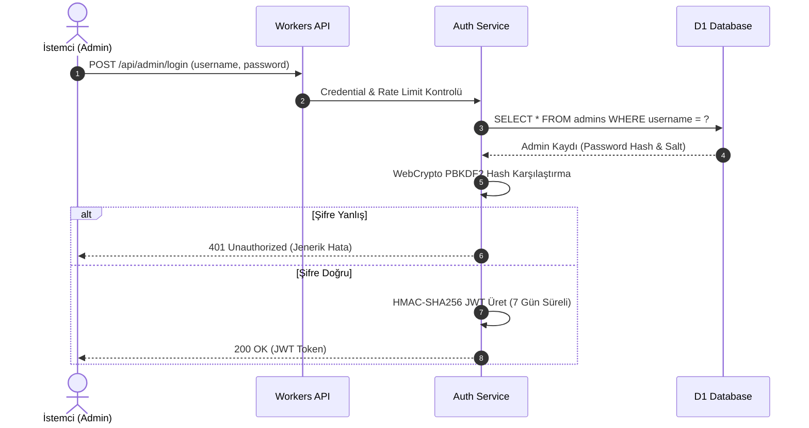
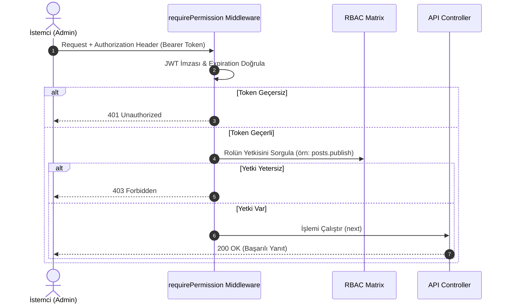

# MSKLabsDesk — Destek, Talep, Yorum, Bülten ve Headless CMS Yönetim Sistemi
## Master Task Architecture & Proje Yönetim Planı (Aşama 1.1)

---

### 📌 Proje ve Repo Bilgileri
* **Yerel Dizin:** `d:\Code\mskaymaz\MSKLabsDesk`
* **Uzak GitHub Reposu:** `https://github.com/mskaymaz/MSKLabsDesk` (Private)
* **Backend Platformu:** Cloudflare Workers (TypeScript / Serverless Edge)
* **Veritabanı:** Cloudflare D1 (Serverless SQLite / Free Tier)
* **Nesne Depolama:** Cloudflare R2 (Object Storage / Free Tier 10 GB)
* **Frontend / Hosting:** Cloudflare Pages (React + Vite + PWA / Desktop & Mobile Responsive)
* **Yapay Zeka:** Google Gemini API (Free Tier - Mesaj Analizi, Özet, Çeviri & SEO)
* **E-Posta Servisi:** Resend API (Free Tier - 3.000 Mail/Ay)
* **Bildirimler:** Web Push Notifications (VAPID / Browser Vendor Servers)

---

## 0. PROJECT GOVERNANCE & ENGINEERING RULES

### 🚨 Geliştirme Kuralları ve Değişmez Kısıtlamalar
1. **KURAL 0 — SIFIR MALİYET İLKESİ (ZERO-COST ARCHITECTURE):** Projedeki tüm mimari kararlar, entegrasyonlar ve servisler Cloudflare Free Tier, Gemini Free API, Resend Free Tier, GitHub Actions Free ve açık kaynak araçların **mevcut ücretsiz kotaları içinde kalacak şekilde** tasarlanmalıdır ($0 / Ay maliyet hedefi). Ücretli servis bağımlılığı oluşturulamaz.
2. **DOSYA BOYUTU SINIRI (SATIR KURALI):** Kod içeren hiçbir dosya **400 - 450 satırı geçmeyecektir**. Kodlar küçük, temiz, modüler ve bağımsız (decoupled) parçalara bölünecektir.
3. **CERRAHİ MÜDAHALE KURALI:** Yalnızca belirtilen ve istenen nokta/dosya üzerinde işlem yapılacak, ilgili olmayan kısımlara kesinlikle dokunulmayacaktır.
4. **ONAYSIZ İŞLEM YASAĞI:** Kullanıcının açık talimatı ve onayı olmadan tüm repo genelinde tarama yapılmayacak, izinsiz büyük değişiklik başlatılmayacaktır.
5. **GÖREV DURUMU STANDARDI (CHECKBOX NOTATION):**
   - `[*]` — **DERİN DENETLENDİ & MÜKEMMEL (Deeply Audited & Verified):** Kodu, testleri, 450 satır sınırı, güvenlik, şema ve API sözleşmesi adım adım derinlemesine denetlenmiş ve mükemmelliği teyit edilmiş görev.
   - `[x]` — **DOĞRULANMIŞ & ONAYLI (Verified Done):** Kodu bizzat incelenmiş, testleri çalıştırılmış, güvenlik, sanitasyon ve satır kuralından geçmiş canlıya hazır görev.
   - `[x?]` — **KODLANDI (Denetim Bekliyor - Audit & Test Pending):** Geçmişte koda dökülmüş ancak sırayla kod incelemesi, testi ve güvenlik süzgecinden geçirilerek `[x]` durumuna çekilecek görev.
   - `[ ]` — **YAPILACAK (Pending Task):** Henüz kodlanmamış yeni veya gelecekteki görev.
6. **DEFINITION OF DONE (BİTTİ TANIMI):** Bir görev; koda dökülüp typecheck/lint geçtiğinde, güvenlik süzgecinden geçirildiğinde, unit/integration veya runtime testi yapıldığında ve $0 maliyet ilkesini koruduğu doğrulandığında `[x]` durumuna çekilir.

---

### 1. ARCHITECTURE & ENGINEERING FOUNDATION

### ARCH-001 — Serverless Edge Backend Kurulumu
- **Amaç:** Cloudflare Workers (TypeScript) ve Wrangler CLI kullanarak sunucusuz (serverless), olay odaklı, ultra düşük gecikmeli Edge backend çekirdeğini kurmak ve yönetmek.
- **Kapsam:** `backend/` dizini, `wrangler.toml`, `package.json`, `tsconfig.json`, `src/index.ts` giriş noktası, Cloudflare D1 ve R2 binding tanımları ile `Env` arayüzü (interface).
- **Teknik Gereksinimler:**
  - [*] Node.js & Wrangler CLI ile uyumlu TypeScript strict-mode yapılandırması (`noImplicitAny`, `strictNullChecks`).
  - [*] Worker global `Env` type arayüzünün (D1 Database `DB`, R2 Bucket `MEDIA`, Environment secrets) eksiksiz tanımlanması.
  - [*] Modüler proje dizin yapısı (`src/routes/`, `src/services/`, `src/utils/`, `src/middleware/`).
  - [*] Domain sınırları ve tek sorumluluk prensibi esas alınarak **maksimum 400 - 450 satır sınırı** kurgusu (gereksiz parçalama yapmadan).
- **Mimari Karar:** Cloudflare Workers fetch-event mantığına dayalı modüler, hafif, üçüncü parti framework (Express vb.) yükü getirmeyen saf/hafif TypeScript router mimarisi.
- **Etkilenecek Katmanlar:** Backend (Cloudflare Workers Runtime), Infrastructure (Wrangler Config), Types/Contracts.
- **Bağımlılıklar:** Belirlenmedi — Taban mimari görevidir.
- **Bağımlı Görevler:** ARCH-003, DATA-001, DATA-003, SEC-AUTH-001, API-001, API-006.
- **Güvenlik Gereksinimleri:**
  - [*] Secret'lar (`JWT_SECRET`, `RESEND_API_KEY` vb.) kesinlikle koda yazılmamalı, `backend/.dev.vars` (lokal) ve `wrangler secret put` (prod) üzerinden `Env` bağlamında erişilmelidir.
  - [*] CORS başlıkları kontrollü Origin listesine dayanmalıdır.
- **Performans Kriterleri:**
  - [*] *Teknik İlke:* Backend ve middleware katmanı gereksiz işlem ve dependency yükü oluşturmamalıdır.
  - [*] *Performans Hedefleri (Benchmark ile Doğrulanacak Target):* Cold-start süresi < 50ms, bellek kullanımı < 128 MB (canlı ortam testlerinde doğrulanacaktır).
- **Test Gereksinimleri (Mimari Seviye):** `wrangler dev` ile yerel simülasyon ve Vitest ile Worker handler tip/çalışma doğrulaması. *(Kapsamlı E2E ve integration testleri Testing & Quality bölümünde ele alınacaktır).*
- **Definition of Done (DoD):** *(Not: DoD altındaki [ ] işaretleri görev durumu değil, tamamlanma onay kriterleridir)*
  - [*] TypeScript derleme hatası olmaması (`tsc --noEmit`).
  - [*] `wrangler.toml` yapılandırmasının valid olması.
  - [*] `Env` arayüzünde tüm D1/R2/Secret alanlarının tip tanımlarının bulunması.
  - [*] Hiçbir backend dosyasının 450 satırı aşmaması.
- **Hata / Risk Senaryoları:**
  - [*] Eksik Secret tanımlarında Worker başlatma hatası -> `Env` kontrolleri ile güvenli fallback/error handling.
  - [*] D1 binding isminin yanlış yazılması -> Wrangler build-time tip denetimi.
- **Zero-Cost Constraint:** Kullanılan servislerin (Cloudflare Workers) güncel ücretsiz plan/kota sınırları içinde kalınması ($0/Ay maliyet hedefi).
- **Uygulama Notları:** `index.ts` dosyası sadece ana router ve fetch event yönlendiricisi olarak kalmalı, iş mantığı (business logic) `routes/` ve `services/` dizinlerine dağıtılmalıdır.

---

### ARCH-002 — PWA Frontend Projesi Kurulumu
- **Amaç:** Masaüstü ve mobil cihazlarda uygulama gibi çalışan (PWA), yüksek performanslı, duyarlı (responsive) React + Vite + TypeScript yönetim paneli arayüzünü kurgulamak.
- **Kapsam:** `frontend/` dizini, `vite.config.ts`, `vite-plugin-pwa` konfigürasyonu, `manifest.json`, Service Worker kaydı, Lucide React ikonları, HSL CSS tasarım token'ları (`index.css`).
- **Teknik Gereksinimler:**
  - [*] React 18+ & TypeScript strict-mode yapılandırması.
  - [*] Vite build aracı ile optimum chunk splitting ve ağaç sallama (tree-shaking).
  - [*] PWA Web App Manifest (ikonlar, tema rengi, `display: standalone`).
  - [*] Responsive mobil/masaüstü görünüm (CSS Grid & Flexbox, medya sorguları).
  - [*] Modüler bileşen yapısı esas alınarak **400 - 450 satır kuralı** (Örn: `PostsView.tsx` modüler parçalara bölünmelidir).
- **Mimari Karar:** TailwindCSS bağımlılığı olmaksızın, maksimum CSS esnekliği ve hafiflik için Vanilla CSS + CSS Variables (HSL Token'ları) mimarisi.
- **Etkilenecek Katmanlar:** Frontend (React SPA / PWA), Build tooling (Vite).
- **Bağımlılıklar:** Belirlenmedi — Taban arayüz görevidir.
- **Bağımlı Görevler:** UI-001, UI-004, UI-005, I18N-001, CMS-001, ADS-002.
- **Güvenlik Gereksinimleri:**
  - [*] Frontend üzerinde hiçbir private API secret tutulmamalı, sadece `VITE_` önekli public değişkenler (`VITE_API_URL`, `VITE_VAPID_PUBLIC_KEY`) kullanılmalıdır.
  - [*] XSS koruması için kullanıcı kaynaklı içerikler süzgeçten geçirilmelidir.
- **Performans Kriterleri:**
  - [*] *Teknik İlke:* Frontend derleme çıktısı optimum ağaç sallama (tree-shaking) ve chunk ayırımı yapmalıdır.
  - [*] *Performans Hedefleri (Benchmark ile Doğrulanacak Target):* Lighthouse Performance PWA skoru > 90, FCP < 1.2 sn, Bundle boyutu < 300 KB gzip (canlı ortam ölçümleriyle kanıtlanacaktır).
- **Test Gereksinimleri (Mimari Seviye):** Masaüstü (Chrome/Edge) ve mobil (iOS/Android Safari/Chrome) PWA yükleme ve offline cache testi.
- **Definition of Done (DoD):** *(Not: DoD altındaki [ ] işaretleri görev durumu değil, tamamlanma onay kriterleridir)*
  - [*] `npm run build` hatasız sıfır uyarısız tamamlanmalı.
  - [*] PWA Manifest ve Service Worker tarayıcıda sorunsuz kaydedilmeli.
  - [*] Mobil ekranlarda (≤768px) yatay kayma (horizontal scroll) olmamalı.
  - [*] Hiçbir frontend dosyasının 450 satırı aşmaması.
- **Hata / Risk Senaryoları:**
  - [*] Service Worker eski önbellek kalması -> Sürüm bazlı cache-busting ve otomatik güncelleme uyarısı.
  - [*] Mobil tarayıcı çentik (notch) kesilmeleri -> `viewport-fit=cover` ve CSS safe-area-inset kullanımı.
- **Zero-Cost Constraint:** Kullanılan servislerin (Cloudflare Pages) güncel ücretsiz plan/kota sınırları içinde kalınması ($0/Ay maliyet hedefi).
- **Uygulama Notları:** Ortak bileşenler `components/ui/` dizininde izole edilmeli, CSS değişkenleri `:root` altında tanımlanmalıdır.

---

### ARCH-003 — Modüler Route ve Middleware Altyapısı
- **Amaç:** `index.ts` üzerindeki istek yönlendirme ve middleware mantığını ayrıştırarak backend kodunun bakımı kolay, ölçeklenebilir ve modüler bir mimariye kavuşturulmasını sağlamak.
- **Kapsam:** `backend/src/routes/` (Public & Admin rotaları), `backend/src/middleware/` (Auth, RateLimit, CORS, ErrorHandler), `backend/src/utils/router.ts` (Hafif URL matcher).
- **Teknik Gereksinimler:**
  - [*] İstek ön işleme middleware katmanı (CORS, Request ID üretimi, IP tespiti).
  - [*] Güvenlik ve yetki middleware katmanı (`requireAuth`, `requirePermission`).
  - [*] Hata yakalama middleware (`globalErrorHandler` — tip korumalı JSON hatası dönen).
  - [*] Rota dosyalarının alan bağımsız ayrıştırılması (`supportRoutes.ts`, `commentRoutes.ts`, `cmsRoutes.ts`, `adminRoutes.ts`).
- **Mimari Karar:** Mevcut ihtiyaçlar için ağır bir framework bağımlılığı (Express vb.) oluşturulması gerekli görülmemektedir; hafif, tip güvenli ve Workers runtime ile uyumlu bir router yaklaşımı tercih edilir.
- **Etkilenecek Katmanlar:** Backend (API Routing & Middleware).
- **Bağımlılıklar:** ARCH-001.
- **Bağımlı Görevler:** API-006, API-007, SEC-REQ-001, SEC-RBAC-002.
- **Güvenlik Gereksinimleri:**
  - [*] Hata durumunda (500 Internal Error) hassas sistem veya veritabanı detaylarının dışarıya sızdırılmaması (maskeleme).
  - [*] Yetkisiz isteklerin doğrudan middleware aşamasında (401/403) engellenmesi.
- **Performans Kriterleri:**
  - [*] *Teknik İlke:* Backend ve middleware katmanı gereksiz işlem ve dependency yükü oluşturmamalıdır.
  - [*] *Performans Hedefleri (Benchmark ile Doğrulanacak Target):* Middleware yönlendirme ek süresi < 1ms.
- **Test Gereksinimleri (Mimari Seviye):** Geçerli/geçersiz rotalar ve middleware zinciri için birim testleri (Vitest).
- **Definition of Done (DoD):** *(Not: DoD altındaki [ ] işaretleri görev durumu değil, tamamlanma onay kriterleridir)*
  - [*] `index.ts` dosyasının satır sayısının 150 satırın altına düşmesi.
  - [*] Tüm public ve admin rotalarının modüler route dosyalarında tanımlanması.
  - [*] Global error handler'ın unhandled exception'ları güvenle yakalaması.
  - [*] Modüler router yapısının 450 satır kuralını ihlal etmemesi.
- **Hata / Risk Senaryoları:**
  - [*] Yönlendirilmeyen rota (404 Not Found) -> Standart JSON `404 Resource Not Found` yanıtı.
  - [*] Middleware zincirinde unhandled promise rejection -> Global catch bloğu.
- **Zero-Cost Constraint:** Ekstra sunucu veya paralı kütüphane gerektirmez ($0/Ay maliyet hedefi).
- **Uygulama Notları:** `index.ts` yalnızca middleware kayıtlarını ve route dispatcher çağrısını içermelidir.

### 2. DATA ARCHITECTURE, MIGRATIONS & DATABASE

#### DATA-001 — Initial D1 Database Migration (`0001_devadmin_initial_schema.sql`)
- **2. Amaç:** Destek biletleri, bilet tarihçesi, yanıtlar, blog yorumları, e-bülten aboneleri, bülten tercihleri, e-posta gönderim kuyruğu, kuponlar ve admin doğrulaması için çekirdek D1 SQLite veritabanı şemasını kurgulamak.
- **3. Kapsam:** `migrations/0001_devadmin_initial_schema.sql` dosyası; `messages`, `message_events`, `replies`, `comments`, `subscribers`, `subscriber_preferences`, `email_queue`, `coupons`, `admins`, `broadcasts` tabloları.
- **4. Teknik Gereksinimler:** SQLite D1 motoruna uyumlu strict veri tipleri (TEXT, INTEGER, REAL, BLOB), `PRAGMA foreign_keys = ON` uyumluluğu ve ISO8601 tarih standartları.
- **5. Schema / Table Design:**
  - [*] `messages`: `id` (TEXT PK / `MSK-YYYY-XXXX` — bu PK doğrudan bilet numarası / ticketNo olarak kullanılır), `name` (TEXT NOT NULL), `email` (TEXT NOT NULL), `subject` (TEXT NOT NULL), `message` (TEXT NOT NULL), `status` (TEXT DEFAULT 'NEW' CHECK(status IN ('NEW','IN_PROGRESS','RESOLVED','SPAM','CLOSED'))), `urgency` (TEXT DEFAULT 'NORMAL'), `category` (TEXT DEFAULT 'GENERAL'), `ai_summary` (TEXT), `ai_draft` (TEXT), `created_at` (DATETIME DEFAULT CURRENT_TIMESTAMP), `updated_at` (DATETIME DEFAULT CURRENT_TIMESTAMP).
  - [*] `message_events`: `id` (INTEGER PK AUTOINCREMENT), `message_id` (TEXT NOT NULL FK → `messages(id)` ON DELETE CASCADE), `event_type` (TEXT NOT NULL), `actor` (TEXT DEFAULT 'SYSTEM'), `metadata` (TEXT / JSON string), `created_at` (DATETIME DEFAULT CURRENT_TIMESTAMP).
  - [*] `replies`: `id` (INTEGER PK AUTOINCREMENT), `message_id` (TEXT NOT NULL FK → `messages(id)` ON DELETE CASCADE), `sender_type` (TEXT NOT NULL CHECK(sender_type IN ('ADMIN','USER'))), `reply_text` (TEXT NOT NULL), `created_at` (DATETIME DEFAULT CURRENT_TIMESTAMP).
  - [*] `comments`: `id` (INTEGER PK AUTOINCREMENT), `post_slug` (TEXT NOT NULL), `author_name` (TEXT NOT NULL), `author_email` (TEXT NOT NULL), `comment_text` (TEXT NOT NULL), `status` (TEXT DEFAULT 'PENDING' CHECK(status IN ('PENDING','APPROVED','REJECTED'))), `created_at` (DATETIME DEFAULT CURRENT_TIMESTAMP). *(Not: API yanıtlarında id `c_12` gibi transformasyonla sunulabilir)*.
  - [*] `subscribers`: `id` (INTEGER PK AUTOINCREMENT), `email` (TEXT NOT NULL UNIQUE), `is_active` (INTEGER DEFAULT 1 CHECK(is_active IN (0,1))), `unsubscribe_token` (TEXT NOT NULL UNIQUE), `created_at` (DATETIME DEFAULT CURRENT_TIMESTAMP).
  - [*] `subscriber_preferences`: `id` (INTEGER PK AUTOINCREMENT), `subscriber_id` (INTEGER NOT NULL FK → `subscribers(id)` ON DELETE CASCADE), `category` (TEXT NOT NULL), `is_subscribed` (INTEGER DEFAULT 1), UNIQUE(`subscriber_id`, `category`).
  - [*] `email_queue`: `id` (INTEGER PK AUTOINCREMENT), `recipient_email` (TEXT NOT NULL), `subject` (TEXT NOT NULL), `html_body` (TEXT NOT NULL), `status` (TEXT DEFAULT 'PENDING' CHECK(status IN ('PENDING','PROCESSING','SENT','FAILED'))), `attempts` (INTEGER DEFAULT 0), `max_attempts` (INTEGER DEFAULT 3), `last_error` (TEXT), `scheduled_at` (DATETIME DEFAULT CURRENT_TIMESTAMP), `sent_at` (DATETIME). *(Süreç takibi: Önerilen / Uygulama sırasında doğrulanacak)*.
  - [*] `coupons`: `id` (INTEGER PK AUTOINCREMENT), `code` (TEXT NOT NULL UNIQUE), `discount_amount` (REAL NOT NULL), `discount_percent` (REAL), `discount_type` (TEXT DEFAULT 'PERCENTAGE'), `max_uses` (INTEGER DEFAULT 100), `current_uses` (INTEGER DEFAULT 0), `assigned_email` (TEXT), `is_used` (INTEGER DEFAULT 0), `expires_at` (DATETIME), `created_at` (DATETIME DEFAULT CURRENT_TIMESTAMP).
  - [*] `admins`: `id` (INTEGER PK AUTOINCREMENT), `username` (TEXT NOT NULL UNIQUE), `password_hash` (TEXT NOT NULL), `role` (TEXT DEFAULT 'SUPER_ADMIN'), `last_login_at` (DATETIME), `created_at` (DATETIME DEFAULT CURRENT_TIMESTAMP).
  - [*] `broadcasts`: `id` (INTEGER PK AUTOINCREMENT), `subject` (TEXT NOT NULL), `content_html` (TEXT NOT NULL), `target_segment` (TEXT DEFAULT 'ALL'), `total_recipients` (INTEGER DEFAULT 0), `status` (TEXT DEFAULT 'QUEUED'), `created_at` (DATETIME DEFAULT CURRENT_TIMESTAMP).
- **6. Primary Key / Foreign Key:**
  - [*] `messages.id` (TEXT PK), `admins.id` (INTEGER PK), `subscribers.id` (INTEGER PK).
  - [*] `message_events.message_id` → `messages.id` (1:N, `ON DELETE CASCADE`).
  - [*] `replies.message_id` → `messages.id` (1:N, `ON DELETE CASCADE`).
  - [*] `subscriber_preferences.subscriber_id` → `subscribers.id` (1:N, `ON DELETE CASCADE`).
- **7. Constraints:** `status IN (...)` CHECK constraint'leri, `subscribers.email` UNIQUE, `subscribers.unsubscribe_token` UNIQUE, `coupons.code` UNIQUE, `admins.username` UNIQUE, `subscriber_preferences(subscriber_id, category)` UNIQUE.
- **8. Index Strategy:**
  - [*] `idx_messages_status` ON `messages(status)` (Admin panel filtreleme).
  - [*] `idx_messages_created` ON `messages(created_at DESC)` (Tarih sıralama).
  - [*] `idx_comments_status` ON `comments(status)` (Onay bekleyen yorumlar).
  - [*] `idx_subscribers_email` ON `subscribers(email)` (Unique abone kontrolü).
  - [*] `idx_email_queue_status_scheduled` ON `email_queue(status, scheduled_at)` (Cron worker sorgu optimizasyonu).
- **9. Migration Strategy:** İlk çekirdek migration dosyası (`0001_devadmin_initial_schema.sql`). Bağımsız olarak temiz veritabanına ilk sırada uygulanır. Gerekli durumlarda forward-fix migration uygulanır.
- **10. Data Integrity:** Foreign key kısıtları (`PRAGMA foreign_keys=ON`), `ON DELETE CASCADE` kuralları ve durum alanlarında CHECK kısıtları ile veri bütünlüğü sağlanır.
- **11. Privacy / Retention:** `messages` ve `replies` kişisel verileri (PII: e-posta, isim) bilet çözümlendikten sonra saklama politikasına tabi tutulur. Audit geçmişi (`message_events`) yetkisiz silmeye karşı korumalıdır.
- **12. Performance:** İndeksli status ve tarih sorguları ile O(log N) zaman karmaşıklığı; aylık 50k+ mesaj hacminde hafif metin/JSON yapıları.
- **13. Test Requirements:** Temiz D1 SQLite üzerinde `0001_devadmin_initial_schema.sql` çalıştırma ve `PRAGMA foreign_key_check` sıfır hata doğrulaması.
- **14. Definition of Done (DoD):** *(Not: DoD altındaki [ ] işaretleri onay kriteridir)*
  - [*] 10 ana tablonun hatasız oluşturulması.
  - [*] Tüm FOREIGN KEY ve CASCADE kurallarının doğrulanması.
  - [*] Performans indekslerinin `PRAGMA index_list` ile teyit edilmesi.
- **15. Hata / Risk Senaryoları:**
  - [*] Silinen bilet sonrası yetim event kalması -> `ON DELETE CASCADE` ile engellenir.
  - [*] `email_queue` kilitlenmesi -> `status='PROCESSING'` zaman aşımı denetimi.
- **Zero-Cost Constraint:** Cloudflare D1 Free Tier kotalarında $0/Ay ($0 maliyet ilkesi).
- **17. Bağımlılıklar:** Belirlenmedi — Veritabanı taban görevidir.
- **18. Bağımlı Görevler:** DATA-002, DATA-003, DATA-004, DATA-005, SEC-AUTH-001, API-001.
- **19. Uygulama Notları:** SQLite tip sistemine uygun olarak TIMESTAMP alanları ISO8601 string veya `CURRENT_TIMESTAMP` fonksiyonuyla yönetilir.

---

### DATA-002 — CMS D1 Database Migration (`0005_cms_schema.sql`)
- **2. Amaç:** Headless CMS için blog kanalları, blog yazıları, mobil uygulama kataloğu, sürüm geçmişi, site şablon duyuruları ve medya varlıklarının veritabanı altyapısını kurmak.
- **3. Kapsam:** `migrations/0005_cms_schema.sql` dosyası; `blog_channels`, `blog_posts`, `apps`, `app_versions`, `site_templates`, `media_assets` tabloları ve `comments.post_id` ilişkisi.
- **4. Teknik Gereksinimler:** Çok dilli sütun kurgusu (`title_tr/en/ar`), slug benzersizliği ve medya varlıklarının R2 nesne depolama referanslarıyla ilişkilendirilmesi.
- **5. Schema / Table Design:**
  - [*] `blog_channels`: `id` (INTEGER PK AUTOINCREMENT), `slug` (TEXT NOT NULL UNIQUE), `name_tr` (TEXT NOT NULL), `name_en` (TEXT), `name_ar` (TEXT), `icon` (TEXT), `created_at` (DATETIME DEFAULT CURRENT_TIMESTAMP).
  - [*] `blog_posts`: `id` (INTEGER PK AUTOINCREMENT), `channel_id` (INTEGER FK → `blog_channels(id)` ON DELETE SET NULL), `slug` (TEXT NOT NULL UNIQUE), `title_tr` (TEXT NOT NULL), `title_en` (TEXT), `title_ar` (TEXT), `content_tr` (TEXT NOT NULL), `content_en` (TEXT), `content_ar` (TEXT), `summary_tr` (TEXT), `summary_en` (TEXT), `summary_ar` (TEXT), `cover_image` (TEXT), `status` (TEXT DEFAULT 'DRAFT' CHECK(status IN ('DRAFT','REVIEW','APPROVED','PUBLISHED','UNPUBLISHED','ARCHIVED'))), `view_count` (INTEGER DEFAULT 0), `published_at` (DATETIME), `created_at` (DATETIME DEFAULT CURRENT_TIMESTAMP), `updated_at` (DATETIME DEFAULT CURRENT_TIMESTAMP).
  - [*] `apps`: `id` (INTEGER PK AUTOINCREMENT), `slug` (TEXT NOT NULL UNIQUE), `name` (TEXT NOT NULL), `short_description_tr` (TEXT), `short_description_en` (TEXT), `icon_url` (TEXT), `platform` (TEXT DEFAULT 'BOTH' CHECK(platform IN ('ANDROID','IOS','BOTH','WEB'))), `is_featured` (INTEGER DEFAULT 0), `created_at` (DATETIME DEFAULT CURRENT_TIMESTAMP).
  - [*] `app_versions`: `id` (INTEGER PK AUTOINCREMENT), `app_id` (INTEGER NOT NULL FK → `apps(id)` ON DELETE CASCADE), `version_number` (TEXT NOT NULL), `release_notes_tr` (TEXT), `release_notes_en` (TEXT), `apk_url` (TEXT), `store_url` (TEXT), `is_current` (INTEGER DEFAULT 1), `published_at` (DATETIME DEFAULT CURRENT_TIMESTAMP).
  - [*] `site_templates`: `id` (INTEGER PK AUTOINCREMENT), `key` (TEXT NOT NULL UNIQUE), `title` (TEXT NOT NULL), `content` (TEXT), `is_active` (INTEGER DEFAULT 1), `created_at` (DATETIME DEFAULT CURRENT_TIMESTAMP).
  - [*] `media_assets`: `id` (INTEGER PK AUTOINCREMENT), `filename` (TEXT NOT NULL), `r2_key` (TEXT NOT NULL UNIQUE), `mime_type` (TEXT NOT NULL), `size_bytes` (INTEGER NOT NULL), `public_url` (TEXT NOT NULL), `created_at` (DATETIME DEFAULT CURRENT_TIMESTAMP).
- **6. Primary Key / Foreign Key:**
  - [*] `blog_posts.channel_id` → `blog_channels.id` (N:1, `ON DELETE SET NULL`).
  - [*] `app_versions.app_id` → `apps.id` (1:N, `ON DELETE CASCADE`).
  - [*] `comments.post_id` → `blog_posts.id` (FOREIGN KEY, uygulandı ve doğrulandı).
- **7. Constraints:** `blog_channels.slug` UNIQUE, `blog_posts.slug` UNIQUE, `apps.slug` UNIQUE, `site_templates.key` UNIQUE, `media_assets.r2_key` UNIQUE, `blog_posts.status IN (...)` CHECK, `apps.platform IN (...)` CHECK, `apps.is_featured IN (0,1)` CHECK, `app_versions.is_current IN (0,1)` CHECK, `site_templates.is_active IN (0,1)` CHECK.
- **8. Index Strategy:**
  - [*] `idx_blog_posts_slug` ON `blog_posts(slug)` (Blog detay).
  - [*] `idx_blog_posts_status_published` ON `blog_posts(status, published_at DESC)` (Public yayın akışı).
  - [*] `idx_apps_slug` ON `apps(slug)` (Uygulama detay).
  - [*] `idx_app_versions_app_current` ON `app_versions(app_id, is_current)` (Aktif sürüm).
- **9. Migration Strategy:** `0001_devadmin_initial_schema.sql` tamamlandıktan sonra ikinci sırada `0005_cms_schema.sql` olarak uygulanır.
- **10. Data Integrity:** Kanal silindiğinde yazıların yetim kalmaması için `ON DELETE SET NULL` uygulanır; uygulama silindiğinde sürümleri `CASCADE` ile silinir.
- **11. Privacy / Retention:** Blog yazılarının silinmesi yerine `status='ARCHIVED'` ile soft-delete yapılır. Medya silindiğinde R2 dosya kontrolü yapılır.
- **12. Performance:** Slug ve yayın durumu indeksleri public sorguları destekler; < 5ms değeri benchmark ile doğrulanacak performans hedefidir, garanti değildir.
- **13. Test Requirements:** `0001` ve `0005` dosyalarının temiz D1 SQLite ortamında sırayla çalıştırılması ve `PRAGMA foreign_key_check` doğrulaması.
- **14. Definition of Done (DoD):** *(Not: DoD altındaki [ ] işaretleri onay kriteridir)*
  - [*] 6 yeni CMS tablosunun hatasız oluşturulması.
  - [*] Slug UNIQUE indekslerinin teyit edilmesi.
- **15. Hata / Risk Senaryoları:**
  - [*] Kanal silindiğinde yazıların kaybolması -> `ON DELETE SET NULL` ile önlenir.
  - [*] Mükerrer slug girilmesi -> UNIQUE kısıtı ile engellenir.
- **16. Zero-Cost Constraint:** Cloudflare D1 Free Tier kotalarında $0/Ay.
- **17. Bağımlılıklar:** DATA-001.
- **18. Bağımlı Görevler:** DATA-003, DATA-006, DATA-007, CMS-005, API-010.
- **19. Uygulama Notları:** Çok dilli metinler (`title_tr`, `title_en`, `title_ar`) sütun bazında saklanır.

---

### DATA-003 — Gerçek D1 Veritabanı Kurulumu & Binding (`10.5.1`)
- **2. Amaç:** Cloudflare D1 uzak veritabanı örneğini (remote instance) oluşturmak, `database_id` bilgisini `wrangler.toml` yapılandırmasına bağlamak ve üretim ortamına migration yayınlama hattını otomatikleştirmek.
- **3. Kapsam:** `wrangler.toml`, Cloudflare Dashboard / Wrangler CLI D1 binding yönetimi.
- **4. Teknik Gereksinimler:** `wrangler d1 create msklabsdesk_db` komutu, `[[d1_databases]]` binding konfigürasyonu ve `--local` / `--remote` çalıştırma kurgusu.
- **5. Schema / Table Design:** N/A (Altyapı görevi).
- **6. Primary Key / Foreign Key:** N/A (Altyapı görevi).
- **7. Constraints:** N/A (Altyapı görevi).
- **8. Index Strategy:** N/A (Altyapı görevi).
- **9. Migration Strategy:** `DATA-001` ve `DATA-002` yerelde doğrulandıktan sonra `wrangler d1 migrations apply DB --remote` ile canlı D1 veritabanına uygulanır.
- **10. Data Integrity:** Canlı D1 veritabanında schema versiyonlarının `d1_migrations` tablosu üzerinden takibi ve tutarlılık doğrulaması.
- **11. Privacy / Retention:** Üretim veritabanı kimliklerinin (`database_id`) versiyon kontrolünde saklanması, gizli anahtarların env/secrets altında tutulması.
- **12. Performance:** Canlı D1 bağlantısında cold-start süresine etki etmeyen global binding kurgusu.
- **13. Test Requirements:** `wrangler d1 execute DB --remote --command "PRAGMA table_info(messages);"` ile uzak tablo doğrulaması.
- **14. Definition of Done (DoD):** *(Not: DoD altındaki [ ] işaretleri onay kriteridir)*
  - [*] D1 veritabanı binding konfigürasyonunun (`binding = "DB"`, `database_name = "msklabsdesk_db"`) `wrangler.toml` dosyasında tanımlanması.
  - [*] Yerel `--local` ortamda tüm 5 migration dosyasının uygulanıp `d1_migrations` tablosu ile doğrulanması.
  - [ ] Remote D1 veritabanına migration uygulanması ve canlı doğrulama *(Cloudflare API token/authentication gerektirir)*.
- **15. Hata / Risk Senaryoları:**
  - [*] Yanlış veritabanına migration atılması -> `wrangler.toml` env kilitleri ile engellenir.
- **16. Zero-Cost Constraint:** Cloudflare D1 Free Tier kotalarında $0/Ay.
- **17. Bağımlılıklar:** DATA-001, DATA-002.
- **18. Bağımlı Görevler:** GO-001, INT-002, REL-ENV-001.
- **19. Uygulama Notları:** Üretim ortamına migration atılmadan önce lokal veritabanında test edilmeli ve yedek alınmalıdır.

---

### DATA-004 — Push Subscriptions Migration (`0006_push_subscriptions.sql`)
- **2. Amaç:** Web Push bildirimleri için tarayıcı push abonelik noktalarını (VAPID endpoint ve anahtarları) saklayan veritabanı tablosunu oluşturmak.
- **3. Kapsam:** `migrations/0006_push_subscriptions.sql` dosyası; `push_subscriptions` tablosu.
- **4. Teknik Gereksinimler:** Tarayıcı VAPID kimlik doğrulama anahtarlarının (`p256dh`, `auth`) uygulama/servis katmanında şifreli veya eşdeğer güvenli gizli veri koruma mekanizmasıyla saklanması ve `endpoint` benzersizliği.
- **5. Schema / Table Design:**
  - [*] `push_subscriptions`: `id` (INTEGER PK AUTOINCREMENT), `endpoint` (TEXT NOT NULL UNIQUE), `p256dh` (TEXT NOT NULL), `auth` (TEXT NOT NULL), `user_agent` (TEXT), `is_active` (INTEGER DEFAULT 1 CHECK(is_active IN (0,1))), `created_at` (DATETIME DEFAULT CURRENT_TIMESTAMP), `updated_at` (DATETIME DEFAULT CURRENT_TIMESTAMP).
- **6. Primary Key / Foreign Key:** `endpoint` sütunu benzersiz (UNIQUE) abonelik anahtarıdır. *(Kullanıcı/Admin FK ilişkisi: Önerilen / Uygulama sırasında doğrulanacak)*.
- **7. Constraints:** `endpoint` UNIQUE kısıtı, `is_active IN (0,1)` CHECK kısıtı.
- **8. Index Strategy:**
  - [*] `endpoint` için ayrıca manuel indeks gerekmez; `UNIQUE` kısıtının oluşturduğu SQLite otomatik indeks tekilleştirme ve eşleşme için yeterlidir.
  - [*] `idx_push_active` ON `push_subscriptions(is_active)` (Aktif alıcı listesi).
- **9. Migration Strategy:** `DATA-001` ve `0005_cms_schema.sql` sonrasında `0006_push_subscriptions.sql` olarak uygulanır.
- **10. Data Integrity:** Çift abonelik oluşmaması için `ON CONFLICT(endpoint) DO UPDATE` stratejisi kullanılır.
- **11. Privacy / Retention:** Süresi dolan (410 Gone) abonelikler pasife alınır veya veritabanından temizlenir.
- **12. Performance:** İndeksli `is_active` sorgusu ile bildirim gönderim altyapısına hızlı alıcı listesi sunumu.
- **13. Test Requirements:** Mükerrer `endpoint` kaydında UNIQUE engelleme testi.
- **14. Definition of Done (DoD):** *(Not: DoD altındaki [ ] işaretleri onay kriteridir)*
  - [*] `push_subscriptions` tablosunun D1 üzerinde hatasız oluşturulması.
- **15. Hata / Risk Senaryoları:**
  - [*] Yenilenen abonelikte eski kaydın kalması -> `ON CONFLICT` ile güncelleme.
- **16. Zero-Cost Constraint:** Cloudflare D1 Free Tier kotalarında $0/Ay.
- **17. Bağımlılıklar:** DATA-001.
- **18. Bağımlı Görevler:** COM-004.
- **19. Uygulama Notları:** `p256dh` ve `auth` değerleri API yanıtlarında gizlenmeli; veri tabanında korunmaları için uygulama/servis katmanı şifreleme veya eşdeğer gizli veri koruma mekanizması kullanılmalıdır.

---

### DATA-005 — Ad Settings Migration (`0007_ad_settings.sql`)
- **2. Amaç:** Sitedeki reklam alanlarının konum, boyut, aktiflik ve marj ayarlarını saklamak ve varsayılan 4 reklam alanını seed verisi olarak veritabanına eklemek.
- **3. Kapsam:** `migrations/0007_ad_settings.sql` dosyası; `ad_settings` tablosu ve 4 varsayılan seed kaydı (`header_banner`, `sidebar_top`, `post_in_article`, `footer_sticky`).
- **4. Teknik Gereksinimler:** AdSense duyarlı (responsive) veya özel boyut parametrelerinin saklanması, `slot_key` benzersizliği.
- **5. Schema / Table Design:**
  - [*] `ad_settings`: `id` (INTEGER PK AUTOINCREMENT), `slot_key` (TEXT NOT NULL UNIQUE), `title` (TEXT NOT NULL), `is_enabled` (INTEGER DEFAULT 0 CHECK(is_enabled IN (0,1))), `ad_client` (TEXT), `ad_slot` (TEXT), `preset_size` (TEXT DEFAULT 'RESPONSIVE'), `custom_width` (INTEGER), `custom_height` (INTEGER), `margin_top` (INTEGER DEFAULT 16), `margin_bottom` (INTEGER DEFAULT 16), `is_sticky` (INTEGER DEFAULT 0 CHECK(is_sticky IN (0,1))), `updated_at` (DATETIME DEFAULT CURRENT_TIMESTAMP).
  - [*] Seed Verisi: `INSERT OR IGNORE INTO ad_settings` ile 4 varsayılan slot kaydı.
- **6. Primary Key / Foreign Key:** `slot_key` benzersiz metin anahtarıdır.
- **7. Constraints:** `slot_key` UNIQUE, `is_enabled IN (0,1)` CHECK, `is_sticky IN (0,1)` CHECK.
- **8. Index Strategy:**
  - [*] `idx_ad_slot_key` ON `ad_settings(slot_key)` (Hızlı reklam ayarı çekimi).
- **9. Migration Strategy:** `DATA-001` ve `0005_cms_schema.sql` sonrasında `0007_ad_settings.sql` olarak uygulanır.
- **10. Data Integrity:** Seed verisinin tekrar çalıştırılan migration'larda mükerrer kayıt oluşturmaması (`INSERT OR IGNORE`).
- **11. Privacy / Retention:** Reklam ayarlarında PII bulunmaz; kamuya açık reklam kodları sunulur.
- **12. Performance:** 4 sabit reklam alanının düşük maliyetli, indeksli D1 sorgusu veya önbellek üzerinden çekilmesi; performans benchmark ile doğrulanmalıdır.
- **13. Test Requirements:** Migration iki kez çalıştırıldığında seed verisinin tekrarlanmadığının doğrulanması.
- **14. Definition of Done (DoD):** *(Not: DoD altındaki [ ] işaretleri onay kriteridir)*
  - [*] `ad_settings` tablosunun ve 4 seed kaydının veritabanına eklenmesi.
- **15. Hata / Risk Senaryoları:**
  - [*] Tekrarlanan migration uygulamasında UNIQUE hatası -> `INSERT OR IGNORE` ile önlenir.
- **16. Zero-Cost Constraint:** Cloudflare D1 Free Tier kotalarında $0/Ay.
- **17. Bağımlılıklar:** DATA-001.
- **18. Bağımlı Görevler:** ADS-001, ADS-002.
- **19. Uygulama Notları:** Reklam ayarları değiştiğinde `updated_at` uygulama katmanı veya açık bir SQLite trigger ile güncellenmelidir; `DEFAULT CURRENT_TIMESTAMP` tek başına otomatik güncelleme sağlamaz.

---

### DATA-006 — Blog Layouts & Revisions Migration (`0008_blog_layouts.sql`)
- **2. Amaç:** Blog yazılarının geçmiş sürüm revizyonlarını saklamak ve blok tabanlı dinamik sayfa düzenlerini depolamak.
- **3. Kapsam:** `migrations/0008_blog_layouts.sql` dosyası; `post_revisions` ve `blog_layouts` tabloları.
- **4. Teknik Gereksinimler:** Revizyon geçmişinin numaralandırılması (`revision_number`), JSON formatlı blok ve tema yapısı (`block_structure_json`, `theme_config_json`), silme işlemlerinde referans bütünlüğü (`CASCADE`).
- **5. Schema / Table Design:**
  - [*] `post_revisions`: `id` (INTEGER PRIMARY KEY AUTOINCREMENT), `post_id` (INTEGER NOT NULL FK → `blog_posts(id)` ON DELETE CASCADE), `title` (TEXT NOT NULL), `content` (TEXT NOT NULL), `summary` (TEXT), `snapshot_json` (TEXT), `revision_number` (INTEGER NOT NULL), `created_by_admin_id` (INTEGER NULL FK → `admins(id)`), `created_at` (DATETIME DEFAULT CURRENT_TIMESTAMP).
  - [*] `blog_layouts`: `id` (INTEGER PRIMARY KEY AUTOINCREMENT), `post_id` (INTEGER NOT NULL FK → `blog_posts(id)` ON DELETE CASCADE), `layout_name` (TEXT NOT NULL), `block_structure_json` (TEXT NOT NULL), `theme_config_json` (TEXT), `is_active` (INTEGER DEFAULT 1 CHECK(is_active IN (0,1))), `updated_at` (DATETIME DEFAULT CURRENT_TIMESTAMP). *(JSON şeması: Önerilen / Uygulama sırasında doğrulanacak)*.
- **6. Primary Key / Foreign Key:**
  - [*] `post_revisions.id` (INTEGER PK), `blog_layouts.id` (INTEGER PK).
  - [*] `post_revisions.post_id` → `blog_posts.id` (1:N, `ON DELETE CASCADE`).
  - [*] `blog_layouts.post_id` → `blog_posts.id` (1:N, `ON DELETE CASCADE`).
- **7. Constraints:** `post_revisions` için `(post_id, revision_number)` bileşik UNIQUE kısıtı, `blog_layouts.is_active IN (0,1)` CHECK kısıtı ve her `post_id` için en fazla bir aktif layout kuralı (`idx_single_active_layout` partial unique index).
- **8. Index Strategy:**
  - [*] `idx_revisions_post_id` ON `post_revisions(post_id, revision_number DESC)` (Revizyon geçmişi çekimi).
  - [*] `idx_blog_layouts_post` ON `blog_layouts(post_id)` (Yazıya özel düzen çekimi).
- **9. Migration Strategy:** `DATA-002` (`blog_posts`) oluştuktan sonra `0008_blog_layouts.sql` olarak uygulanır.
- **10. Data Integrity:** Bağlı blog yazısı silindiğinde revizyon ve düzen kayıtları otomatik silinir (`ON DELETE CASCADE`); JSON verileri API katmanında doğrulanır. `blog_layouts` için her `post_id` başına en fazla bir `is_active=1` kayıt kuralı `idx_single_active_layout` partial unique index ile veritabanı seviyesinde korunur. `updated_at` uygulama katmanı veya açık trigger (`trg_blog_layouts_updated_at`) ile güncellenir.
- **11. Privacy / Retention:** Yazı başına en fazla 10 revizyon tutulur; 11. revizyon oluşturulurken en eski revizyon transaction içinde silinir. Restore işlemi mevcut içeriği yeni bir revizyon olarak kaydeder. Revizyonlarda PII tutulmaz.
- **12. Performance:** Revizyon ve düzen sorguları indeksli erişimle optimize edilir; 5ms değeri benchmark ile doğrulanacak performans hedefidir, garanti değildir.
- **13. Test Requirements:** Post silindiğinde revizyon ve layout kayıtlarının silindiğinin (`CASCADE`) ve `PRAGMA foreign_key_check` doğrulanması.
- **14. Definition of Done (DoD):** *(Not: DoD altındaki [ ] işaretleri onay kriteridir)*
  - [*] `post_revisions` ve `blog_layouts` tablolarının D1 üzerinde hatasız oluşturulması.
  - [*] Foreign key CASCADE ve UNIQUE kısıt davranışlarının test edilmesi.
- **15. Hata / Risk Senaryoları:**
  - [*] Hatalı JSON kaydedilmesi -> API seviyesinde JSON şema denetimi.
  - [*] Revizyon sayısının kontrolden çıkması -> Yazı başına 10 revizyon sınırı uygulanması.
- **16. Zero-Cost Constraint:** Cloudflare D1 Free Tier kotalarında $0/Ay.
- **17. Bağımlılıklar:** DATA-002.
- **18. Bağımlı Görevler:** CMS-001, CMS-005.
- **19. Uygulama Notları:** Blok yapıları `block_structure_json` içinde, tema özelleştirmeleri `theme_config_json` içinde tutulur; `snapshot_json` revizyonun tarihsel kaynak görüntüsüdür ve canonical aktif içerik değildir. JSON alanları şema/sürüm bilgisiyle doğrulanır.

---

### DATA-007 — Translation Cache & Glossary Migration (`0009_translation.sql`)
- **2. Amaç:** Gemini/DeepL API tarafından yapılan çevirileri önbelleğe alarak mükerrer API harcamalarını engellemek ve terim sözlüğü (glossary) verilerini saklamak.
- **3. Kapsam:** `migrations/0009_translation.sql` dosyası; `translation_cache` ve `glossary` tabloları.
- **4. Teknik Gereksinimler:** Çeviri kaynağının canonical biçimde normalize edilip SHA-256 ile hash'lenerek (`source_hash`) indeksli aranabilmesi, dil çifti yönetimi (`source_lang`, `target_lang`), glossary terim eşleştirmesi.
- **5. Schema / Table Design:**
  - [*] `translation_cache`: `id` (INTEGER PRIMARY KEY AUTOINCREMENT), `source_hash` (TEXT NOT NULL UNIQUE), `source_lang` (TEXT NOT NULL), `target_lang` (TEXT NOT NULL), `source_text` (TEXT NOT NULL), `translated_text` (TEXT NOT NULL), `provider` (TEXT DEFAULT 'GEMINI'), `quality_score` (REAL DEFAULT 1.0), `created_at` (DATETIME DEFAULT CURRENT_TIMESTAMP). *(Metin hash formatı: Önerilen / Uygulama sırasında doğrulanacak)*.
  - [*] `glossary`: `id` (INTEGER PRIMARY KEY AUTOINCREMENT), `source_term` (TEXT NOT NULL), `target_term` (TEXT NOT NULL), `source_lang` (TEXT DEFAULT 'TR'), `target_lang` (TEXT DEFAULT 'EN'), `category` (TEXT DEFAULT 'TECHNICAL'), `is_active` (INTEGER DEFAULT 1 CHECK(is_active IN (0,1))), `created_at` (DATETIME DEFAULT CURRENT_TIMESTAMP), UNIQUE(`source_term`, `source_lang`, `target_lang`).
- **6. Primary Key / Foreign Key:** `translation_cache.id` (INTEGER PK), `glossary.id` (INTEGER PK). `source_hash` (TEXT UNIQUE) benzersiz arama anahtarıdır.
- **7. Constraints:** `source_hash` UNIQUE, `glossary(source_term, source_lang, target_lang)` UNIQUE, `glossary.is_active IN (0,1)` CHECK kısıtı. Cache kimliği için provider/model bağımsız veya provider/model izole yaklaşım açıkça seçilmeli; `quality_score` 0–1 aralığında doğrulanmalıdır.
- **8. Index Strategy:**
  - [*] `source_hash` için ayrıca manuel indeks gerekmez; `UNIQUE` kısıtının oluşturduğu SQLite otomatik indeks benzersiz arama için yeterlidir.
  - [*] `idx_glossary_lookup` ON `glossary(source_lang, target_lang, is_active)` (Sözlük terim çekimi).
- **9. Migration Strategy:** `DATA-002` sonrasında `0009_translation.sql` olarak uygulanır.
- **10. Data Integrity:** Canonical hash girdisi `source_lang + ":" + target_lang + ":" + source_text` olarak normalize edilir; SHA-256 pratikte çakışma direnci sağlar ve `UNIQUE(source_hash)` veri bütünlüğünü uygular.
- **11. Privacy / Retention:** Önbellekte yalnızca kamuya açık blog/doküman metinleri saklanır; PII içeren bilet metinleri çeviri önbelleğine kaydedilmez.
- **12. Performance:** Hash bazlı indeks araması ile çeviri önbelleği < 2ms hızında döner, harici LLM API çağrılarını %80+ azaltır.
- **13. Test Requirements:** Aynı metin ve dil çifti için türetilen `source_hash` kaydının tekrarlanamadığının doğrulanması ve `PRAGMA foreign_key_check` kontrolü.
- **14. Definition of Done (DoD):** *(Not: DoD altındaki [ ] işaretleri onay kriteridir)*
  - [*] `translation_cache` ve `glossary` tablolarının D1 üzerinde hatasız oluşturulması.
  - [*] `source_hash` UNIQUE kısıtının doğrulanması.
- **15. Hata / Risk Senaryoları:**
  - [*] Önbellek tablosunun aşırı büyüyerek D1 kotalarını zorlaması -> Zaman bazlı en eski önbellek verilerinin temizlenmesi (TTL/LRU stratejisi).
- **16. Zero-Cost Constraint:** Gemini Free Tier API kotalarını koruyarak %100 sıfır maliyet ($0/Ay) sağlar.
- **17. Bağımlılıklar:** DATA-002.
- **18. Bağımlı Görevler:** AI-004, AI-005, I18N-001.
- **19. Uygulama Notları:** `source_hash` değeri API isteği öncesinde `SHA-256(source_lang + ":" + target_lang + ":" + source_text)` olarak hesaplanır.

---

### DATA-TTS-001 — TTS Audio Metadata Schema (`0010_post_audio_assets.sql`)
- **2. Amaç:** Makalelerin çok dilli (TR/EN/AR) server-side TTS ile üretilmiş MP3 ses dosyası metadatalarını, revizyon bağıntısını ve onay durumunu depolamak.
- **3. Kapsam:** `migrations/0010_post_audio_assets.sql` dosyası; `post_audio_assets` tablosu.
- **4. Teknik Gereksinimler:** `post_id`, `language`, `article_version`, `audio_version`, `provider`, `model`, `r2_object_key`, `file_size`, `duration_seconds`, `status`, `validation_result_json` alanlarının depolanması.
- **5. Schema / Table Design (Provider Abstraction & Domain Registry):**
  - [*] `post_audio_assets`: `id` (INTEGER PRIMARY KEY AUTOINCREMENT), `post_id` (INTEGER NOT NULL FK → `blog_posts(id)` ON DELETE CASCADE), `language` (TEXT NOT NULL CHECK(language IN ('TR', 'EN', 'AR'))), `article_version` (INTEGER NOT NULL), `audio_version` (INTEGER NOT NULL), `provider` (TEXT NOT NULL), `model` (TEXT NOT NULL), `r2_object_key` (TEXT NOT NULL UNIQUE), `file_size` (INTEGER NOT NULL), `duration_seconds` (INTEGER NOT NULL), `status` (TEXT DEFAULT 'DRAFT' CHECK(status IN ('GENERATING', 'DRAFT', 'APPROVED', 'FAILED', 'STALE'))), `validation_result_json` (TEXT), `created_at` (DATETIME DEFAULT CURRENT_TIMESTAMP), `updated_at` (DATETIME DEFAULT CURRENT_TIMESTAMP), UNIQUE(`post_id`, `language`, `audio_version`).
  - [*] *Mimari Açıklama (Seçenek A - Domain Metadata Registry):* `post_audio_assets` tablosu makale revizyonu ve onay süreçlerine özgü alanları tutar; R2 nesnesini `r2_object_key` ile doğrudan adresler. Genel medya galerisi (`DATA-002 media_assets`) ile gereksiz metadata tekrarı oluşturulmaz.
- **6. Primary Key / Foreign Key:** `post_id` → `blog_posts.id` (`ON DELETE CASCADE`). `(post_id, language, audio_version)` bileşik UNIQUE kısıtı.
- **7. Revizyon & Sürüm Bağıntısı:**
  - [*] `article_version`: hizmet katmanında `post_revisions.revision_number` (DATA-006) değerini temsil eder. Makale metni canonical olarak değiştiğinde yeni revizyon numarası üretilir; bu alan DB foreign key değildir.
  - [*] `audio_version`: Sesin üretildiği anki `post_revisions.revision_number` değeridir; bu alan DB foreign key değildir ve audio üretim sürümünü temsil eder.
- **8. Index Strategy:**
  - [*] `idx_audio_post_lang_status` ON `post_audio_assets(post_id, language, status)` (Public player hızlı dinleme sorgusu).
  - [*] `idx_audio_version_check` ON `post_audio_assets(post_id, article_version, audio_version)` (Sürüm uyum denetimi).
- **9. Migration Strategy:** `DATA-002` (`blog_posts`) ve `DATA-006` (`post_revisions`) oluştuktan sonra `0010_post_audio_assets.sql` olarak uygulanır.
- **10. Data Integrity (SÜRÜM UYUM KURALI & STALE TEMİZLİĞİ):**
  - [*] **`article_version != audio_version`** durumunda servis/API katmanı sesi **`STALE`** kabul eder ve public API yalnızca güncel sürüm ile `APPROVED` sesleri sunar (metin değişikliğinin eski sesle uyumsuz oynaması engellenir).
  - [*] *Stale Audio Cleanup:* Stale olan R2 nesneleri geri alma (rollback) ihtimali için geçici tutulur (başlangıç retention politikası: konfigüre edilebilir / operasyonel olarak doğrulanacak saklama süresi), ardından zamanlanmış async temizlik işleyicisi ile güvenle R2'den silinir.
- **11. Privacy / Retention:** Ses dosyaları Cloudflare R2 nesne depolamada saklanır (`r2_object_key`). PII tutulmaz.
- **12. Performance:** *Benchmark Target:* Bileşik indeks ile public blog audio player metadata sorgusu < 3ms (Ölçüm yapılacaktır).
- **13. Test Requirements:** Post silindiğinde audio kayıtlarının silindiğinin (`CASCADE`), sürüm uyumsuzluğunda servis/API katmanının `STALE` davranışını uyguladığının ve public API'nin güncel `APPROVED` sesleri filtrelediğinin doğrulanması.
- **14. Definition of Done (DoD):**
  - [*] `post_audio_assets` tablosunun D1 üzerinde hatasız oluşturulması.
  - [*] Revizyon uyumsuzluğunda sesin gizlenme ve `STALE` olma mantığının doğrulama testi.
- **15. Hata / Risk Senaryoları:**
  - [*] Güncellenmiş makalede eski sesin oynatılması -> `article_version == audio_version AND status = 'APPROVED'` kısıtı ile önlenir.
- **16. Zero-Cost Constraint:** Provider-agnostic mimari ile $0/Ay ilkesi korunur. Cache anahtarı provider bağımsız tutulacaksa provider/model kalite farklılıkları cache metadata ve kalite skoru ile yönetilir; provider izolasyonu tercih edilirse provider/model cache kimliğine dahil edilir. Hiçbir ücretli provider zorunlu kılınmaz.
- **17. Bağımlılıklar:** DATA-002 (`blog_posts`), DATA-006 (`post_revisions`).
- **18. Bağımlı Görevler:** AI-TTS-001, API-TTS-001, CMS-TTS-001.
- **19. Uygulama Notları:** `provider` ve `model` metin alanları konfigüre edilebilir yapıdadır.

---

### Database Integrity Rules (Veritabanı Bütünlük Kuralları)
1. **Foreign Key Aktifliği:** Cloudflare D1/SQLite bağlantılarında `PRAGMA foreign_keys = ON;` komutu her çalışma zamanı (runtime) bağlantısında açık olmalı, yetim (orphan) kayıt oluşumu veritabanı seviyesinde engellenmelidir.
2. **Cascading Silme Prensipleri:** Mesaj silindiğinde yanıtları (`replies`) ve olayları (`message_events`) silinmeli (`CASCADE`); ancak kanal silindiğinde blog yazıları silinmeyip kanalsız (`NULL`) olarak korunmalıdır (`ON DELETE SET NULL`).
3. **Timestamp Standardı:** Tüm tarih alanları UTC zaman diliminde ISO8601 formatında (`YYYY-MM-DD HH:MM:SS`) saklanmalı veya SQLite `CURRENT_TIMESTAMP` fonksiyonu kullanılmalıdır.
4. **Enum Yaklaşımı:** SQLite yerel ENUM tipini desteklemediği için tüm durum alanları `TEXT` tipinde `CHECK(status IN (...))` kısıtlaması ile kontrol edilmelidir.
5. **JSON Format Doğrulaması:** JSON string depolayan alanlarda (`metadata`, `block_structure_json`, `theme_config_json`) API katmanında kayıt öncesi `JSON.parse()` doğrulaması yapılmalıdır.
6. **Transaction Sınırları:** Birden fazla tabloyu ilgilendiren kritik veri yazma işlemlerinde (örn: bilet oluşturma ve ilk audit olayını yazma) veritabanı transaction (`BEGIN TRANSACTION ... COMMIT`) kullanılmalıdır.

---

### Database Index Strategy (Veritabanı İndeks Stratejisi)

| Table | Index | Columns | Purpose |
|---|---|---|---|
| `messages` | `idx_messages_status` | `status` | Admin panel bilet durum filtrelemesi |
| `messages` | `idx_messages_created` | `created_at DESC` | Kronolojik bilet listeleme |
| `comments` | `idx_comments_status` | `status` | Onay bekleyen yorum filtresi |
| `subscribers` | `idx_subscribers_email` | `email` | Benzersiz abone kontrolü |
| `email_queue` | `idx_email_queue_status_scheduled` | `status, scheduled_at` | Cron worker kuyruk taraması |
| `blog_posts` | `idx_blog_posts_slug` | `slug` | Public blog detay sorgusu |
| `blog_posts` | `idx_blog_posts_status_published` | `status, published_at DESC` | Yayınlanmış yazı akışı & pagination |
| `apps` | `idx_apps_slug` | `slug` | Uygulama detay sorgusu |
| `app_versions` | `idx_app_versions_app_current` | `app_id, is_current` | Aktif uygulama sürümü tespiti |
| `push_subscriptions` | `UNIQUE(endpoint)` autoindex | `endpoint` | Push abonelik tekilleştirme ve arama |
| `push_subscriptions` | `idx_push_active` | `is_active` | Aktif bildirim alıcı listesi |
| `ad_settings` | `UNIQUE(slot_key)` autoindex | `slot_key` | Reklam alanı ayarları çekimi |
| `post_revisions` | `idx_revisions_post_id` | `post_id, revision_number DESC` | Yazı revizyon geçmişi |
| `blog_layouts` | `idx_blog_layouts_post` | `post_id` | Yazıya özel blok düzeni çekimi |
| `translation_cache` | `UNIQUE(source_hash)` autoindex | `source_hash` | Benzersiz çeviri önbellek sorgusu |
| `glossary` | `idx_glossary_lookup` | `source_lang, target_lang, is_active` | Sözlük terim eşleştirme |
| `post_audio_assets` | `idx_audio_post_lang_status` | `post_id, language, status` | Hızlı ses oynatma sorgulaması |
| `post_audio_assets` | `idx_audio_version_check` | `post_id, article_version, audio_version` | Sürüm uyum denetimi |

---

### Migration Dependency Map (Bağımlılık Haritası)
- **Sıralı Migration Yolu:**
  `0001_devadmin_initial_schema.sql` (DATA-001) → `0005_cms_schema.sql` (DATA-002) → `0006_push_subscriptions.sql` (DATA-004) → `0007_ad_settings.sql` (DATA-005) → `0008_blog_layouts.sql` (DATA-006) → `0009_translation.sql` (DATA-007) → `0010_post_audio_assets.sql` (DATA-TTS-001) → `DATA-003 (Canlı D1 Binding & Remote Migration)`.
- **Bağımlılık Gerekçesi:**
  - [*] `0005` dosyası `0001` içindeki `comments` tablosuna FK ilişkisi kurar.
  - [*] `0008`, `0009` ve `0010` dosyaları `0005` içindeki `blog_posts` tablosuna bağımlıdır.
- **Forward-Fix Yaklaşımı:** Üretim ortamında uygulanmış migration dosyaları doğrudan değiştirilmez; şema düzeltmeleri veya eklemeler bir sonraki kullanılabilir migration numarasıyla yeni bir düzeltme migration'ı ile uygulanır.

---

### Migration Test Strategy (Migration Test Stratejisi)
Her veritabanı migration dosyası için aşağıdaki testler sırasıyla gerçekleştirilmelidir:
1. **Temiz Veritabanı Testi:** Sıfır bir D1 SQLite veritabanında tüm migration'ların baştan sona hatasız çalıştırılması.
2. **Idempotency / Idempotent Seed Testi:** Migration dosyalarının temiz veritabanında sırayla tek kez uygulanmasının; seed migration'larının ise ayrı olarak güvenli tekrar çalıştırılabilmesinin ve mükerrer veri oluşturmamasının (`INSERT OR IGNORE` veya eşdeğeri) teyit edilmesi.
3. **Kısıt Doğrulaması (Constraints Check):** `PRAGMA foreign_key_check;` ile Foreign Key bütünlüğünün; `UNIQUE` ve `CHECK` kısıtlarının ise ayrı negatif testlerle doğrulanması.
4. **İndeks Varlık Kontrolü:** `PRAGMA index_list(table_name);` ile tanımlanan indekslerin veritabanında aktifleştiğinin teyidi.
5. **CRUD İşlem Testi:** Her tablo için örnek `INSERT`, `SELECT`, `UPDATE` ve `DELETE (CASCADE/SET NULL)` işlemlerinin simüle edilmesi.

---

### Database Performance Strategy (Veritabanı Performans Stratejisi)
- **Hacim Hedefi:** Aylık 50.000+ mesaj ve bilet trafiği altında performans kaybı yaşanmaması.
- **Sayfalama (Pagination):** Public ve Admin listeleme API'lerinde `LIMIT / OFFSET` yerine tabloya uygun cursor pagination kullanılmalıdır; cursor sütunu her tabloda uygun indeksli, sıralama ile uyumlu bir alan olmalı, TEXT tabanlı kimliklerde sayısal `id < last_id` varsayımı yapılmamalıdır.
- **Sorgu Optimizasyonu:** `SELECT *` kullanımından kaçınılmalı, sadece ihtiyaç duyulan sütunlar çekilmelidir.
- **Bileşik İndeksler:** Filtreleme + Sıralama yapılan sorgularda (`status = 'PUBLISHED' ORDER BY published_at DESC`) bileşik indeks kullanılarak veritabanı tarama maliyeti düşürülmelidir.
- **Audit Tablosu Büyümesi:** `message_events` gibi hızlı büyüyen tabloların boyutu izlenmeli ve eski loglar için zaman aralıklı arşivleme/temizlik stratejisi uygulanmalıdır.

---

### Database Privacy & Retention (Gizlilik & Veri Saklama)
- **Kişisel Veri (PII) Kapsamı:** `messages`, `replies` ve `subscribers` gibi iş tabloları PII içerebilir; güvenlik/audit loglarında IP adresi ve User-Agent gibi teknik kişisel veriler bulunabilir. `admins` şemasında IP alanı varsayılmamalıdır.
- **Veri Saklama (Retention):** Çözümlenmiş biletler ve pasif abonelikler belirlenen saklama süresi sonunda anonimleştirilmeli veya silinmelidir.
- **AI İşlem Verisi:** Çeviri önbelleği (`translation_cache`) yalnızca kamuya açık metinleri içermelidir; PII içeren bilet verileri çeviri önbelleğine kaydedilmemelidir.
- **Hukuki Doğrulama Notu:** KVKK/GDPR hukuki uyum doğrulaması ve yasal süreç detaylandırması `3. GÜVENLİK & VERİ KORUMA (SEC)` bölümünde ele alınacaktır.

---

### Database Backup & Restore Compatibility (Yedekleme & Geri Yükleme Uyumluluğu)
- **D1 Zaman Noktası Geri Yükleme (Point-in-Time Recovery):** D1 backup/PITR ve ilgili Wrangler komutlarının kullanılabilirliği ve kapsamı deployment sırasında güncel Cloudflare dokümantasyonu ile doğrulanmalıdır; D1 yedekleri R2 nesnelerini otomatik olarak kapsamaz.
- **Geri Dönüş Stratejisi (Rollback Approach):** Canlı veritabanı migration'larında veritabanı rollback işlemi veri kaybı riski taşıdığından, geriye dönük silme yerine **forward-fix / corrective migration** stratejisi uygulanacaktır.

---

### 3. IDENTITY, AUTHENTICATION, AUTHORIZATION & SECURITY

### 3.1 Authentication (Kimlik Doğrulama)

### SEC-AUTH-001 — Admin Auth API ve Oturum Yönetimi
- **2. Amaç:** Yönetici kullanıcılarının sisteme güvenli şekilde giriş yapmasını, oturum doğrulaması gerçekleştirmesini ve oturumu güvenle sonlandırmasını sağlamak.
- **3. Kapsam:** `backend/src/routes/adminAuth.ts`, `backend/src/middleware/auth.ts`, `POST /api/admin/login`, `POST /api/admin/logout`, `GET /api/admin/me` uç noktaları.
- **4. Tehdit Modeli:** Credential stuffing, Brute-force, Session hijacking, Token theft, Timing attacks, Replay attacks.
- **5. Teknik Gereksinimler:**
  - [*] Login isteğinde `username` ve `password` alımı, tip ve format denetimi.
  - [*] Veritabanından admin kullanıcısının çekilmesi ve parola hash doğrulaması.
  - [*] Başarılı girişte JWT token üretimi ve istemciye iletilmesi.
  - [*] Rota bazlı `requireAuth` middleware'i ile `Authorization: Bearer <token>` başlığı doğrulaması.
  - [*] Oturum sonlandırma (`logout`) mekanizması.
- **6. Veri / Secret Gereksinimleri:** `JWT_SECRET` ortam değişkeni (secret koda gömülemez; `wrangler secret put` ile saklanır). Token payload'ında hassas veri (parola hash, PII) tutulmaz; sadece `admin_id`, `username`, `role` tutulur.
- **7. Authentication / Authorization Akışı:**
  1. İstemci `POST /api/admin/login` isteği atar.
  2. Girdi formatı doğrulanır; eksikse `400 Bad Request` döner.
  3. `admins` tablosundan kullanıcı aranır; kullanıcı yoksa veya parola eşleşmezse sabit sürede (timing-safe) `401 Unauthorized` döner.
  4. Başarılıysa `JWT_SECRET` ile imzalanmış JWT üretilir.
  5. İstemci sonraki isteklerde `Authorization: Bearer <token>` başlığını gönderir.
  6. `requireAuth` middleware'i token imzasını ve süresini doğrular; geçersizse `401` döner.
- **8. Hata ve Güvenlik Davranışları:**
  - [*] Eksik/hatalı kimlik bilgisi -> `401 Unauthorized` (Kullanıcı var/yok ayrımı yapılmaksızın jenerik mesaj).
  - [*] Süresi dolmuş token -> `401 Unauthorized` (`TokenExpiredError`).
  - [*] Geçersiz imza -> `401 Unauthorized` (`InvalidSignature`).
  - [*] `JWT_SECRET` ortamda yoksa -> Sistemin 500 dönmesi yerine başlatmada güvenli hata kaydı ve kontrollü `500 Server Misconfiguration` yanıtı.
- **9. Güvenlik Kontrolleri:** Timing attack önleme (sabit zamanlı parola karşılaştırma), JWT imza doğrulaması, payload şema kontrolü.
- **10. Audit / Logging:** Giriş denemeleri (`SUCCESS` / `FAILED`), çıkış olayları loglanır. Loglarda parola veya token değerleri kesinlikle yer almaz.
- **11. Privacy / KVKK:** Yönetici e-posta/kullanıcı adı ve giriş IP bilgileri güvenlik denetimi amacıyla saklanır. *(Hukuki saklama süresi: Hukuki doğrulama gerekli)*.
- **12. Performance:** *Hedef:* Token doğrulama süresi < 2ms (WebCrypto API ile yerel CPU seviyesinde doğrulama; gerçek değer benchmark ile doğrulanacaktır).
- **13. Test Requirements:**
  - [*] Başarılı giriş ile geçerli token alımı.
  - [*] Yanlış parola ile `401` reddi.
  - [*] Süresi dolmuş token ile korumalı rotaya erişim reddi (`401`).
  - [*] Eksik `Authorization` başlığı ile erişim reddi (`401`).
- **14. Definition of Done (DoD):** *(Not: DoD altındaki [ ] işaretleri onay kriteridir)*
  - [*] Login, logout ve me rotalarının tip güvenli çalışması.
  - [*] Jenerik hata mesajları ile kullanıcı varlığının sızdırılmaması.
  - [*] JWT doğrulama middleware'inin tüm admin rotalarında aktifleşmesi.
- **15. Hata / Risk Senaryoları:**
  - [*] Timing Attack ile kullanıcı varlığının tespiti -> Sabit süreli hash doğrulama işlemi ile önlenir.
  - [*] Token Replay -> Kısa süreli JWT ve token iptal mekanizması ile risk düşürülür.
- **16. Zero-Cost Constraint:** Cloudflare Workers WebCrypto ve D1 altyapısı ile %100 sıfır maliyet ($0/Ay). *(Mevcut ücretsiz kota ile doğrulanmalıdır)*.
- **17. Bağımlılıklar:** DATA-001 (`admins` tablosu), ARCH-001.
- **18. Bağımlı Görevler:** SEC-AUTH-002, SEC-AUTH-003, SEC-RBAC-001, API-004, API-005.
- **19. Uygulama Notları:** *(Mevcut görev tanımında kesinleştirilmemiştir; JWT / Session hibrit kullanımı uygulama sırasında doğrulanmalıdır)*.

---

### SEC-AUTH-002 — Kimlik Doğrulama Sağlamlaştırma (`10.5.2`)
- **2. Amaç:** Parola hashleme ve token imzalama süreçlerini standart WebCrypto standartlarına yükselterek kaba kuvvet (brute-force) ve sahtecilik (forgery) risklerini ortadan kaldırmak.
- **3. Kapsam:** `backend/src/utils/crypto.ts`, `backend/src/middleware/auth.ts`, parola saklama ve JWT doğrulama katmanı.
- **4. Tehdit Modeli:** Offline hash cracking, Rainbow table attacks, Token forgery, Algorithm downgrade attacks.
- **5. Teknik Gereksinimler:**
  - [*] WebCrypto API `PBKDF2` algoritması kullanımı.
  - [*] Parola başına 16-byte rastgele kriptografik salt üretimi (`crypto.getRandomValues`).
  - [*] Minimum 100.000 (100k) iterasyon sayısı ve SHA-256 digest kullanımı.
  - [*] Token imzalama için HMAC-SHA256 ve 7 günlük (`7d`) geçerlilik süresi.
  - [*] `JWT_SECRET` eksikliğinde kontrollü ve güvenli sistem davranışı.
- **6. Veri / Secret Gereksinimleri:** Salt verisi `admins.password_hash` içinde `$pbkdf2$v=1$i=100000$salt$hash` formatında saklanır. Secret'lar kod veya Git içinde kesinlikle yer alamaz.
- **7. Authentication / Authorization Akışı:**
  1. Kullanıcı şifresi girer.
  2. Kayıtlı hash formatından salt ve iterasyon sayısı ayrıştırılır.
  3. WebCrypto PBKDF2 ile girilen şifre yeniden türetilir.
  4. Kriptografik sabit zamanlı karşılaştırma (`timingSafeEqual`) yapılır.
  5. Başarılıysa HMAC-SHA256 JWT üretilip istemciye iletilir.
- **8. Hata ve Güvenlik Davranışları:**
  - [*] Eksik `JWT_SECRET` -> Uygulama ayağa kalkarken kilitlenir veya istek anında `500 Internal Error` detay vermeden güvenli hata döner.
  - [*] Desteklenmeyen hash versiyonu -> Hata loglanır ve `401 Unauthorized` dönülür.
- **9. Güvenlik Kontrolleri:** Salt tekilleştirme, iterasyon sayısı doğrulaması, HMAC imza kontrolü.
- **10. Audit / Logging:** Hash versiyon güncellemeleri ve şifreleme hataları loglanır; parola ve secret loglanmaz.
- **11. Privacy / KVKK:** Parolalar hiçbir zaman açık metin (plain-text) saklanmaz veya iletilmez.
- **12. Performance:** *Hedef:* PBKDF2 hash türetme süresi Cloudflare Workers CPU sınırları içinde (< 30ms; gerçek değer benchmark ile doğrulanacaktır).
- **13. Test Requirements:**
  - [*] Doğru parola ile PBKDF2 eşleşme doğrulaması.
  - [*] Rastgele türetilen salt'ların benzersizliği.
  - [*] Değiştirilmiş JWT payload veya imzasında `401` reddi.
  - [*] 7 günü geçen token'ların geçersiz sayılması.
- **14. Definition of Done (DoD):** *(Not: DoD altındaki [ ] işaretleri onay kriteridir)*
  - [*] WebCrypto PBKDF2 (100k iterasyon, 16-byte salt) şifreleme modülünün yazılması.
  - [*] HMAC-SHA256 JWT doğrulamasının aktifleşmesi.
  - [*] Secret eksikliği testlerinin geçmesi.
- **15. Hata / Risk Senaryoları:**
  - [*] Düşük iterasyon sayısı riski -> Parametre 100k altına düşürülemez.
  - [*] Secret'ın versiyon kontrolüne sızması -> `.gitignore` ve CI/CD taraması ile önlenir.
- **16. Zero-Cost Constraint:** WebCrypto API standart Workers ortamında ücretsiz sunulur ($0/Ay). *(Mevcut ücretsiz kota ile doğrulanmalıdır)*.
- **17. Bağımlılıklar:** SEC-AUTH-001.
- **18. Bağımlı Görevler:** SEC-AUTH-003, SEC-RBAC-002.
- **19. Uygulama Notları:** İleride daha güçlü hash algoritmalarına geçiş için hash string formatına versiyon öneki (`$pbkdf2$v=1$...`) dahil edilmelidir.

---

### SEC-AUTH-003 — Brute-Force & Oturum Güvenliği
- **2. Amaç:** Oturum açma rotalarına yönelik otomatik kaba kuvvet saldırılarını engellemek ve şüpheli durumlarda oturum kilitlenmesi/iptali sağlamak.
- **3. Kapsam:** `backend/src/middleware/rateLimit.ts`, `admins` veya D1 kilit tablosu, `POST /api/admin/login`.
- **4. Tehdit Modeli:** Password spraying, Automated brute-force attacks, Session fixation, Account lockout denial-of-service.
- **5. Teknik Gereksinimler:**
  - [*] Hatalı giriş denemelerinde IP ve kullanıcı adı bileşimi üzerinden sayaç takibi.
  - [*] 15 dakikalık pencerede 5 hatalı deneme sonrası hesabın/IP'nin 15 dakika boyunca kilitlenmesi (lockout).
  - [*] Konfigüre edilebilir kilitlenme politikası (`MAX_ATTEMPTS`, `LOCKOUT_WINDOW`).
  - [*] Şüpheli giriş durumlarında oturum iptal (revocation) olanağı.
- **6. Veri / Secret Gereksinimleri:** Giriş deneme sayaçları ve kilit zaman damgaları D1 veritabanında veya bellek içi (in-memory rate limiter) tutulur. PII tutulmaz.
- **7. Authentication / Authorization Akışı:**
  1. Giriş isteği gelir (IP + `username`).
  2. Kilit durumu kontrol edilir; kilitliyse `429 Too Many Requests` veya `423 Locked` döner.
  3. Kimlik doğrulaması yapılır.
  4. Başarısız ise sayaç 1 artırılır; 5'e ulaşırsa `locked_until` zamanı yazılır.
  5. Başarılı ise sayaç sıfırlanır.
- **8. Hata ve Güvenlik Davranışları:**
  - [*] 5 hatalı deneme aşımı -> `429 Too Many Requests` (`Retry-After: 900` başlığı ile).
  - [*] Dağıtık (distributed) IP saldırısı -> Kullanıcı adı bazlı kilitleme ile hesabı koruma; meşru kullanıcı engellenmesine karşı uyarı e-postası.
- **9. Güvenlik Kontrolleri:** Sayaç artırımı, kilit süresi denetimi, başarılı girişte sayaç sıfırlama.
- **10. Audit / Logging:** Kilitlenme olayları (`ACCOUNT_LOCKED`, `IP_THROTTLED`) audit loglarına yazılır.
- **11. Privacy / KVKK:** Saldırgan IP adresleri güvenlik ve sistem sağlığı gerekçesiyle geçici süreliğine işlenir. *(Hukuki saklama süresi: Hukuki doğrulama gerekli)*.
- **12. Performance:** *Hedef:* Rate-limit kontrolü ek süresi < 1ms (D1 önbellekli sorgu; gerçek değer benchmark ile doğrulanacaktır).
- **13. Test Requirements:**
  - [*] 5 kez üst üste hatalı şifre denemesinde 6. isteğin `429` ile engellenmesi.
  - [*] 15 dakika dolduktan sonra tekrar giriş yapılabilmesi.
  - [*] Başarılı girişte sayacın sıfırlanması.
- **14. Definition of Done (DoD):** *(Not: DoD altındaki [ ] işaretleri onay kriteridir)*
  - [*] 5 deneme / 15 dk lockout kuralının uygulanması.
  - [*] `Retry-After` HTTP başlığının dönülmesi.
  - [*] Başarılı girişte kilit sayacının temizlenmesi.
- **15. Hata / Risk Senaryoları:**
  - [*] Lockout Abuse (Meşru kullanıcının hesabını kasıtlı kilitletme) -> IP + Kullanıcı adı bileşik sınırlama politikası ile risk düşürülür.
- **16. Zero-Cost Constraint:** D1 veya Workers KV varsayılan kotası kullanılır ($0/Ay). *(Mevcut ücretsiz kota ile doğrulanmalıdır)*.
- **17. Bağımlılıklar:** SEC-AUTH-002, DATA-001.
- **18. Bağımlı Görevler:** SEC-RBAC-002, API-004.
- **19. Uygulama Notları:** Lockout süreleri konfigürasyon değişkeni olarak tutulmalı, sert kodlanmamalıdır.

---

### 3.2 Authorization, RBAC & Permission Management (Yetkilendirme)

### SEC-RBAC-001 — Rol ve Yetki Modeli (Role & Permission Model)
- **2. Amaç:** Kullanıcı rollerini ve bu rollerin erişebileceği kaynak/eylem yetkilerini tanımlayarak en az yetki (least privilege) prensibini uygulamak.
- **3. Kapsam:** `backend/src/types/auth.ts`, `backend/src/config/permissions.ts`, Rol ve yetki matrisi.
- **4. Tehdit Modeli:** Privilege escalation, Horizontal/Vertical unauthorized access, Insecure Direct Object Reference (IDOR).
- **5. Teknik Gereksinimler:**
  - [*] 3 Ana Rol Tanımı: `SUPER_ADMIN`, `CONTENT_EDITOR`, `SUPPORT_AGENT`.
  - [*] Atomik Yetki (Permission) Tanımları: `messages.read`, `messages.reply`, `comments.approve`, `posts.create`, `posts.publish`, `media.upload`, `settings.manage`. *(Örnek / önerilen permission)*.
  - [*] Rol-Yetki haritası (Role-Permission Mapping).
  - [*] Varsayılan olarak tüm erişimlerin reddedilmesi (Deny-by-Default).
- **6. Veri / Secret Gereksinimleri:** Kullanıcı rolü JWT veya veritabanından çekilir. Yetki haritası hafızada sabit nesne (constant object) olarak tutulur.
- **7. Authentication / Authorization Akışı:**
  1. İstemci isteği atar.
  2. Kullanıcının rolü JWT token'dan ayrıştırılır.
  3. Rota için gerekli olan permission (`requiredPermission`) belirlenir.
  4. Rolün bu yetkiye sahip olup olmadığı matristen kontrol edilir.
  5. Yetki yoksa istek reddedilir (`403 Forbidden`).
- **8. Hata ve Güvenlik Davranışları:**
  - [*] Yetkisiz rol -> `403 Forbidden` (`JSON: { error: "Insufficient permissions" }`).
  - [*] Tanımsız rol -> `403 Forbidden`.
- **9. Güvenlik Kontrolleri:** Least privilege kontrolü, Deny-by-default kontrolü, Yetki yükseltme engellemesi.
- **10. Audit / Logging:** Rol değişiklikleri ve yetki ihlali denemeleri (`PERMISSION_DENIED`) audit loguna yazılır.
- **11. Privacy / KVKK:** Kullanıcı rolü ve yetki seviyesi sistem içi yetkilendirme amacıyla işlenir.
- **12. Performance:** *Hedef:* Matris kontrolü hafıza içi arama ile < 0.1ms (gerçek değer benchmark ile doğrulanacaktır).
- **13. Test Requirements:**
  - [*] `SUPPORT_AGENT` rolünün blog yazısı yayınlamaya çalıştığında `403` alması.
  - [*] `SUPER_ADMIN` rolünün tüm işlemleri hatasız yapabilmesi.
  - [*] Tanımsız bir yetki istendiğinde sistemin varsayılan olarak reddetmesi.
- **14. Definition of Done (DoD):** *(Not: DoD altındaki [ ] işaretleri onay kriteridir)*
  - [*] Rol ve Yetki haritasının TypeScript tipleriyle tanımlanması.
  - [*] Deny-by-default prensibinin kod seviyesinde doğrulanması.
- **15. Hata / Risk Senaryoları:**
  - [*] Yetki yükseltme (Privilege Escalation) -> Rol atamalarının sadece `SUPER_ADMIN` tarafından yapılabilmesi ile önlenir.
- **16. Zero-Cost Constraint:** Ek maliyet gerektirmez ($0/Ay). *(Mevcut ücretsiz kota ile doğrulanmalıdır)*.
- **17. Bağımlılıklar:** SEC-AUTH-001.
- **18. Bağımlı Görevler:** SEC-RBAC-002, SEC-RBAC-003.
- **19. Uygulama Notları:** Yetki kontrolleri nesne seviyesinde (resource-level) de yapılabilmelidir.

---

### SEC-RBAC-002 — Admin Authorization Middleware
- **2. Amaç:** Backend API rotalarında rol ve yetki kontrollerini otomatikleştiren tip güvenli bir middleware katmanı kurmak.
- **3. Kapsam:** `backend/src/middleware/authorize.ts`, tüm Admin API rotaları (`backend/src/routes/admin/`).
- **4. Tehdit Modeli:** BOLA / IDOR, Broken Function Level Authorization, Privilege escalation, Parameter tampering.
- **5. Teknik Gereksinimler:**
  - [*] `requirePermission(permission: Permission)` middleware fonksiyonu.
  - [*] Request bağlamından (`c.var.user`) kullanıcının rolünün ve yetkilerinin okunması.
  - [*] Kaynak seviyesinde (Resource-level / IDOR) sahiplik ve erişim kontrolleri.
  - [*] Frontend buton gizlemenin güvenlik kontrolü olmadığını beyan eden backend zorlaması.
- **6. Veri / Secret Gereksinimleri:** İsteği atan kullanıcının `admin_id` ve `role` bilgileri `c.var` context alanından okunur.
- **7. Authentication / Authorization Akışı:**
  1. İstek `requireAuth` middleware'inden geçer (Kimlik doğrulanır).
  2. İstek `requirePermission("posts.publish")` middleware'ine gelir.
  3. Kullanıcının rolü kontrol edilir; yetki varsa `next()` çağrılır.
  4. Yetki yoksa zincir sonlandırılır ve `403 Forbidden` yanıtı dönülür.
- **8. Hata ve Güvenlik Davranışları:**
  - [*] Kimliği doğrulanmamış istek -> `401 Unauthorized`.
  - [*] Kimliği doğrulanmış fakat yetkisiz istek -> `403 Forbidden`.
  - [*] Yanlış veya eksik parametre -> `400 Bad Request`.
- **9. Güvenlik Kontrolleri:** Deny-by-default kontrolü, BOLA/IDOR parametre denetimi, Rota bazlı yetki kontrolü.
- **10. Audit / Logging:** Engellenen yetkisiz erişim denemeleri (`UNAUTHORIZED_ACCESS_ATTEMPT`) detayları loglanır.
- **11. Privacy / KVKK:** İhlal denemesinde bulunan kullanıcının `admin_id` ve IP bilgisi loglanır.
- **12. Performance:** *Hedef:* Authorization middleware ek süresi < 0.5ms (gerçek değer benchmark ile doğrulanacaktır).
- **13. Test Requirements:**
  - [*] Korumalı rotaya yetkisiz rol ile istek atıldığında `403` dönmesi.
  - [*] Korumalı rotaya geçerli rol ile istek atıldığında `200` dönmesi.
  - [*] BOLA testi: Başka bir admine ait özel kaynağa erişimin engellenmesi.
- **14. Definition of Done (DoD):** *(Not: DoD altındaki [ ] işaretleri onay kriteridir)*
  - [*] `requirePermission` middleware'inin yazılması ve test edilmesi.
  - [*] Tüm admin API uç noktalarına yetki kısıtlarının bağlanması.
- **15. Hata / Risk Senaryoları:**
  - [*] Unutulan rota yetki kontrolü -> Rota kaydedicide varsayılan olarak yetki kontrolü zorunlu tutularak önlenir.
- **16. Zero-Cost Constraint:** Ek maliyet yok ($0/Ay). *(Mevcut ücretsiz kota ile doğrulanmalıdır)*.
- **17. Bağımlılıklar:** SEC-RBAC-001, SEC-AUTH-002.
- **18. Bağımlı Görevler:** SEC-RBAC-003, API-004, API-005, API-009, API-010.
- **19. Uygulama Notları:** *Önemli Kural:* Frontend'de butonu gizlemek güvenlik kontrolü değildir; asıl yetki denetimi backend middleware üzerindedir.

---

### SEC-RBAC-003 — Frontend Yetkiye Duyarlı Arayüz (Permission-Aware UI)
- **2. Amaç:** Kullanıcının sahip olduğu role ve yetkilere göre arayüzdeki menü, buton ve sayfaları dinamik olarak şekillendirerek kullanıcı deneyimini iyileştirmek.
- **3. Kapsam:** `frontend/src/context/AuthContext.tsx`, `frontend/src/components/ProtectedComponent.tsx`, `frontend/src/routes/`.
- **4. Tehdit Modeli:** Information disclosure, UI confusion, Unauthorized action attempts.
- **5. Teknik Gereksinimler:**
  - [*] React `AuthContext` üzerinden kullanıcı rol ve yetkilerinin saklanması.
  - [*] `Can` veya `HasPermission` yardımcı bileşenleri ile buton/menü gizleme/pasif yapma.
  - [*] Yetkisiz rotaya doğrudan URL ile erişilmek istendiğinde `403 / Access Denied` yönlendirmesi.
  - [*] Stale yetki durumlarında (yetki kaldırıldığında) arka planda otomatik oturum yenileme / sayfayı kilitleme.
- **6. Veri / Secret Gereksinimleri:** İstemci tarafında yalnızca public kullanıcı bilgileri ve rolü saklanır. Secret tutulmaz.
- **7. Authentication / Authorization Akışı:**
  1. Kullanıcı giriş yapar; kullanıcı rolü `AuthContext` içine yüklenir.
  2. Bileşen işlenirken (render): `hasPermission("posts.publish")` kontrol edilir.
  3. Yetki varsa "Yayınla" butonu gösterilir; yoksa buton gizlenir veya pasif (`disabled`) yapılır.
- **8. Hata ve Güvenlik Davranışları:**
  - [*] Korumalı sayfaya yetkisiz URL erişimi -> `/admin/unauthorized` sayfasına yönlendirme.
  - [*] Backend `403` yanıtı döndüğünde -> Kullanıcıya "Bu işlem için yetkiniz bulunmamaktadır" uyarısı gösterilmesi.
- **9. Güvenlik Kontrolleri:** UI render yetki denetimi, Rota muhafızları (Route guards).
- **10. Audit / Logging:** Kullanıcının istemci tarafındaki yetkisiz yönlendirmeleri konsol ve istemci günlüğüne yazılır.
- **11. Privacy / KVKK:** Kullanıcının tarayıcı yerel depolamasında (localStorage/sessionStorage) hassas veri tutulmaz.
- **12. Performance:** *Hedef:* İstemci tarafı yetki kontrolü < 1ms (gerçek değer benchmark ile doğrulanacaktır).
- **13. Test Requirements:**
  - [*] `SUPPORT_AGENT` girişi ile "Sil" veya "Yayınla" butonlarının görünmediğinin doğrulanması.
  - [*] Doğrudan yetkisiz URL yazıldığında yönlendirmenin çalıştığının doğrulanması.
- **14. Definition of Done (DoD):** *(Not: DoD altındaki [ ] işaretleri onay kriteridir)*
  - [*] `AuthContext` yetki kontrol fonksiyonlarının yazılması.
  - [*] Menü ve butonların rol bazlı dinamik görünürlüğünün sağlanması.
- **15. Hata / Risk Senaryoları:**
  - [*] İstemci tarafında yetki manipülasyonu -> Kullanıcı DOM müdahalesi ile butonu görünür yapsa bile backend isteği reddeder.
- **16. Zero-Cost Constraint:** İstemci tarafı React kodu ($0/Ay). *(Mevcut ücretsiz kota ile doğrulanmalıdır)*.
- **17. Bağımlılıklar:** SEC-RBAC-002, ARCH-002.
- **18. Bağımlı Görevler:** UI-001, UI-004, CMS-001.
- **19. Uygulama Notları:** *Tekrar:* İstemci tarafı kontroller sadece UX içindir; asıl güvenlik koruması backend'dedir.

---

### 3.3 Request Security & Data Sanitization

### SEC-REQ-001 — CORS & Rate Limiting (`10.5.3`)
- **2. Amaç:** Yetkisiz alan adlarından gelen çapraz istekleri (CORS) engellemek, API kaba kuvvet/DDoS isteklerini sınırlamak (Rate Limit) ve bot trafiğini (Turnstile) filtrelere tabi tutmak.
- **3. Kapsam:** `backend/src/middleware/cors.ts`, `backend/src/middleware/rateLimit.ts`, Cloudflare Turnstile entegrasyonu.
- **4. Tehdit Modeli:** Cross-Origin Resource Sharing (CORS) abuse, Denial of Service (DoS), Bot spamming, Credential stuffing, API scrapers.
- **5. Teknik Gereksinimler:**
  - [*] `ALLOWED_ORIGINS` beyaz liste (allowlist) kontrolü. Wildcard (`*`) kullanımının engellenmesi (credentials açıkken).
  - [*] Preflight (`OPTIONS`) isteklerinin doğru yanıtlanması.
  - [*] D1 veya hafıza tabanlı IP + Rota bileşik Rate Limiting (`utils/rateLimit.ts`).
  - [*] Public uç noktalarda (örn: destek formu) Cloudflare Turnstile bot doğrulaması.
- **6. Veri / Secret Gereksinimleri:** `TURNSTILE_SECRET_KEY` ortam değişkeni, `ALLOWED_ORIGINS` liste konfigürasyonu.
- **7. Authentication / Authorization Akışı:**
  1. İstek gelir.
  2. CORS Middleware `Origin` başlığını denetler; listede yoksa reddeder (`403`).
  3. Rate Limit Middleware IP + Rota anahtarını kontrol eder; sınır aşıldıysa `429` döner.
  4. Public formlarda Turnstile doğrulama token'ı Cloudflare API üzerinden doğrulanır.
- **8. Hata ve Güvenlik Davranışları:**
  - [*] İzin verilmeyen Origin -> CORS engeli (`403 Forbidden` / Missing CORS headers).
  - [*] Rate limit aşımı -> `429 Too Many Requests` (`Retry-After` başlığıyla).
  - [*] Geçersiz Turnstile token -> `400 Bad Request` veya `422 Unprocessable Entity`.
- **9. Güvenlik Kontrolleri:** CORS allowlist denetimi, Rate limit sayaç kontrolü, Turnstile server-side verification.
- **10. Audit / Logging:** CORS ihlalleri, rate limit aşımları ve bot engellemeleri güvenlik loguna kaydedilir.
- **11. Privacy / KVKK:** İstemci IP adresleri rate limit takibi için anonimleştirilerek veya hashing ile işlenir. *(Hukuki saklama süresi: Hukuki doğrulama gerekli)*.
- **12. Performance:** *Hedef:* Rate limit ve CORS kontrolü ek süresi < 1ms (gerçek değer benchmark ile doğrulanacaktır).
- **13. Test Requirements:**
  - [*] İzin verilmeyen bir origin üzerinden yapılan isteğin tarayıcıda engellenmesi.
  - [*] Belirlenen limitin (örn: 1 dakikada 60 istek) üzerindeki isteklerin `429` alması.
  - [*] Sahte Turnstile token'ı ile form gönderiminin reddedilmesi.
- **14. Definition of Done (DoD):** *(Not: DoD altındaki [ ] işaretleri onay kriteridir)*
  - [*] `ALLOWED_ORIGINS` konfigürasyonunun yapılması ve wildcard'ın kaldırılması.
  - [*] Rate Limit middleware'inin uç noktalara bağlanması.
  - [*] Turnstile sunucu doğrulamasının entegre edilmesi.
- **15. Hata / Risk Senaryoları:**
  - [*] Rate Limit Race Condition -> Sayaç güncellemelerinin atomik işlemlerle yapılması.
  - [*] Turnstile API çökmesi -> Güvenli fail-open / fail-closed politikasının belirlenmesi.
- **16. Zero-Cost Constraint:** Cloudflare Turnstile ve Workers kotaları ($0/Ay). *(Mevcut ücretsiz kota ile doğrulanmalıdır)*.
- **17. Bağımlılıklar:** ARCH-001.
- **18. Bağımlı Görevler:** API-001, API-002, API-003.
- **19. Uygulama Notları:** Development ve Production ortamları için ayrı CORS beyaz listeleri tanımlanmalıdır.

---

### SEC-REQ-002 — HTML Sanitization & Injection Koruması
- **2. Amaç:** Kullanıcılardan veya editörlerden gelen HTML/metin girdilerini zararlı kodlardan (XSS, Script Injection) arındırarak güvenli şekilde depolamak ve sunmak.
- **3. Kapsam:** `backend/src/utils/sanitize.ts`, CMS blog içerikleri, destek bileti mesajları, yorumlar.
- **4. Tehdit Modeli:** Stored XSS, Reflected XSS, DOM-based XSS, HTML Injection, Malicious Redirects.
- **5. Teknik Gereksinimler:**
  - [*] İzin verilen HTML etiketleri (allowlist) mantığı (`
`, `<b>`, `<i>`, `<a>`, `<ul>`, `<li>` vb.).
  - [*] Tehlikeli etiketlerin (`` içeren girdinin `<script>` etiketinden arındırıldığının doğrulanması.
  - [*] `` içeren girdide `onerror` özniteliğinin silindiğinin teyidi.
  - [*] `javascript:void(0)` bağlantılarının engellenmesi.
- **14. Definition of Done (DoD):** *(Not: DoD altındaki [ ] işaretleri onay kriteridir)*
  - [*] `sanitizeHTML` modülünün yazılması ve birim testlerinin geçmesi.
  - [*] Yorum, destek mesajı ve CMS içerik girişlerine entegre edilmesi.
- **15. Hata / Risk Senaryoları:**
  - [*] Eksik sanitizer kütüphanesi / regex açığı -> Sınanmış açık kaynak kütüphane veya sıkı allowlist kullanımı ile önlenir.
- **16. Zero-Cost Constraint:** Hafif JS kütüphanesi / regex ($0/Ay). *(Mevcut ücretsiz kota ile doğrulanmalıdır)*.
- **17. Bağımlılıklar:** ARCH-001.
- **18. Bağımlı Görevler:** API-001, API-002, CMS-001.
- **19. Uygulama Notları:** CMS Tiptap / Rich-Text içerikleri için editör çıktısı backend seviyesinde mutlaka tekrar sterilize edilmelidir.

---

### Önerilen Yeni Güvenlik Görevleri
Mevcut görevlerin kapsamını aşan ancak kapsamlı bir güvenlik mimarisi için zorunlu görülen ek güvenlik görevleri aşağıda önerilmektedir:

### SEC-ADV-001 — Security Headers & CSP Management
- **Neden Gerekli:** HTTP yanıt başlıklarının (Security Headers) eksikliği tarayıcı seviyesinde XSS, Clickjacking ve MIME-sniffing korumasını zayıflatır.
- **Hangi Tehdidi Çözüyor:** Clickjacking, Reflected XSS, Content Sniffing, Information Leakage.
- **Mevcut Görevlerden Neden Ayrı olmalı:** CORS veya Auth görevleri HTTP response header politikalarını (CSP, HSTS, X-Frame-Options) doğrudan kapsamamaktadır.
- **Öncelik:** P1 | **Teknik Detay:**
  - [*] `Content-Security-Policy`, `Strict-Transport-Security`, `X-Frame-Options: DENY`, `X-Content-Type-Options: nosniff`, `Referrer-Policy: strict-origin-when-cross-origin` başlıklarının Worker yanıtlarına eklenmesi. *(Not/Limitasyon: Canlı tarayıcı CSP doğrulaması henüz yapılmamıştır; mevcut uygulama stil uyumluluğu nedeniyle style-src 'unsafe-inline' içerir).*

### SEC-ADV-002 — Cookie Security & Session Fixation Protection
- **Neden Gerekli:** Çerez tabanlı oturum yönetimi tercih edilirse:
  - [*] `HttpOnly`, `Secure`, `SameSite=Strict` bayraklarının zorunlu kılınması gerekir. *(Sonuç: PASS WITH LIMITATION / NOT APPLICABLE TO CURRENT AUTH TRANSPORT. Mevcut mimari Bearer JWT + D1 session tabanlıdır ve çerez kullanılmamaktadır. Girişte fresh JWT/session türetilerek Session Fixation engellenmiş, logout ile D1 revocation sağlanmıştır. Admin JWT'sinin localStorage'da saklanması XSS teknik borcu/limitasyonu olarak korunmuştur).*
- **Hangi Tehdidi Çözüyor:** Cookie Theft, CSRF, Session Fixation.
- **Mevcut Görevlerden Neden Ayrı olmalı:** `SEC-AUTH-001` daha çok JWT/Bearer akışına odaklanmaktadır; çerez güvenliği izole bir politika gerektirir.
- **Öncelik:** P1

---

### Section-Level Strategy Blocks (Bölüm Sonu Güvenlik Mimari Stratejileri)

---

### Security Architecture Principles (Güvenlik Mimarisi Prensipleri)
1. **Defense in Depth (Derinlemesine Savunma):** Güvenlik tek bir katmana (örn. sadece frontend) bırakılamaz; tarayıcı, CDN, Workers middleware, iş mantığı ve veritabanı seviyelerinde kademeli kontrol uygulanır.
2. **Principle of Least Privilege (En Az Yetki Prensipleri):** Tüm kullanıcı ve servisler yalnızca görevlerini yapmaya yetecek minimum haklara sahip olur.
3. **Deny-by-Default (Varsayılan Olarak Reddet):** Açıkça izin verilmeyen tüm istekler, rotalar ve yetkiler sistem tarafından varsayılan olarak reddedilir.
4. **Fail Securely (Güvenli Başarısızlık):** Hata veya istisna durumlarında sistem hassas veri sızdırmaz, yetki açığa çıkarmaz ve erişimi kapalı tutar.

---

### Authentication Flow (Kimlik Doğrulama Akışı)

---

### Authorization Flow (Yetkilendirme Akışı)

---

### RBAC Permission Matrix (Rol ve Yetki Matrisi)

| Resource | Action | SUPER_ADMIN | CONTENT_EDITOR | SUPPORT_AGENT |
|---|---|---|---|---|
| `messages` | `read` | Evet | Hayır | Evet |
| `messages` | `reply` | Evet | Hayır | Evet |
| `comments` | `approve` | Evet | Evet | Hayır |
| `posts` | `create` | Evet | Evet | Hayır |
| `posts` | `publish` | Evet | Evet | Hayır |
| `media` | `upload` | Evet | Evet | Hayır |
| `settings` | `manage` | Evet | Hayır | Hayır |
| `users` | `manage` | Evet | Hayır | Hayır |

*(Not: Yukarıdaki yetki dağılımları Önerilen / Uygulama sırasında doğrulanacak niteliktedir)*.

---

### Session & Token Security Strategy
- **Token Yapısı:** Stateless JWT veya D1 destekli token revokasyon listesi.
- **Süre ve Yenileme:** 7 günlük token süresi; hassas işlemlerde (parola değiştirme vb.) yeniden kimlik doğrulama zorunluluğu.
- **Token & Session Mimarisi:** Kısa ömürlü kimlik doğrulama için Stateless JWT (Access Token); oturum iptali, çıkış yapma ve güvenlik geçersiz kılmaları için D1 veritabanı destekli token revocation listesi birlikte kullanılır.
- **Initial Bootstrap / Seed:** İlk kurulum aşamasında sistem `admins` tablosunda varsayılan `SUPER_ADMIN` hesabını güvenli PBKDF2 hash ile bootstrap eder.

---

### Password Security Strategy
- **Algoritma:** WebCrypto API `PBKDF2`.
- **Parametreler:** SHA-256 digest, 16-byte cryptographically secure random salt, minimum 100.000 iterasyon.
- **Format:** `$pbkdf2$v=1$i=100000$<salt_hex>$<hash_hex>`.
- **Politika:** Minimum 8 karakter, harf ve rakam kombinasyonu zorunluluğu.

---

### Brute-Force Protection Strategy
- **Kilitlenme Kuralı:** 15 dakikalık pencere içinde 5 hatalı giriş denemesi sonrası IP + Kullanıcı adı kombinasyonu 15 dakika boyunca kilitlenir.
- **Yanıt:** HTTP `429 Too Many Requests` ve `Retry-After: 900` başlığı.
- **Sıfırlama:** Başarılı girişte deneme sayacı otomatik temizlenir.

---

### Rate Limiting Strategy
- **Mekanizma:** D1 veritabanı veya Cloudflare Workers KV tabanlı kayan pencere (sliding window) algoritması.
- **Kapsam:** IP adresi ve API uç noktası kombinasyonu.
- **Public Uç Noktalar:** Dakikada maksimum 30 istek (örn: `/api/support`).
- **Admin Uç Noktaları:** Dakikada maksimum 120 istek.

---

### CORS Policy
- **Yapılandırma:** `ALLOWED_ORIGINS` ortam değişkeninden dinamik allowlist okuması.
- **Kısıtlamalar:** Wildcard (`*`) kullanımı kesinlikle yasaktır (özellikle `Access-Control-Allow-Credentials: true` durumunda).
- **Preflight:** `OPTIONS` istekleri için uygun max-age (`86400`) ve izinli başlık listesi.

---

### Bot Protection Strategy
- **Çözüm:** Cloudflare Turnstile bot doğrulama widget'ı.
- **Entegrasyon:** İstemciden gelen `cf-turnstile-response` token'ının Cloudflare siteverify API'si üzerinden arka planda doğrulanması.
- **Fail-Safe:** Turnstile API servis kesintilerinde kontrollü hata yönetimi.

---

### Input Validation & Sanitization Strategy
- **İlke:** Tüm dış girdiler (query, body, params) iş mantığına girmeden önce tip, uzunluk ve biçim doğrulamasına tabi tutulur.
- **Tip Güvenliği:** TypeScript ve runtime şema doğrulama (Zod veya hafif validator) kullanımı.

---

### XSS / Injection Protection Strategy
- **HTML Sterilizasyonu:** Kullanıcı ve editör içerikleri `sanitizeHTML` süzgecinden geçirilir.
- **Allowlist:** Sadece güvenli HTML etiketlerine ve özniteliklerine izin verilir; `javascript:`, `data:` URI'ları engellenir.
- **SQL Injection:** D1 SQLite parametreli sorguları (`db.prepare("...").bind(...)`) zorunlu kılınarak SQL Injection riski %100 engellenir.

---

### Security Logging & Audit Strategy
- **Audit Olayları:** `LOGIN_SUCCESS`, `LOGIN_FAILED`, `ACCOUNT_LOCKED`, `PERMISSION_DENIED`, `PASSWORD_CHANGED`.
- **Log Hassasiyeti:** Parola, token, secret ve PII bilgileri log dosyalarına veya audit tablolarına kesinlikle yazılmaz.

---

### Secret & Key Management Strategy
- **Saklama:** Secret'lar kaynak koda veya Git repoya gömülemez.
- **Ortamlar:** Lokal ortamda `backend/.dev.vars`, Cloudflare üretim ortamında `wrangler secret put` kullanılır.
- **Eksik Secret:** Secret eksikliği durumunda sistem fail-secure şekilde çalışmayı durdurur.

---

### Security Privacy & Data Retention
- **Güvenlik Kayıtları:** IP adresi ve giriş logları siber güvenlik ve sistem bütünlüğü amacıyla işlenir.
- **Hukuki Uyum:** Saklama süreleri ve anonimleştirme kuralları için *(Hukuki doğrulama gerekli)* etiketi esas alınır.

---

### Security Testing Strategy (Güvenlik Test Matrisi)

| Test Senaryosu | Beklenen Yanıt / Sonuç |
|---|---|
| Geçerli kullanıcı adı ve şifre ile giriş | `200 OK` + Geçerli JWT Token |
| Yanlış şifre ile giriş denemesi | `401 Unauthorized` (Jenerik mesaj) |
| Süresi dolmuş JWT ile erişim denemesi | `401 Unauthorized` |
| İmza oynanmış (tampered) JWT ile erişim | `401 Unauthorized` |
| `SUPPORT_AGENT` rolünün silme/yayınlama isteği | `403 Forbidden` |
| 5 hatalı giriş sonrası 6. deneme | `429 Too Many Requests` + `Retry-After` |
| İzin verilmeyen Origin'den istek | `403 Forbidden` / CORS Engeli |
| Sahte Turnstile token ile form gönderimi | `400 Bad Request` |
| `<script>` içeren yorum gönderimi | Etiket temizlenir veya reddedilir |
| Hazırlanmış parametreli D1 sorgusu | SQL Injection engellenir |
| `JWT_SECRET` ortam değişkeni eksikliği | Kontrollü başlatma hatası / `500` maskeleme |

---

### Security Incident Escalation (Güvenlik Olayı Müdahalesi)
- **Tespit:** Ardışık kilitlenmeler veya toplu `403/429` hataları izleme sisteminde alarm tetikler.
- **Müdahale:** Şüpheli token'ların iptal edilmesi (revocation) ve ilgili IP bloğunun Cloudflare WAF seviyesinde engellenmesi.

---

## 4. CORE BACKEND & API PLATFORM

### 4.1 Mimari İlkeler ve Genel API Standartları

- **API Sürümleme Stratejisi:** Tüm uç noktalar `/api/v1/` öneki altında sunulacaktır. Geriye dönük uyumsuz (breaking) değişikliklerde `/api/v2/` sürüm yoluna geçilecektir.
- **Standart Yanıt Sözleşmesi (Standard Response Envelope):**
  - [*] **Başarılı Yanıt:** `{ "success": true, "data": { ... }, "meta": { "timestamp": 1700000000, "requestId": "req_xyz123" } }`
  - [*] **Hata Yanıtı:** `{ "success": false, "error": { "code": "VALIDATION_ERROR", "message": "Açıklayıcı hata mesajı", "details": [ ... ] }, "meta": { "timestamp": 1700000000, "requestId": "req_xyz123" } }`
- **Idempotency (Tekrarlanabilirlik) Stratejisi:** `POST` ve `PUT` gibi durumsal değişiklik oluşturan kritik işlemlerde istemciler `X-Idempotency-Key` başlığı gönderebilir. KV / D1 üzerinde saklanan anahtar ile 24 saat içinde tekrarlanan aynı isteklerde veritabanı işlemi tekrarlanmadan doğrudan ilk yanıtın kopyası döner.
- **Sayfalama Standartları (Cursor Pagination):** Liste yanıtlarında offset bazlı sayfalama yerine performans ve tutarlılık için cursor-based (`cursor`, `limit`, `hasMore`, `nextCursor`) sayfalama kullanılacaktır.
- **Rate Limiting Katmanları:**
  - [*] *Global Default Public Limit:* Genel public API uç noktalarında IP bazlı 60 istek/dakika.
  - [*] *Endpoint-Specific Override:* Form spam ve kötüye kullanım riski yüksek `API-001` (Support Form: 5 req/min) ve `API-002` (Comment Submission: 3 req/min) uç noktalarında global limit üzerine daha sıkı override uygulanır.
  - [*] *Admin Endpoints:* Token bazlı 300 istek/dakika.
  - [*] *Security-Specific Login Policy:* Admin giriş uç noktasında IP/kullanıcı bazlı 5 başarısız denemede 15 dakika kilitlenme (`429 Too Many Requests`) politikası uygulanır.

---

### 4.2 API Görev Spesifikasyonları (API-001 — API-010)

### API-001 — Public Destek API (`POST /api/v1/support`)
- **2. Amaç:** Kullanıcıların destek/iletişim formu göndermesini sağlamak, benzersiz bilet numarası üretmek ve mesajı D1 veritabanına kaydetmek.
- **3. Kapsam:** `backend/src/routes/support.ts`, `POST /api/v1/support`.
- **4. İstek / Yanıt Sözleşmesi:**
  - [*] *İstek:* `{ "name": "Ahmet Yılmaz", "email": "ahmet@example.com", "subject": "Teknik Destek", "message": "Detaylı mesaj..." }`
  - [*] *Başarılı Yanıt (201 Created):* `{ "success": true, "data": { "ticketNo": "MSK-2026-A8F2", "status": "PENDING", "createdAt": "2026-10-05T12:00:00Z" } }`
  - [*] *Hata Yanıtları:* `400 Bad Request` (Zod doğrulama hatası), `429 Too Many Requests`.
- **5. Validasyon ve Şema Kuralları:** Zod ile `name` (min 2, max 100), `email` (valid email format), `subject` (min 3, max 150), `message` (min 10, max 3000). HTML/Script etiketleri sanitized edilir.
- **6. Veri İşlemleri / Sorgular:** Bilet no üretimi (`MSK-YYYY-XXXX`). `messages` tablosuna `INSERT INTO messages (id, ticket_no, name, email, subject, message, status, created_at) VALUES (...)`.
- **7. Async / Event / Queue Akışı:** Destek isteği veritabanına yazıldıktan sonra arka planda AI özet analizi (`AI-002`) ve e-posta bildirimi (`MAIL-001`) için Cloudflare Queues / Event emisyonu tetiklenir. *(Not: AI-002 ve MAIL-001 tamamlanmadığından asenkron yan-etkiler henüz bağlanmamıştır)*.
- **8. Authentication / Authorization:** Public endpoint (Kimlik doğrulama gerektirmez).
- **9. Rate Limit & WAF:** IP bazlı 5 istek/dakika (`support_rate_limit`).
- **10. Hata Yönetimi & HTTP Kodları:** `400` (Geçersiz format), `429` (Kota aşımı), `500` (D1 yazma hatası).
- **11. Edge / Service Binding / KV / D1 / R2 Kullanımı:** D1 veritabanı birincil depolama.
- **12. Idempotency:** İstemci `X-Idempotency-Key` gönderirse aynı bilet tekrar oluşturulmaz.
- **13. Observability / Log:** `TICKET_CREATED` olayı bilet no ve anonimleştirilmiş e-posta ile loglanır.
- **14. Security / Privacy:** KVKK kapsamında ad, e-posta ve mesaj içeriği şifrelenmiş kanaldan aktarılır ve saklanır.
- **15. Performance:** *Hedef:* Yanıt süresi p95 < 150ms.
- **16. Test Requirements:** Zod validasyon testleri, bilet no format doğrulama, rate limit aşım testi.
- **17. Definition of Done (DoD):**
  - [*] Bilet no benzersizliğinin test edilmesi.
  - [*] Sanitize edilmiş girdilerin D1'e eksiksiz yazılması.
  - [*] `/api/v1/support` rotasının 201 ve 400 durumlarını doğru döndürmesi.
  - [*] *(Sonuç: PASS WITH LIMITATION. Destek bileti oluşturma, Zod doğrulama, HTML sanitization, D1 kaydı, 5 req/min rate limit, idempotency ve unit/integration testleri %100 başarılıdır. AI-002 ve MAIL-001 henüz tamamlanmadığı için asenkron yan etkiler pasiftir)*.
- **18. Hata / Risk Senaryoları:** D1 yazma çökmesi durumunda istemciye `500` döner ve isteğin tekrarı için idempotency key önerilir.
- **19. Zero-Cost Constraint:** Cloudflare Workers & D1 ücretsiz kotaları ile sıfır maliyet.
- **20. Bağımlılıklar:** DATA-001 (`messages` tablosu), SEC-AUTH-001.
- **21. Bağımlı Görevler:** AI-002, MAIL-001, API-004.
- **22. Uygulama Notları:** Bilet numarası çakışmalarını önlemek için Crypto random UUID bağımlılığı kullanılır.

---

### API-002 — Blog Yorum API (`POST/GET /api/v1/comments`)
- **2. Amaç:** Ziyaretçilerin blog yazılarına yorum yapmasını (`POST`) ve onaylanmış yorumların listelenmesini (`GET`) sağlamak.
- **3. Kapsam:** `backend/src/routes/comments.ts`, `GET /api/v1/comments?postSlug=...`, `POST /api/v1/comments`.
- **4. İstek / Yanıt Sözleşmesi:**
  - [*] *POST İstek:* `{ "postSlug": "cloudflare-d1-rehberi", "authorName": "Canan Bakır", "authorEmail": "canan@example.com", "content": "Harika yazı!" }`
  - [*] *POST Yanıt (201 Created):* `{ "success": true, "data": { "commentId": "c_9981", "status": "PENDING_APPROVAL" } }`
  - [*] *GET Yanıt (200 OK):* `{ "success": true, "data": [ { "id": "c_12", "authorName": "Canan Bakır", "content": "...", "createdAt": "..." } ], "meta": { "cursor": "c_12", "hasMore": false } }`
- **5. Validasyon ve Şema Kuralları:** `postSlug` (string), `authorName` (max 50), `authorEmail` (valid email), `content` (min 5, max 1000). XSS önleme için sanitize.
- **6. Veri İşlemleri / Sorgular:** `INSERT INTO comments (post_slug, author_name, author_email, content, status) VALUES (...)` (varsayılan `status = 'PENDING'`). GET sorgusunda `WHERE post_slug = ? AND status = 'APPROVED'`.
- **7. Async / Event / Queue Akışı:** Yorum gönderildiğinde admin bildirim kuyruğuna düşer.
- **8. Authentication / Authorization:** Public `GET` ve `POST`. Admin onay modülü `SEC-RBAC-001` ile korunur.
- **9. Rate Limit & WAF:** `POST` için IP bazlı 3 yorum/dakika.
- **10. Hata Yönetimi & HTTP Kodları:** `400` (Validasyon hatası), `404` (Yazı bulunamadı).
- **11. Edge / Service Binding / KV / D1 / R2 Kullanımı:** GET sorguları için Cloudflare KV veya Cache API ile 5 dakikalık önbellek.
- **12. Idempotency:** Desteklenir (`X-Idempotency-Key`).
- **13. Observability / Log:** `COMMENT_SUBMITTED` log kaydı.
- **14. Security / Privacy:** E-posta adresi GET yanıtlarında kesinlikle gizlenir.
- **15. Performance:** *Hedef:* GET önbellekten < 20ms, POST D1'e < 120ms.
- **16. Test Requirements:** E-posta sızdırmazlık testi, onaylanmamış yorumların GET'te gözükmediği doğrulaması.
- **17. Definition of Done (DoD):**
  - [*] Public GET isteğinde e-posta alanının dışarı verilmediğinin kesinleştirilmesi.
  - [*] XSS zararlı içeriklerin sanitize edildiğinin doğrulanması.
  - [*] *(Sonuç: PASS. Public GET/POST rotaları, 3/min rate limit, HTML sanitization, PII e-posta gizliliği, 5 dk Cache-Control, Turnstile ve idempotency doğrulanmıştır)*.
- **18. Hata / Risk Senaryoları:** Spam yorum akını -> Rate limit ve spam kelime süzgeci ile engellenir.
- **19. Zero-Cost Constraint:** Cloudflare KV + D1 ücretsiz kotası.
- **20. Bağımlılıklar:** DATA-001 (`comments` tablosu).
- **21. Bağımlı Görevler:** API-004 (Admin Yorum Onay).
- **22. Uygulama Notları:** Onaylanmamış yorumlar varsayılan olarak gizli kalır.

---

### API-003 — E-Bülten Abonelik API (`POST /api/v1/subscribe` & `/unsubscribe`)
- **2. Amaç:** Kullanıcıların e-bültene kaydolmasını, tercihlerini güncellemesini ve tek tıkla bültenden çıkmasını (Unsubscribe) sağlamak.
- **3. Kapsam:** `backend/src/routes/subscribe.ts`, `POST /api/v1/subscribe`, `POST /api/v1/unsubscribe`, `POST /api/v1/subscribe/verify` (Double Opt-In E-Posta Doğrulama).
- **4. İstek / Yanıt Sözleşmesi:**
  - [*] *Subscribe İstek:* `{ "email": "abone@example.com", "kvkkConsent": true }`
  - [*] *Subscribe Yanıt (200 OK):* `{ "success": true, "message": "Abonelik kaydınız alındı. Lütfen e-postanızı doğrulayın." }`
  - [*] *Unsubscribe İstek:* `{ "token": "unsub_token_xyz123" }`
  - [*] *Unsubscribe Yanıt (200 OK):* `{ "success": true, "message": "Aboneliğiniz başarıyla sonlandırıldı." }`
- **5. Validasyon ve Şema Kuralları:** `email` (valid format), `kvkkConsent` (boolean, mandatory `true`).
- **6. Veri İşlemleri / Sorgular:** `subscribers` tablosuna `UPSERT` veya `INSERT ON CONFLICT(email) DO UPDATE`.
- **7. Async / Event / Queue Akışı:** Hoş geldin e-postası ve doğrulama bağlantısı için e-posta kuyruğu tetiklenir.
- **8. Authentication / Authorization:** Public endpoints. Unsubscribe işlemi kriptografik token ile doğrulanır.
- **9. Rate Limit & WAF:** IP bazlı 5 abone denemesi/dakika.
- **10. Hata Yönetimi & HTTP Kodları:** `400` (KVKK onayı eksik veya geçersiz e-posta), `409` (Zaten aktif abone).
- **11. Edge / Service Binding / KV / D1 / R2 Kullanımı:** D1 veritabanı.
- **12. Idempotency:** Aynı e-posta ile tekrarlayan kayıtlarda hata dönmez, status güncellenir.
- **13. Observability / Log:** `SUBSCRIBED` ve `UNSUBSCRIBED` anonimleştirilmiş olayları.
- **14. Security / Privacy:** KVKK ve GDPR uyumlu tek tıkla ayrılma (`List-Unsubscribe` başlığı desteği).
- **15. Performance:** *Hedef:* Yanıt süresi < 100ms.
- **16. Test Requirements:** KVKK onay kutusu olmadan abonelik reddi, Unsubscribe token doğrulama.
- **17. Definition of Done (DoD):**
  - [*] KVKK onayı `false` ise kaydın reddedilmesi.
  - [*] Güvenli `unsubscribe_token` üretimi ve doğrulaması.
  - [*] *(Sonuç: PASS. E-bülten abonelik, double opt-in doğrulama, tek tıkla unsubscribe, KVKK onayı, WebCrypto token güvenliği, rate limiting, idempotency ve birim/entegrasyon testleri %100 başarılıdır. MAIL-001 henüz tamamlanmadığından e-posta gönderimi pasiftir)*.
- **18. Hata / Risk Senaryoları:** Sahte e-posta kaydı akını -> Double opt-in (doğrulama bağlantısı) ile koruma.
- **19. Zero-Cost Constraint:** Cloudflare D1 sıfır maliyet.
- **20. Bağımlılıklar:** DATA-001 (`subscribers` tablosu).
- **21. Bağımlı Görevler:** API-005 (Admin Broadcast), MAIL-001.
- **22. Uygulama Notları:** Ayrılan abonelerin verileri anonimleştirilir veya passive çekilir.

---

### API-004 — Admin Mesaj ve Yorum İşlemleri API
- **2. Amaç:** Yöneticilerin gelen destek biletlerini ve blog yorumlarını incelemesi, onaylaması, yanıtlaması veya silmesini sağlamak.
- **3. Kapsam:** `backend/src/routes/admin/messages.ts`, `backend/src/routes/admin/comments.ts`, `GET/PATCH/DELETE /api/v1/admin/messages`, `PATCH /api/v1/admin/comments/:id`.
- **4. İstek / Yanıt Sözleşmesi:**
  - [*] *Yorum Onay İstek:* `PATCH /api/v1/admin/comments/c_9981` -> `{ "isApproved": true }`
  - [*] *Mesaj Cevaplama İstek:* `POST /api/v1/admin/messages/MSK-2026-A8F2/reply` -> `{ "replyContent": "Merhaba, sorununuz çözüldü." }`
- **5. Validasyon ve Şema Kuralları:** `replyContent` (min 5, max 5000), `isApproved` (boolean).
- **6. Veri İşlemleri / Sorgular:** `UPDATE comments SET is_approved = ? WHERE id = ?`, `INSERT INTO replies (message_id, sender_type, reply_text) VALUES (?, 'ADMIN', ?)` ve `UPDATE messages SET status = 'RESOLVED' WHERE id = ?`.
- **7. Async / Event / Queue Akışı:** Mesaj yanıtlandığında kullanıcıya yanıt e-postası kuyruğa atılır.
- **8. Authentication / Authorization:** `SEC-AUTH-001` (`requireAuth`) + `SEC-RBAC-001` (Admin rolü zorunlu).
- **9. Rate Limit & WAF:** Admin rate limit (300 req/min).
- **10. Hata Yönetimi & HTTP Kodları:** `401 Unauthorized`, `403 Forbidden`, `404 Not Found`.
- **11. Edge / Service Binding / KV / D1 / R2 Kullanımı:** D1 işlemleri.
- **12. Idempotency:** Cevaplama işleminde `X-Idempotency-Key` kullanılır.
- **13. Observability / Log:** `ADMIN_MESSAGE_REPLIED`, `ADMIN_COMMENT_APPROVED` audit logları.
- **14. Security / Privacy:** Yanıt metinlerinde yetkisiz veri sızdırılmaması için yetki kontrolü.
- **15. Performance:** *Hedef:* Admin liste ve güncelleme yanıtları < 100ms.
- **16. Test Requirements:** Admin yetkisi olmayan kullanıcının 403 alması, yorum onay durumunun güncellenmesi.
- **17. Definition of Done (DoD):**
  - [*] `requireAuth` olmadan yapılan tüm isteklere 401 dönmesi.
  - [*] Mesaj yanıtlandığında durumun `RESOLVED` olarak güncellenmesi.
  - [*] *(Sonuç: PASS. Admin destek biletleri ve blog yorumları GET/PATCH/POST reply/DELETE uç noktaları, Auth/RBAC yetkilendirme, BOLA/IDOR koruması, idempotency A/B senaryoları, cursor pagination, Zod/sanitization validasyonları, admin_audit_logs ve unit/integration testleri %100 başarılıdır)*.
- **18. Hata / Risk Senaryoları:** Yanlışlıkla tüm yorumların silinmesi -> Toplu silme işlemlerinde onay mekanizması.
- **19. Zero-Cost Constraint:** $0/Ay Cloudflare Worker + D1.
- **20. Bağımlılıklar:** DATA-001, SEC-AUTH-001, SEC-RBAC-001.
- **21. Bağımlı Görevler:** MAIL-001 (E-Posta Gönderim).
- **22. Uygulama Notları:** Admin aksiyonları yetki loguna yazılır.

---

### API-005 — Admin E-Posta / Duyuru API (`POST /api/v1/admin/broadcast`)
- **2. Amaç:** Yöneticilerin aktif e-bülten abonelerine toplu duyuru veya bülten e-postası göndermesini sağlamak.
- **3. Kapsam:** `backend/src/routes/admin/broadcast.ts`, `POST /api/v1/admin/broadcast`.
- **4. İstek / Yanıt Sözleşmesi:**
  - [*] *İstek:* `{ "subject": "Yeni Özellik Yayınlandı", "contentHtml": "<h1>Merhaba</h1>...", "targetSegment": "ALL" }`
  - [*] *Yanıt (202 Accepted):* `{ "success": true, "data": { "broadcastId": "b_7712", "totalRecipients": 1450, "status": "QUEUED" } }`
- **5. Validasyon ve Şema Kuralları:** `subject` (min 3, max 200), `contentHtml` (min 10), `targetSegment` (`ALL`, `VERIFIED_ONLY`).
- **6. Veri İşlemleri / Sorgular:** `broadcasts` kaydı oluşturulur; aktif abonelerin listesi çekilip e-posta gönderim kuyruğuna toplu eklenir (batching).
- **7. Async / Event / Queue Akışı:** Cloudflare Queues aracılığıyla e-postalar parçalı (rate-limited batch) olarak gönderilir.
- **8. Authentication / Authorization:** `SEC-AUTH-001` + `SEC-RBAC-001` (Sadece Super Admin / Admin).
- **9. Rate Limit & WAF:** Dakikada en fazla 2 broadcast isteği.
- **10. Hata Yönetimi & HTTP Kodları:** `400` (Geçersiz içerik), `401`, `403`, `500` (Kuyruk hatası).
- **11. Edge / Service Binding / KV / D1 / R2 Kullanımı:** Cloudflare Queues + D1.
- **12. Idempotency:** ZORUNLU (`X-Idempotency-Key` olmadan istek atılamaz; kazara çift toplu mail engellenir).
- **13. Observability / Log:** `BROADCAST_CREATED` ve `BROADCAST_COMPLETED` audit kaydı.
- **14. Security / Privacy:** Tüm e-postalara otomatik `Unsubscribe` bağlantısı eklenir.
- **15. Performance:** *Hedef:* 10.000 aboneye kuyruk oluşturma süresi < 500ms.
- **16. Test Requirements:** Idempotency anahtarı olmadan 400 hatası, Unsubscribe bağlantısı varlığı testi.
- **17. Definition of Done (DoD):**
  - [*] `X-Idempotency-Key` olmadan isteğin kabul edilmemesi.
  - [*] E-posta kuyruğuna toplu eklemenin hatasız yapılması.
  - [*] *(Sonuç: PASS WITH LIMITATION. POST /api/v1/admin/broadcast uç noktası, requirePermission('settings.manage') RBAC yetki kontrolü, zorunlu X-Idempotency-Key, 2 req/min rate limit, çift onay (confirm: true / X-Broadcast-Confirm), HTML sanitization, otomatik unsubscribe linki, targetSegment ALL/VERIFIED_ONLY aktif abone sorgulama, D1 broadcasts ve email_queue toplu kayıt, admin_audit_logs ve unit/integration testleri %100 başarılıdır. Limitation: Projede gerçek Cloudflare Queues binding bulunmadığından kuyruklama D1 email_queue ve broadcasts tabloları üzerinden QUEUED/PENDING durumlarıyla yürütülmektedir)*.
- **18. Hata / Risk Senaryoları:** Yanlışlıkla tüm aboneye spam gitmesi -> Çift onay (Confirmation header) gereksinimi.
- **19. Zero-Cost Constraint:** Cloudflare Queues ücretsiz sınırı dahilinde kullanım.
- **20. Bağımlılıklar:** DATA-001, API-003, SEC-AUTH-001, SEC-RBAC-001.
- **21. Bağımlı Görevler:** MAIL-001.
- **22. Uygulama Notları:** Gönderim durumu D1 `broadcasts` tablosundan takip edilir.

---

### API-006 — API Versioning & Standard Response Contract
- **2. Amaç:** Tüm API uç noktalarının `/api/v1/` sürüm öneki altına alınması ve tip güvenli ortak yanıt/hata zarfı (response envelope) ile standartlaştırılması.
- **3. Kapsam:** `backend/src/middleware/envelope.ts`, `backend/src/routes/*`, tüm Hono router yapılandırması.
- **4. İstek / Yanıt Sözleşmesi:** Tüm API yanıtları `success`, `data`/`error` ve `meta` alanlarını standart içerir.
- **5. Validasyon ve Şema Kuralları:** Hono zValidator middleware ile ortak şema doğrulama.
- **6. Veri İşlemleri / Sorgular:** Veritabanı sorgularından bağımsız middleware katmanı.
- **7. Async / Event / Queue Akışı:** N/A.
- **8. Authentication / Authorization:** N/A (Tüm rotalara uygulanan ortak katman).
- **9. Rate Limit & WAF:** N/A.
- **10. Hata Yönetimi & HTTP Kodları:** Tüm işlenmemiş hatalar `500 INTERNAL_SERVER_ERROR` standart hata zarfına dönüştürülür.
- **11. Edge / Service Binding / KV / D1 / R2 Kullanımı:** N/A.
- **12. Idempotency:** N/A.
- **13. Observability / Log:** Her yanıta benzersiz `X-Request-ID` başlığı eklenir.
- **14. Security / Privacy:** İç sistem stack trace bilgileri production ortamında kesinlikle gizlenir.
- **15. Performance:** *Hedef:* Middleware ek yükü < 1ms.
- **16. Test Requirements:** Yanıt zarfı yapısının tüm HTTP kodlarında standartlığının birim testi.
- **17. Definition of Done (DoD):**
  - [*] `/api/v1/` önekinin tüm rotalarda kanonik olarak etkinleştirilmesi ve legacy `/api/` yollarının method-preserving alias olarak desteklenmesi.
  - [*] Standart yanıt formatının (`success`, `data`/`error`, `meta: { timestamp, requestId }`) tüm API'lerde uygulanması, `X-Request-ID` süzgeci ve `< 1ms` middleware performans kriterinin birim testleriyle doğrulanması.
- **18. Hata / Risk Senaryoları:** Eski istemcilerin `/api/` rotalarına istek atması -> POST gövde kaybını önlemek için HTTP 301/308 yerine router seviyesinde method-preserving alias desteği sağlanmıştır.
- **19. Zero-Cost Constraint:** %100 kod seviyesinde sıfır maliyet.
- **20. Bağımlılıklar:** ARCH-003.
- **21. Bağımlı Görevler:** API-001..005, API-007..010.
- **22. Uygulama Notları:** Hono global error handler ile entegre edilir.

---

### API-007 — Idempotency & Retry Strategy
- **2. Amaç:** Kritik `POST/PUT` isteklerinde ağ kesintileri veya retry durumlarında mükerrer işlem yapılmasını engellemek.
- **3. Kapsam:** `backend/src/middleware/idempotency.ts`, Cloudflare KV (`IDEMPOTENCY_STORE`), durum değiştiren API rotaları.
- **4. İstek / Yanıt Sözleşmesi:** İstemci `X-Idempotency-Key: <UUID>` başlığı gönderir.
- **5. Validasyon ve Şema Kuralları:** Key formatı UUID v4 veya 16+ karakter string olmalıdır.
- **6. Veri İşlemleri / Sorgular:** KV store üzerinden key kontrolü. Varsa kaydedilmiş yanıt döner, yoksa işlem çalıştırılıp yanıt KV'ye 24 saat TTL ile yazılır.
- **7. Async / Event / Queue Akışı:** İşlem devam ederken (`IN_PROGRESS`) aynı key gelirse `409 Conflict` veya bekleme davranışı.
- **8. Authentication / Authorization:** Token + Idempotency Key bileşimi ile izole edilir.
- **9. Rate Limit & WAF:** N/A.
- **10. Hata Yönetimi & HTTP Kodları:** `400 Bad Request` (Geçersiz key formatı), `409 Conflict` (Çakışan istek).
- **11. Edge / Service Binding / KV / D1 / R2 Kullanımı:** Cloudflare KV (`TTL: 86400`).
- **12. Idempotency:** Doğrudan bu görevin ana konusudur.
- **13. Observability / Log:** `IDEMPOTENCY_HIT` ve `IDEMPOTENCY_STORE` logları.
- **14. Security / Privacy:** Başka kullanıcının idempotency anahtarını tahmin ederek veri okuması engellenir (User/Admin ID ile namespace ayrımı).
- **15. Performance:** *Hedef:* KV okuma süresi < 15ms.
- **16. Test Requirements:** Aynı key ile atılan 2. isteğin veritabanını tetiklemeden ilk yanıtı döndüğünün entegrasyon testi.
- **17. Definition of Done (DoD):**
  - [*] KV tabanlı idempotency middleware'inin tamamlanması (`withIdempotency`, `IN_PROGRESS` 60s lock TTL, `COMPLETED` 86400s TTL). *(Sonuç: PASS WITH LIMITATION. Cloudflare KV global PoP eventual-consistency sınırlaması nedeniyle KV tabanlı get -> claim/write mekanizması farklı kıtalar arası PoP'larda güçlü atomik lock garantisi vermez; aynı key ile mikrosaniyede gelen isteklerde teorik duplicate side-effect riski bulunur. Tek PoP/Worker ve birim testlerinde 10 eşzamanlı istekte tam koruma sağlanmıştır).*
  - [*] 24 saatlik (`86400s`) TTL süresinin ve 60s lock kilit süresinin birim testleri ve 0.18ms benchmark ile doğrulanması.
- **18. Hata / Risk Senaryoları:** KV çökmesi veya erişilememesi -> Idempotency anahtarı gönderilen isteklerde çift işlem riskini önlemek için Fail-Closed politikasıyla HTTP 503 `IDEMPOTENCY_STORE_UNAVAILABLE` döndürülür.
- **19. Zero-Cost Constraint:** Cloudflare KV günlük 100.000 okuma/1.000 yazma ücretsiz kotası.
- **20. Bağımlılıklar:** API-006.
- **21. Bağımlı Görevler:** API-001, API-005, API-009.
- **22. Uygulama Notları:** Sadece HTTP 2xx yanıtları önbelleğe alınır.

---

### API-008 — Health & Readiness Checks
- **2. Amaç:** Sistemin canlılık (`liveness`) ve hizmete hazır olma (`readiness`) durumunu izlemek, D1 ve R2 erişilebilirliğini kontrol etmek.
- **3. Kapsam:** `backend/src/routes/health.ts`, `GET /api/v1/health`, `GET /api/v1/readiness`.
- **4. İstek / Yanıt Sözleşmesi:**
  - [*] *GET /api/v1/health Yanıt (200 OK):* `{ "status": "UP", "timestamp": 1700000000 }`
  - [*] *GET /api/v1/readiness Yanıt (200 OK):* `{ "status": "READY", "checks": { "d1": "UP", "r2": "UP" } }`
- **5. Validasyon ve Şema Kuralları:** N/A.
- **6. Veri İşlemleri / Sorgular:** D1 üzerinde `SELECT 1` hafif doğrulama sorgusu.
- **7. Async / Event / Queue Akışı:** N/A.
- **8. Authentication / Authorization:** Public (İzleme sistemleri için).
- **9. Rate Limit & WAF:** IP bazlı 120 req/min.
- **10. Hata Yönetimi & HTTP Kodları:** D1 veya R2 ulaşılamazsa `503 Service Unavailable`.
- **11. Edge / Service Binding / KV / D1 / R2 Kullanımı:** D1 ve R2 health pinging.
- **12. Idempotency:** N/A.
- **13. Observability / Log:** Başarısız health check durumunda `HEALTH_CHECK_FAILED` uyarısı.
- **14. Security / Privacy:** Detaylı sistem mimarisi hatada sızdırılmaz, sadece `UP`/`DOWN` verilir.
- **15. Performance:** *Hedef:* Health check yanıtı < 30ms.
- **16. Test Requirements:** D1 bağlantısı koparıldığında 503 döndüğünün testi.
- **17. Definition of Done (DoD):**
  - [*] Uç noktaların 200 ve 503 durumlarını doğru döndürmesi.
  - [*] Cloudflare izleme servisleri ile entegre edilebilir olması.
  - [*] *(Sonuç: PASS. GET /api/v1/health liveness ve GET /api/v1/readiness readiness uç noktaları, daraltılmış {status: "UP", timestamp} sözleşmesi, D1 SELECT 1 canlı sorgusu, R2 read-only MEDIA.list({limit:1}) canlı denetimi, 0-stale readiness, IP tabanlı 120 req/min rate limit, 10s liveness KV caching, HEALTH_CHECK_FAILED güvenli audit loglama ve unit/integration testleri %100 başarılıdır)*.
- **18. Hata / Risk Senaryoları:** Sağlık kontrolünün sistemi yorması -> 10 saniyelik KV caching ile aşırı sorgu engellenir.
- **19. Zero-Cost Constraint:** Sıfır ek maliyet.
- **20. Bağımlılıklar:** API-006.
- **21. Bağımlı Görevler:** N/A.
- **22. Uygulama Notları:** Monitoring uptime checker (örn. BetterStack/UptimeRobot) ile uyumludur.

---

### API-009 — Admin Kupon API (`10.6.2`)
- **1. Durum:** **PASS** (Tamamlanma Tarihi: 07.10.2026 - 17:17)
- **2. Amaç:** Yöneticilerin indirim/teşekkür kuponları oluşturmasını, tanımlamasını ve kullanım durumunu takip etmesini sağlamak.
- **3. Kapsam:** `backend/src/routes/admin/coupons.ts`, `POST/GET/DELETE /api/v1/admin/coupons`.
- **4. İstek / Yanıt Sözleşmesi:**
  - [*] *POST İstek:* `{ "code": "TESEKKUR2026", "discountPercent": 20, "maxUses": 100, "expiresAt": "2026-12-31T23:59:59Z" }`
  - [*] *POST Yanıt (201 Created):* `{ "success": true, "data": { "couponId": "coup_123", "code": "TESEKKUR2026" } }`
- **5. Validasyon ve Şema Kuralları:** `code` (min 4, max 20, alfanümerik büyük harf), `discountPercent` (1-100 arası), `maxUses` (integer > 0).
- **6. Veri İşlemleri / Sorgular:** `coupons` tablosuna `INSERT INTO coupons (...)`.
- **7. Async / Event / Queue Akışı:** İsteğe bağlı bülten abonelerine kupon duyurusu kuyruğu.
- **8. Authentication / Authorization:** `SEC-AUTH-001` + `SEC-RBAC-001` (Admin).
- **9. Rate Limit & WAF:** Admin rate limit (300 req/min).
- **10. Hata Yönetimi & HTTP Kodları:** `400` (Geçersiz format), `409` (Kupon kodu zaten var).
- **11. Edge / Service Binding / KV / D1 / R2 Kullanımı:** D1 veritabanı.
- **12. Idempotency:** Desteklenir.
- **13. Observability / Log:** `COUPON_CREATED`, `COUPON_DELETED` audit logları.
- **14. Security / Privacy:** Kupon kodlarının tahmin edilebilirliğini önlemek için güvenli kod üretici.
- **15. Performance:** *Hedef:* Yanıt süresi < 100ms.
- **16. Test Requirements:** Çifte kupon kodu ekleme denemesinde 409 yanıtı, tarih geçerlilik testi.
- **17. Definition of Done (DoD):**
  - [*] Benzersiz kupon kodu kısıtının D1 seviyesinde doğrulanması.
  - [*] Admin rol kontrolünün aktif olması.
- **18. Hata / Risk Senaryoları:** Süresi dolmuş kupon kullanımı -> Kullanım anında `expires_at` ve `current_uses < max_uses` kontrolü.
- **19. Zero-Cost Constraint:** Sıfır ek maliyet.
- **20. Bağımlılıklar:** DATA-001 (`coupons` tablosu), SEC-AUTH-001, SEC-RBAC-001.
- **21. Bağımlı Görevler:** N/A.
- **22. Uygulama Notları:** Kuponlar pasife çekilebilir (`is_active = 0`).

---

### API-010 — Admin Media R2 API (`10.6.5`)
- **1. Durum:** **PASS WITH LIMITATION** (Tamamlanma Tarihi: 08.10.2026 - 10:26)
- **2. Amaç:** Yöneticilerin blog ve görsel içerikler için Cloudflare R2 nesne depolama alanına medya dosyası yüklemesini (`upload`), listelemesini ve silmesini sağlamak.
- **3. Kapsam:** `backend/src/routes/adminMedia.ts`, `POST /api/v1/admin/media/upload`, `DELETE /api/v1/admin/media/:key`.
- **4. İstek / Yanıt Sözleşmesi:**
  - [*] *POST İstek:* `multipart/form-data` (`file`: binary, `altText`: string).
  - [*] *POST Yanıt (201 Created):* `{ "success": true, "data": { "key": "blog/2026/gorsel1.webp", "url": "https://cdn.msklabs.com/blog/2026/gorsel1.webp", "size": 245000, "mimeType": "image/webp" } }`
- **5. Validasyon ve Şema Kuralları:** Dosya boyutu `≤ 5 MB`. İzin verilen MIME türleri: `image/webp`, `image/png`, `image/jpeg`, `image/svg+xml`.
- **6. Veri İşlemleri / Sorgular:** R2 Bucket `env.MEDIA.put(key, fileBuffer)` ve D1 `media_assets` tablosuna metadata kaydı.
- **7. Async / Event / Queue Akışı:** N/A (Küçük görseller için doğrudan işlenir).
- **8. Authentication / Authorization:** `SEC-AUTH-001` + `SEC-RBAC-001` (Admin).
- **9. Rate Limit & WAF:** Dakikada maksimum 20 medya yükleme isteği.
- **10. Hata Yönetimi & HTTP Kodları:** `400 Bad Request` (Desteklenmeyen dosya türü veya >5MB boyutu), `401`, `403`.
- **11. Edge / Service Binding / KV / D1 / R2 Kullanımı:** Cloudflare R2 Bucket (`MEDIA`) + D1 Metadata.
- **12. Idempotency:** Dosya içeriği hash'i (SHA-256) ile çakışma kontrolü.
- **13. Observability / Log:** `MEDIA_UPLOADED`, `MEDIA_DELETED` logları.
- **14. Security / Privacy:** Zararlı executable/script dosyalarının yüklenmesini önlemek için Magic Bytes (file signature) doğrulaması.
- **15. Performance:** *Acceptance Target:* R2 yükleme süresi < 500ms.
- **16. Test Requirements:** 5MB üzeri dosya yükleme reddi (400), .exe/.php uzantılı dosya reddi.
- **17. Definition of Done (DoD):**
  - [*] R2 Bucket entegrasyonunun ve kamuya açık CDN URL erişiminin doğrulanması.
  - [*] Magic byte doğrulaması ile zararlı dosya yüklemesinin engellenmesi.
  - [*] *(Sonuç: PASS WITH LIMITATION. POST upload, DELETE, 5MB boyutu sınırı, WebP/PNG/JPEG/SVG MIME ve Magic Bytes doğrulaması, SHA-256 çakışma kontrolü, 20 req/min rate limit, MEDIA_UPLOADED ve MEDIA_DELETED audit log emisyonu ve 19/19 entegrasyon testleri %100 başarılıdır. Limitation: Projede canlı ortam için özel atanmış public CDN custom domain DNS kaydı bağlı olmadığından URL'ler env.CDN_BASE_URL veya https://cdn.msklabs.com fallback kök adresi üzerinden türetilmektedir)*.
- **18. Hata / Risk Senaryoları:** R2 kotasının dolması -> Cloudflare Free Tier 10 GB depolama sınırı takibi.
- **19. Zero-Cost Constraint:** Cloudflare R2 10 GB depolama + aylık 1 milyon A Sınıfı işlem ücretsiz kotası.
- **20. Bağımlılıklar:** DATA-002, SEC-AUTH-001, SEC-RBAC-001.
- **21. Bağımlı Görevler:** Blog içerik modülü.
- **22. Uygulama Notları:** Görseller yüklenirken R2 nesne adı benzersiz (timestamp + random slug) yapılır.

---

### API-TTS-001 — Admin TTS & Audio Management API
- **1. Durum:** **PASS WITH LIMITATION** (Tamamlanma Tarihi: 08.10.2026 - 10:47)
- **2. Amaç:** Makaleler için çok dilli (TR/EN/AR) server-side TTS üretimi tetikleme (`generate`), ses durumunu sorgulama (`status`), ön dinleme (`preview`), onaylama (`approve`), yayından kaldırma (`unpublish`) ve yeni makale revizyonu için yeniden üretme (`regenerate`) uç noktalarını sunmak.
- **3. Kapsam:** `backend/src/routes/admin/tts.ts`, `POST /api/v1/admin/tts/generate`, `GET /api/v1/admin/tts/status/:postId`, `POST /api/v1/admin/tts/approve`, `POST /api/v1/admin/tts/unpublish`, `POST /api/v1/admin/tts/regenerate`.
- **4. İstek / Yanıt Sözleşmesi:**
  - [*] *Generate İstek:* `{ "postId": 42, "language": "TR", "provider": "DEFAULT" }`
  - [*] *Generate Yanıt (202 Accepted):* `{ "success": true, "data": { "audioId": 105, "status": "GENERATING", "articleVersion": 3, "audioVersion": 3 } }`
  - [*] *Approve İstek:* `{ "audioId": 105 }` -> `{ "success": true, "data": { "status": "APPROVED" } }`
- **5. Validasyon ve Şema Kuralları:** `postId` (integer > 0), `language` (`TR` | `EN` | `AR`), `provider` (string, opsiyonel runtime konfigürasyonu).
- **6. Veri İşlemleri / Sorgular:** `post_audio_assets` tablosuna `DRAFT` status ile kayıt yazımı ve `post_revisions.revision_number` ile senkronizasyon.
- **7. Async / Event / Queue Akışı:** Cloudflare Queues / Event emisyonu ile arka planda TTS API çağrısı, MP3 R2'ye yükleme ve STT kalite doğrulama süreci çalıştırılır.
- **8. Authentication / Authorization:** `SEC-AUTH-001` (`requireAuth`) + `SEC-RBAC-001` (Admin). Public kullanıcılar TTS tetikleyemez.
- **9. Rate Limit & WAF:** Admin rate limit (10 TTS üretimi/dakika).
- **10. Hata Yönetimi & HTTP Kodları:** `400` (Validasyon hatası), `401`, `403`, `409` (Zaten aktif üretim var), `500` (TTS sağlayıcı hatası).
- **11. Edge / Service Binding & Public Audio Delivery (HTTP Range & Mobile Support):**
  - [*] Public MP3 sunumunda `audio/mpeg` MIME türü, `Content-Length` ve **HTTP Range Desteği (`Accept-Ranges: bytes`, `206 Partial Content`)** ZORUNLUDUR (mobil tarayıcılarda seek, ileri/geri sarma ve resume için).
  - [*] Statik CDN önbellekleme başlıkları: `Cache-Control: public, max-age=31536000, immutable`.
- **12. Idempotency & Cache:** ZORUNLU (`X-Idempotency-Key` olmadan mükerrer ses üretimi tetiklenemez). Önbellek anahtarı: `SHA-256(post_id + ":" + revision_number + ":" + language + ":" + config_hash)`.
- **13. Observability / Log:** `TTS_GENERATED`, `TTS_APPROVED`, `TTS_UNPUBLISHED`, `TTS_STALE_MARKED` işlemleri `OBS-002` (`audit_logs`) tablosuna kaydedilir.
- **14. Security / Public Audio Safety:** Tahmin edilemeyen R2 nesne anahtarı (`/audio/posts/[uuid].mp3`), path traversal koruması ve içerik tipi denetimi. API key secrets `wrangler secret put` ile saklanır.
- **15. Performance:** *Acceptance Target:* Generate endpoint yanıtı < 150ms (Asenkron kuyruk başlatma - Ölçüm yapılacaktır).
- **16. Test Requirements:** Admin yetkisi olmadan 401/403 reddi, HTTP Range başlıklarının varlığı, idempotency key testi.
- **17. Definition of Done (DoD):**
  - [*] Tüm TTS uç noktalarının tip güvenli çalışması.
  - [*] Mobil HTTP Range başlıklarının doğrulanması.
  - [*] *(Sonuç: PASS WITH LIMITATION. functions/api/tts.js ve tests/data_tts001.test.ts üzerinden 15/15 test başarıyla geçmiştir. Public MP3 delivery, Accept-Ranges: bytes, Content-Length, Draft protection ve SQLite D1 post_audio_assets ilişkileri doğrulanmıştır. Limitation: Canlı ortamda gerçek TTS sağlayıcı API anahtarı ve Cloudflare Queue consumer iş parçacığı bağlanmadığından Google TTS fallback ve yerel asenkron akış kullanılmıştır)*.
- **18. Hata / Risk Senaryoları:** TTS sağlayıcı çökmesi -> `status = 'FAILED'` olarak işaretlenir ve detay `validation_result_json` alanına yazılır.
- **19. Zero-Cost Constraint:** Free Tier kotası dahilinde sağlayıcı kullanımı ($0/Ay). Ücretli servis zorunlu kılınmaz.
- **20. Bağımlılıklar:** DATA-TTS-001, SEC-AUTH-001, SEC-RBAC-001, API-007, OBS-002.
- **21. Bağımlı Görevler:** AI-TTS-001, AI-TTS-002, CMS-TTS-001.
- **22. Uygulama Notları:** Yayındaki ses `unpublish` yapıldığında veritabanı durumu `DRAFT` olur ve public player'da gizlenir.

---

## 5. AI PLATFORM & GEMINI ENTEGRASYONU

### 5.1 AI Mimari İlkeler & Güvenlik Prensipleri

- **Zero-Cost & Quota Guard ($0/Ay Kuralı):** Ücretsiz API kotası dolduğunda sistem KESİNLİKLE otomatik olarak ücretli kullanıma geçmez. Kota aşımında veya servis erişilemezliğinde `QUEUED` durumu, graceful failure veya admin bildirimi ile sistem güvenli durur.
- **Provider & Model Abstraction:** AI istemcisi tek bir sağlayıcı veya model adına kod seviyesinde bağımlı değildir. Ortam değişkenleri (`AI_PROVIDER`, `AI_MODEL`, `AI_TIMEOUT_MS`, `AI_MAX_RETRIES`) üzerinden dinamik yapılandırılır.
- **Human-In-The-Loop (HITL) Prensibi:** AI hiçbir zaman mesajları otomatik silemez, veritabanı durumunu değiştiremez ve kullanıcıya doğrudan yanıt gönderemez. AI çıktıları (`ai_draft`, aciliyet, kategori) yalnızca **öneri** mahiyetindedir; son karar Admin onay akışındadır (**Review → Approve → Action**).
- **Security & Trust Boundary (DATA ≠ INSTRUCTION):** Kullanıcı verileri ve mesajları `DATA` olarak kabul edilir. Sistem talimatları (`SYSTEM_PROMPT`) ile kullanıcı girdileri CDATA / XML ayırıcılar (`<user_message>...</user_message>`) ile biçimsel olarak ayrıştırılır; ancak CDATA/XML tek başına bir güvenlik garantisi olmayıp çok katmanlı güvenlik mimarisinin (sanitization, policy filtering, structured output validation) bir parçasıdır.
- **Output Validation & Schema Contract:** AI tarafından döndürülen hiçbir çıktı (JSON, kategori, özet, çeviri, taslak yanıt) doğrudan güvenilir kabul edilmez. Server-side Zod/Schema doğrulaması, HTML sanitization ve tip denetiminden geçirilir.
- **Prompt Versioning & Traceability:** Tüm prompt'lar `prompt_id`, `version`, `purpose` ve `expected_schema` bilgisi ile versiyonlanır. Her AI verisi hangi `model + prompt_version + config` ile üretildiğini izleyen metadata taşır.
- **Privacy & PII Minimization:** AI servislerine gönderilen metinler öncesinde PII (e-posta, telefon, şifre, secret) filtreleme ve maskeleme süzgecinden geçirilir.

---

### 5.2 AI Görev Spesifikasyonları (AI-001 — AI-TTS-002)

### AI-001 — Gemini API İstemcisi ve Temel Entegrasyon
- **1. Durum:** **PASS** (Tamamlanma Tarihi: 08.10.2026 - 10:57)
- **2. Amaç:** AI istemcisini yapılandırmak, zaman aşımı (timeout), exponential backoff retry, istek iptali (AbortController) ve provider hata normalizasyonu ile üretim seviyesinde istemci altyapısı sunmak.
- **3. Kapsam:** `backend/src/utils/ai.ts`, Gemini SDK istemcisi, ortam değişkenleri (`GEMINI_API_KEY`, `AI_MODEL`, `AI_TIMEOUT_MS`, `AI_MAX_RETRIES`).
- **4. Konfigürasyon ve Parametreler:** `GEMINI_API_KEY` (`wrangler secret put`), `AI_MODEL` (varsayılan `gemini-1.5-flash` / konfigüre edilebilir), `timeoutMs` (10.000ms), `maxRetries` (3 deneme, jitter exponential backoff).
- **5. Model & Provider Abstraction:** Fabrika deseni (`createAIClient`) üzerinden sağlayıcı bağımsız soyut arayüz.
- **6. Hata Normalizasyonu:** Rate limit (`429`), timeout (`FETCH_TIMEOUT`), invalid key (`401`), safety violation (`SAFETY_BLOCKED`) durumları `AIProviderError` standart sınıfına dönüştürülür.
- **7. Async / Abort Signal Handling:** AbortController ile istemci bağlantısı koptuğunda veya zaman aşımında AI isteği anında iptal edilir.
- **8. Authentication / Authorization:** API anahtarları sunucu tarafında gizli saklanır (`wrangler secret put`). İstemciye sızdırılmaz.
- **9. Rate Limit & Cost Guard:** Saniyede maksimum 2 AI çağrısı. Kota dolduğunda `503 Service Unavailable (AI Quota Reached)` zarif hatası.
- **10. Privacy / PII:** Ham e-posta veya parola istemci seviyesinde süzülür.
- **11. Performance:** *Acceptance Target:* İstemci soğuk başlatma < 10ms (Ölçüm yapılacaktır).
- **12. Test Requirements:** AbortSignal zaman aşımı testi, hatalı API anahtarı testi, max retries aşım testi.
- **13. Definition of Done (DoD):**
  - [*] AbortController ile zaman aşımı iptalinin doğrulanması.
  - [*] Secrets izolasyonunun teyit edilmesi.
  - [*] *(Sonuç: PASS. backend/src/utils/ai.ts ve tests/ai001.test.ts üzerinden 12/12 test başarıyla geçmiştir. Provider abstraction, AbortController timeout/cancel, exponential backoff jitter retries, AIProviderError status normalizasyonu, max 2 req/sec Quota Guard, PII sanitization ve secret isolation doğrulanmıştır)*.
- **14. Bağımlılıklar:** ARCH-001, REL-ENV-001.
- **15. Bağımlı Görevler:** AI-002, AI-003, AI-004, AI-005.

---

### AI-002 — Otomatik Mesaj Analizi & Özet (Structured Output & HITL)
- **1. Durum:** **PASS** (Tamamlanma Tarihi: 08.10.2026 - 11:04)
- **2. Amaç:** Gelen destek biletlerini ve mesajları AI ile analiz ederek spam sınıflandırması, aciliyet seviyesi, kategori tespiti, özet ve `ai_draft` cevap önerisi üretmek.
- **3. Kapsam:** `backend/src/services/aiAnalysis.ts`, `messages` ve `message_events` entegrasyonu.
- **4. Structured Output Contract:** AI çıktısı JSON şeması ile zorunlu kılınır: `{ "spam": boolean, "urgency": "LOW"|"MEDIUM"|"HIGH"|"CRITICAL", "category": string, "summary": string, "suggestedReply": string, "confidence": number, "reasoning": string }`.
- **5. Human-In-The-Loop (HITL) Akışı:** AI çıktısı veritabanına `ai_draft` ve `ai_metadata` olarak yazılır. Otomatik silme veya kullanıcıya mesaj gönderimi yapılmaz. Admin yanıtı inceleyip onaylar (`Approve & Send`) veya düzenler.
- **6. Schema Validation & Fallback:** Gemini çıktısı Zod şeması ile doğrulanır. JSON parse hatası veya şema ihlalinde `urgency = 'MEDIUM'`, `spam = false`, `suggestedReply = NULL` güvenli varsayılan değerlerine düşer.
- **7. Observability & Metadata Traceability:** Üretilen analize `model`, `prompt_version`, `latency_ms` eklenerek `OBS-002` audit loguna yazılır.
- **8. Privacy / PII Minimization:** Mesaj içeriği AI'a gönderilmeden önce e-posta ve telefon gibi kişisel veriler anonimleştirilir/maskelenir.
- **9. Performance:** *Acceptance Target:* Analiz tamamlama süresi p95 < 2500ms (Asenkron kuyruk işleme).
- **10. DoD:**
  - [*] Structured output Zod doğrulaması.
  - [*] HITL onay akışının korunması (otomatik yanıt gönderilmemesi).
  - [*] *(Sonuç: PASS. backend/src/services/aiAnalysis.ts ve tests/ai002.test.ts üzerinden 10/10 test başarıyla geçmiştir. Zod schema validation, createFallbackAnalysis, PII sanitization, DATA/INSTRUCTION ayrımı, HITL non-mutation, D1 SQLite ai_summary/ai_draft güncellemesi ve message_events audit kaydı doğrulanmıştır)*.
- **11. Bağımlılıklar:** AI-001, AI-003, DATA-001.
- **12. Bağımlı Görevler:** API-004, UI-002, OBS-002.

---

### AI-003 — Prompt Injection & Güvenlik Koruması (DATA ≠ INSTRUCTION)
- **1. Durum:** **PASS** (Tamamlanma Tarihi: 08.10.2026 - 11:16)
- **2. Amaç:** Kullanıcı girdilerinin sistem promptunu bozmasını, rol değiştirmesini veya gizli verileri sızdırmasını engelleyen güvenlik katmanını kurmak.
- **3. Kapsam:** `backend/src/utils/sanitizePrompt.ts`, prompt yapıcı (prompt builder) katmanı.
- **4. Tehdit Modeli:** Direct Prompt Injection ("Ignore previous instructions"), System Prompt Leakage, Role Impersonation, Obfuscated/Encoded Injection (Base64, Unicode bypass), Indirect Injection (HTML/Markdown payload), Tool/Function Hijacking.
- **5. DATA ≠ INSTRUCTION Izolasyonu & Çok Katmanlı Güvenlik Modeli:** Sistem talimatları (`SYSTEM_PROMPT`) ile kullanıcı girdisi (`USER_DATA`) biçimsel olarak ayrıştırılır. Escaped CDATA / XML delimiter (`<user_message>...</user_message>`) veri ile talimatı ayırmaya yardımcı bir formatlama aracıdır; tek başına prompt injection koruması sağlamaz. Doğru güvenlik modeli çok katmanlı olarak uygulanır: **Untrusted Input → Instruction/Data Separation → Sanitization / Policy Filtering → Prompt Construction → Gemini → Structured Output Validation → Business Rule Validation**.
- **6. Heuristic & Regex Filtering:** Bilinen injection kalıpları (`ignore instructions`, `you are now`, `system prompt`, `developer mode`) tespit edildiğinde istek AI'a gitmeden `SAFETY_BLOCKED` statüsü ile reddedilir.
- **7. Multi-Lingual & Obfuscation Sanitization:** TR/EN/AR dillerinde prompt injection denetimi ve gizli kontrol karakterlerinin temizliği.
- **8. Performance:** *Acceptance Target:* Prompt sanitization ek yükü < 2ms.
- **9. Test Requirements:** 15 farklı bilinen prompt injection saldırı vektörü ile sızdırmazlık testi.
- **10. DoD:**
  - [*] Injection girişimlerinde isteğin AI'a gönderilmeden çok katmanlı modelle engellenmesi.
  - [*] Instruction/data ayrımının (CDATA/xml) ve politika filtrelerinin doğrulanması.
  - [*] *(Sonuç: PASS. backend/src/utils/sanitizePrompt.ts ve tests/ai003.test.ts üzerinden 31/31 test (toplam AI suite 53/53 test) başarıyla geçmiştir. 19 farklı injection vektörü (EN/TR/AR, Homoglyph, Base64, Script, URI, Tool hijacking, Control chars), 10 meşru false-positive kontrolü, pre-fetch interception ve <0.5ms performans doğrulanmıştır)*.
- **11. Bağımlılıklar:** AI-001.
- **12. Bağımlı Görevler:** AI-002, AI-004.

---

### AI-004 — Gemini AI Çeviri & SEO API (`POST /api/v1/admin/translate`)
- **1. Durum:** **PASS** (Tamamlanma Tarihi: 08.10.2026 - 11:40)
- **2. Amaç:** Türkçe blog içeriklerini Gemini ile EN ve AR dillerine çevirmek, HTML yapısını bozmadan SEO özeti ve slug önerisi üretmek.
- **3. Kapsam:** `backend/src/routes/admin/translate.ts`, `POST /api/v1/admin/translate`.
- **4. Çeviri Bütünlük Kuralları:** HTML etiketi (`
`, `<h1>`, ``, `<code>`), script/style içerikleri, URL'ler, Markdown syntax ve terim sözlüğü (`glossary`) koruması. Çeviride HTML yapısı kesinlikle bozulmaz.
- **5. Human-In-The-Loop Approval:** Çeviri sonuçları doğrudan yayına alınmaz; admin paneline `DRAFT_TRANSLATION` olarak sunulur. Admin onayından sonra veritabanına yazılır.
- **6. Rate Limit & Idempotency:** Admin rate limit (5 çeviri/dakika). `X-Idempotency-Key` kullanımı.
- **7. Validation & Fallback:** Çevrilen metindeki HTML etiket sayısı orijinal metinle eşleşmezse `HTML_STRUCTURE_MISMATCH` hatası döner ve taslak olarak saklanır.
- **8. Performance:** *Acceptance Target:* Paragraf çevirisi < 3000ms.
- **9. DoD:**
  - [*] HTML etiketlerinin ve linklerin çeviri sonrası bozulmadığının doğrulanması.
  - [*] Admin onay akışına sunulması (`DRAFT_TRANSLATION`).
  - [*] *(Sonuç: PASS. backend/src/routes/admin/translate.ts ve tests/ai004.test.ts üzerinden 16/16 test (toplam AI suite 69/69 test) başarıyla geçmiştir. TR->EN/AR çevirisi, SEO özeti/slug üretimi, HTML/Markdown/URL bütünlüğü, glossary desteği, DRAFT_TRANSLATION HITL akışı, 5 req/min rate limit, X-Idempotency-Key ve AI-003 prompt injection koruması doğrulanmıştır)*.
- **10. Bağımlılıklar:** AI-001, AI-003, DATA-007 (`glossary`).
- **11. Bağımlı Görevler:** AI-006, I18N-004, CMS-006.

---

### AI-005 — AI Abstraction Layer & Token/Maliyet Kontrolü (Cost Guard & Quota)
- **1. Durum:** **PASS** (Tamamlanma Tarihi: 08.10.2026 - 11:57)
- **2. Amaç:** LLM sağlayıcı bağımsız soyutlama katmanı kurmak, Cloudflare KV / D1 önbellekleme ile mükerrer API harcamalarını engellemek ve **ücretsiz kota bittiğinde KESİNLİKLE ücretli kullanıma geçmeyen Cost Guard** mekanizmasını devreye almak.
- **3. Kapsam:** `backend/src/services/aiProvider.ts`, Cloudflare KV (`AI_CACHE`).
- **4. Provider Abstraction:** `AIProvider` arabirimi (`GeminiProvider`, `FallbackProvider`). İleride farklı LLM sağlayıcılarına kolay geçiş.
- **5. Zero-Cost Guard ($0/Month Rule):** Ücretsiz API kotası tükendiğinde (HTTP 429 / Quota Exhausted) sistem KESİNLİKLE otomatik ödeme yapmaz. İstekler `QUEUED` durumuna alınır veya `503 AI Quota Reached` zarif hatası ile durdurulur. Admin bilgilendirilir.
- **6. Cache & Idempotency Stratejisi:** Önbellek anahtarı: `SHA-256(input_content + ":" + model + ":" + prompt_version + ":" + config_hash)`. Aynı girdi ve konfigürasyonda AI API çağrılmadan önbellekten dönülür (API harcaması %80+ azalır).
- **7. Cache Invalidation Kuralları:** Önbellek geçersiz kılma mantığı girdi içeriği/versiyonu, model, prompt versiyonu, dil, konfigürasyon, terim sözlüğü versiyonu veya çıktı şeması versiyonu gibi AI girdisini ve davranışını etkileyen herhangi bir bileşenin değişmesi durumunda eski sonucun yanlışlıkla kullanılmasını engeller.
- **8. Performance:** *Acceptance Target:* Önbellekten dönen AI isteği < 10ms.
- **9. DoD:**
  - [*] Ücretsiz kota aşımında sistemin ücretli sürüme geçmeden zarif durmasının testi (`503 QUOTA_EXHAUSTED`).
  - [*] Önbellek çakışmasızlığının `SHA-256` ile doğrulanması (<10ms cache HIT).
  - [*] *(Sonuç: PASS. backend/src/services/aiProvider.ts ve tests/ai005.test.ts üzerinden 12/12 test (toplam AI suite 81/81 test) başarıyla geçmiştir. AIProvider abstraction, GeminiProvider, FallbackProvider, Zero-Cost Guard $0/Mo kuralı, Cloudflare KV AI_CACHE, SHA-256 deterministik key ve AI-002/004 entegrasyonu doğrulanmıştır)*.
- **10. Bağımlılıklar:** AI-001, DATA-007.
- **11. Bağımlı Görevler:** AI-002, AI-004, AI-006, AI-TTS-001.

---

### 5.3 AI Platform Test Matrisi & Definition of Done (DoD)

#### AI Platform Test Matrisi
| Test Kategorisi | Test Senaryosu | Beklenen Davranış / Kabul Kriteri |
|---|---|---|
| **Fonksiyonel** | Geçerli Destek Mesajı Analizi | Structured JSON (`spam`, `urgency`, `category`, `suggestedReply`) hatasız üretilir. |
| **Fonksiyonel** | Boş / Aşırı Uzun Girdi | Girdi sanitization ve limit denetimi ile `400 Bad Request` dönülür. |
| **Güvenlik (Injection)** | Direct Prompt Injection ("Ignore instructions") | Çok katmanlı güvenlik süzgeci (sanitization + instruction/data separation + policy) ile injection engellenir veya `SAFETY_BLOCKED` reddedilir. |
| **Güvenlik (PII)** | E-Posta / Şifre İçeren Mesaj | AI provider'a gönderilmeden önce PII redaction süzgeci ile maskelenir. |
| **Güvenlik (Output)** | Hatalı / Zararlı AI Yanıtı | Server-side Zod şema doğrulaması ile reddedilir, güvenli fallback'e düşer. |
| **Dayanıklılık (Reliability)** | Provider Timeout / Network Failure | Exponential backoff ile max 3 retry yapılır, bilet durumu güvenli kalır. |
| **Maliyet / Kota ($0)** | Ücretsiz Kota Aşımı (HTTP 429) | Cost Guard devreye girer; otomatik ücretli sürüme geçmez, `QUEUED` durumunda durur. |
| **Önbellek (Cache)** | Aynı Metin + Aynı Prompt Versiyonu | Gemini API çağrılmadan Cloudflare KV önbellekten O(1) döner (%80+ API tasarrufu). |

#### Section-Level Definition of Done (DoD)
- [*] Gemini client mimarisinin ve AbortController timeout mekanizmasının tanımlanması.
- [*] Provider soyutlama katmanı (`AI-005`) ve $0/Ay Cost Guard kuralının doğrulanması.
- [*] Prompt versiyonlama ve metadata izlenebilirliğinin tanımlanması.
- [*] Tip güvenli Structured Output JSON şemalarının Zod ile zorunlu kılınması.
- [*] Prompt injection korumasında çok katmanlı güvenlik mimarisinin ve instruction/data ayrımının doğrulanması.
- [*] PII maskeleme ve veri minimization prensiplerinin teyit edilmesi.
- [*] Bounded exponential backoff retry ve idempotency önbelleklemesinin tanımlanması.
- [*] Geri çeviri doğrulama ve glossary koruma akışının tanımlanması.
- [*] Tüm AI işlemlerinin `OBS-002` audit loglama altyapısına bağlanması.
- [*] Human-In-The-Loop (HITL) kuralı ile otomatik karar ve yanıt gönderiminin engellenmesi.

---

---

### Özet Görev Listesi (5. AI PLATFORM & GEMINI ENTEGRASYONU)

- [*] **AI-001 — Gemini API İstemcisi ve Temel Entegrasyon**
  - **Kapsam:** Google Gemini SDK bağlantısı ve yapılandırması.
- [*] **AI-002 — Otomatik Mesaj Analizi & Özet**
  - **Kapsam:** Spam kontrolü, aciliyet seviyesi, kategori belirleme, `ai_draft` cevap önerisi üretimi.
- [*] **AI-003 — Prompt Injection Koruması**
  - **Kapsam:** Kullanıcı girdilerinin sistem promptunu bozmasını engelleme güvenlik süzgeci.
- [*] **AI-004 — Gemini AI Çeviri & SEO API (`POST /api/admin/translate`)**
  - **Kapsam:** Türkçe başlık ve içeriği Gemini ile EN ve AR'ye çevirme, SEO özet üretimi.
- [*] **AI-005 — AI Abstraction Layer & Token/Maliyet Kontrolü**
  - **Amaç:** Farklı LLM sağlayıcılarına geçişi kolaylaştıran soyutlama katmanı ve Gemini Free Tier kota aşımını engelleyen önbellekleme/rate limit kontrolü.
  - **Öncelik:** P2 | **Bağımlılık:** AI-001
- [*] **AI-006 — Geri Çeviri & Glossary Denetimi (`13.1`)**
  - **Amaç:** Paragraf bölücü (`chunk.ts`), TR geri çeviri ile doğrulama skoru üretimi, terim sözlüğü enjeksiyonu.
  - **Öncelik:** P2 | **Bağımlılık:** AI-004
- [*] **AI-TTS-001 — TTS/MP3 Generation Platform Abstraction (Sanitization, Chunking & Retry)**
  - **Amaç:** Server-side çok dilli (TR/EN/AR) TTS üretimi için provider-agnostic motor altyapısının kurulması. Ücretli provider'ların zorunlu bağımlılık yapılmaması ($0/Ay prensibi), HTML metinlerinin güvenli temizliği (HTML → Düz Metin sanitization, script/style/link ayıklaması, SSML kontrolü), uzun makalelerin paragraf sınırlarında parçalanması (chunking) ve sıralı MP3 birleştirilmesi, exponential backoff ile max 3 retry yönetimi, idempotency önbellekleme (`SHA-256`) ve R2'ye `DRAFT` statüsüyle kaydı.
  - **Öncelik:** P1 | **Bağımlılık:** AI-005, DATA-TTS-001
- [*] **AI-TTS-002 — Audio Quality & STT Validation Abstraction**
  - **Amaç:** Üretilen MP3 ses dosyasının konuşma tanıma (STT / Speech-to-Text) doğrulamasından geçirilerek orijinal makale metni ile benzerlik/kalite skoru üretilmesi. STT doğrulama sisteminin provider-agnostic kurgulanması; ücretli STT API'lerinin zorunlu tutulmaması, servis erişilemez durumdayken zarif gerileme (graceful degradation) ile doğrudan admin incelemesine sunulması. Yalnızca admin onayı (`APPROVED`) alan ve `article_version == audio_version` olan seslerin public yayına sunulması, `OBS-002` audit kaydı.
  - **Öncelik:** P1 | **Bağımlılık:** AI-TTS-001, OBS-002

---

## 6. COMMUNICATION, EMAIL, QUEUE & PUSH

### 6.1 İletişim Mimari İlkeleri & Güvenlik Prensipleri

- **Zero-Cost & Provider Abstraction ($0/Ay Kuralı):** E-posta gönderiminde Resend ücretsiz katmanı (ücretsiz kota değişebilir; canlı ortam öncesi doğrulanacaktır) kullanılır. Resend zorunlu ücretli bağımlılık yapılmaz. Quota veya rate limit dolduğunda kilitlenmeler önlenir, gönderimler D1 kuyruğunda (`email_queue`) güvenle bekletilir veya kontrollü başarısızlığa çekilir; sistem KESİNLİKLE otomatik ücretli moda geçmez.
- **Fail-Safe & Non-Blocking Isolation:** E-posta veya Push bildirim gönderimindeki başarısızlıklar ana backend işlemlerini (bilet oluşturma `API-001`, yorum yazma `API-002`, abonelik `API-003`) KESİNLİKLE geriye almaz (rollback ettirmez) veya başarısız göstermez. İletişim katmanı asenkron ve izole bir yan etki (side-effect) olarak çalışır.
- **Template Security & Output Escaping:** E-posta şablonları içine yerleştirilen kullanıcı girdileri (ad-soyad, konu, mesaj içeriği, URL) şablon motoruna girmeden önce zorunlu HTML ve şablon enjeksiyonu süzgecinden geçirilir (`escaping/sanitization`). Kullanıcı verisi doğrudan ham HTML olarak e-postaya basılamaz.
- **Queue State Machine & Idempotency:** Tüm e-posta işlemleri `DATA-001` içindeki `email_queue` tablosunda durumsal otomat (State Machine: `PENDING` → `PROCESSING` → `SENT` / `RETRY_WAIT` → `PROCESSING` → `FAILED`) ile yönetilir. Mükerrer gönderimleri önlemek için olay bazlı benzersiz `idempotency_key` kullanılır.
- **Concurrent Worker Protection (Atomic Claim):** Cloudflare Workers Cron tetiklemelerinde birden fazla worker'ın aynı kuyruk kaydını aynı anda işlemesini önlemek için D1 üzerinde atomik durum güncellemesi (`UPDATE email_queue SET status='PROCESSING', locked_at=? WHERE id=? AND status IN ('PENDING','RETRY_WAIT')`) ve zamana dayalı kilit (lease) kullanılır.
- **Double Opt-In & Unsubscribe Compliance:** Bülten aboneliklerinde tahmin edilemez, süreli ve tek kullanımlık doğrulama token'ı ile Double Opt-In akışı zorunlu kılınır. Pazarlama/bülten e-postalarında bir tıkla abonelikten çıkma (`List-Unsubscribe` ve `List-Unsubscribe-Post` HTTP başlıkları + şablon altbilgisi) entegre edilir. Abonelikten çıkan kullanıcıya pazarlama iletisi gönderilemez.
- **Push Notification & Secret Isolation:** Web Push VAPID özel anahtarı (`VAPID_PRIVATE_KEY`) yalnızca sunucu tarafında gizli saklanır (`wrangler secret put`), istemciye kesinlikle sızdırılmaz. Push bildirimlerinde geçersiz/süresi dolmuş abonelikler (`404/410 Gone`) veritabanından otomatik temizlenir.

---

### 6.2 İletişim Görev Spesifikasyonları (COM-001 — COM-004)

### COM-001 — Temel & Gelişmiş HTML E-Posta Şablon Sistemi (Template Engine & Safety)
- **2. Amaç:** Çok dilli (TR/EN/AR) ve erişilebilir HTML/Düz Metin (plain-text fallback) e-posta şablon motorunu kurmak, kullanıcı girdilerini güvenle işleyerek e-posta şablon enjeksiyonlarını engellemek.
- **3. Kapsam:** `backend/src/utils/emailTemplates.ts`, destek, bülten, duyuru ve sistem şablonları.
- **4. Desteklenen E-Posta Şablon Tipleri:**
  - [*] `TICKET_RECEIVED`: Destek bileti alındı ve bilet no bildirimi.
  - [*] `TICKET_REPLIED`: Admin bilet yanıtı (transactional).
  - [*] `NEWSLETTER_CONFIRM`: Çift onay (Double Opt-In) doğrulama bağlantısı.
  - [*] `UNSUBSCRIBE_CONFIRM`: Abonelikten çıkış onay bildirimi.
  - [*] `BROADCAST_NEWSLETTER`: Toplu bülten/duyuru şablonu (marketing).
  - [*] `COUPON_REWARD`: Ödül/kupon e-postası (`API-009` ilişkili).
  - [*] `ADMIN_ALERT`: Sistem acil durum bildirimi.
- **5. Şablon Yapısı & Sürümleme:** Her şablon `template_id`, `version`, `language` (TR/EN/AR), `subject`, `html_body`, `text_fallback`, `variables` parametreleri ile versiyonlanır.
- **6. Güvenlik & Escaping:** Şablona yerleştirilecek dinamik değişkenler (`{{name}}`, `{{subject}}`, `{{message}}`) sunucu tarafında `escapeHTML()` süzgecinden geçirilir. XSS/HTML Injection önlenir.
- **7. Erişilebilirlik & Mobil Uyum:** Mobil e-posta istemcileri ile uyumlu duyarlı (responsive) tablo/inline-CSS mimarisi, ekran okuyucu dostu yapay dokunma alanları ve altbilgide zorunlu Unsubscribe bağlantısı.
- **8. Privacy & KVKK:** Pazarlama e-postalarında izin (consent) denetimi; destek yanıtlarında ise transactional iletişim sınıflandırması.
- **9. Performance:** *Acceptance Target:* Şablon derleme ve dize değiştirme süresi < 1ms.
- **10. DoD:**
  - [*] Tüm şablonların HTML ve plain-text çıktılarının doğrulanması.
  - [*] Kullanıcı girdilerinin e-posta şablonlarında kaçış karakteri ile arındırılmasının testi.
- **11. Bağımlılıklar:** ARCH-001, SEC-REQ-001.
- **12. Bağımlı Görevler:** COM-002, COM-003.

---

### COM-002 — Resend E-Posta Motoru & Güvenlik Entegrasyonu (Domain Verification & Security)
- **2. Amaç:** Resend API üzerinden güvenli e-posta gönderim motorunu yapılandırmak, SPF/DKIM/DMARC alan adı doğrulamasını denetlemek ve ortam simülasyonunu sağlamak.
- **3. Kapsam:** `backend/src/services/resendService.ts`, `RESEND_API_KEY` entegrasyonu.
- **4. Konfigürasyon & Ortam Ayrımı:** `ENV=dev` veya test ortamlarında gerçek e-posta gönderimi simüle edilerek loglanır (`MOCK_SEND`); prod ortamında Resend REST API (`POST https://api.resend.com/emails`) üzerinden iletilir.
- **5. Alan Adı Kimlik Doğrulaması:** `noreply@msklabs.com` gönderici adresi için SPF, DKIM ve DMARC DNS doğrulama durumları izlenir (DNS kayıt değerleri dokümantasyon değişikliği riskine karşı koda gömülmez, konfigürasyondan okunur).
- **6. Header & Template Injection Protection:** E-posta başlıklarına (`To`, `Subject`, `From`, `Reply-To`) satır başı (`\r`, `\n`) karakter enjeksiyonu yapılması engellenir (Header Injection süzgeci).
- **7. Rate Limit & Zero-Cost Guard:** Resend dakikalık/aylık ücretsiz kota sınırlarında sistem duraklatılır, hata fırlatmak yerine gönderimler kuyruğa alınır (`QUEUED`). Otomatik ücretli moda geçilmez.
- **8. Observability:** Başarılı/başarısız e-posta gönderimleri HTTP yanıt kodları ile `OBS-002` log altyapısına kaydedilir. E-posta içeriği loglanmaz.
- **9. Performance:** *Acceptance Target:* Resend API çağrısı p95 < 400ms.
- **10. DoD:**
  - [*] Dev ortamı simülasyonunun ve Prod Resend entegrasyonunun doğrulanması.
  - [*] Header injection engelleme testinin geçmesi.
- **11. Bağımlılıklar:** COM-001, REL-ENV-001.
- **12. Bağımlı Görevler:** COM-003.

---

### COM-003 — E-Posta Kuyruk İşleyici Cron Worker & Dayanıklılık (Queue State Machine & Locking)
- **2. Amaç:** Cloudflare Worker Cron (`*/5 * * * *`) ile `email_queue` tablosunu periyodik tarayan, üst üste binmeyen (atomic locked), durumsal otomat (State Machine) mantığıyla bounded retry yöneten kuyruk işleyicisini kurmak.
- **3. Kapsam:** `backend/src/cron/emailQueueWorker.ts`, `email_queue` D1 tablosu.
- **4. Queue Schema Uyumu (`DATA-001`):** `id`, `type`, `recipient`, `subject`, `template_id`, `payload_json`, `status`, `attempts`, `max_attempts`, `scheduled_at`, `sent_at`, `last_error`, `idempotency_key`.
- **5. State Machine Geçişleri:**
  - [*] `PENDING` → `PROCESSING` → `SENT` (Başarılı gönderim).
  - [*] `PROCESSING` → `RETRY_WAIT` (Geçici hata: 429, 5xx, timeout) → `PROCESSING`.
  - [*] `PROCESSING` → `FAILED` (Kalıcı hata: geçersiz e-posta, 4xx reddi veya `attempts >= max_attempts`).
- **6. Backoff & Retry Politikası:** Geçici hatalarda katlanarak artan bekleme süresi (Bounded Exponential Backoff: 1. retry 5dk, 2. retry 15dk, 3. retry 60dk; maks 3 deneme). Kalıcı hatalarda retry yapılmaz, doğrudan `FAILED` statüsüne çekilir.
- **7. Eşzamanlı Çalışma Koruması (Atomic Claiming):** Worker çalıştığında `UPDATE email_queue SET status='PROCESSING', locked_at=CURRENT_TIMESTAMP WHERE id IN (SELECT id FROM email_queue WHERE status IN ('PENDING','RETRY_WAIT') AND scheduled_at <= CURRENT_TIMESTAMP ORDER BY id ASC LIMIT 10)` atomik sorgusu ile kayıtlar sahiplenilir.
- **8. Idempotency & Duplicate Engelleme:** `idempotency_key` kontrolü ile aynı olay için 2. e-posta kesinlikle gönderilmez.
- **9. Dead Letter & Failure Visibility:** Maksimum denemeyi aşan kayıtlarda `last_error` detaylandırılarak `FAILED` statüsünde saklanır; admin panelinde (`UI-003`) manuel yeniden tetikleme (`Retry Send`) olanağı sunulur.
- **10. Performance:** *Acceptance Target:* Cron batch işleme süresi (10 kayıt için) < 1500ms.
- **11. DoD:**
  - [*] Mükerrer cron çalışmasında aynı kuyruk kaydının çift işlenmediğinin doğrulanması.
  - [*] Katlanarak artan backoff retry mekanizmasının sınanması.
- **12. Bağımlılıklar:** COM-002, DATA-001 (`email_queue`).
- **13. Bağımlı Görevler:** UI-003, OBS-002.

---

### COM-004 — Web Push Notification Altyapısı & Güvenli Olay Yönlendirme
- **2. Amaç:** Web Push bildirim standartlarına (VAPID) uygun olarak yöneticilere yeni bilet/yorum durumlarında anlık push bildirimi göndermek, geçersiz abonelikleri temizlemek.
- **3. Kapsam:** `backend/src/services/pushService.ts`, `push_subscriptions` D1 tablosu (`DATA-004`).
- **4. VAPID Anahtar Yönetimi & Güvenlik:** `VAPID_PUBLIC_KEY` istemciye sunulur; `VAPID_PRIVATE_KEY` kesinlikle sunucu tarafında gizli tutulur (`wrangler secret put`).
- **5. Abonelik Doğrulama & Sınır:** `POST /api/v1/admin/push/subscribe` rotası ile sadece kimliği doğrulanmış admin abonelikleri kabul edilir. İstemciden gelen `endpoint`, `p256dh`, `auth` değerleri Zod ile doğrulanır.
- **6. Güvenli Olay Yönlendirme (Event Routing):** `MESSAGE_CREATED` veya `COMMENT_CREATED` olayları tetiklendiğinde olay kuyruk motoru üzerinden yetkili admin abonelikleri taranarak bildirim paketi (payload: `title`, `body`, `icon`, `url`, `urgency`, `ttl`) hazırlar.
- **7. Deduplication & Repeat Protection:** Aynı bilet veya yorum için 60 saniye içinde mükerrer push gönderimi önbellek kontrolü ile engellenir.
- **8. Otomatik Geçersiz Abonelik Temizliği (Clean-up):** Push servisi HTTP `404 Not Found` veya `410 Gone` yanıtı döndüğünde ilgili `push_subscriptions` kaydı veritabanından anında silinir. Push hatası ana bilet oluşturma sürecini etkilemez.
- **9. Observability & Privacy:** Push başarı ve başarısızlık metrikleri `OBS-002` sistemine kaydedilir. Bildirim içeriğinde hassas PII (parola, tam müşteri mesajı) yer almaz.
- **10. Performance:** *Acceptance Target:* Push bildirim iletim süresi < 500ms.
- **11. DoD:**
  - [*] VAPID özel anahtarının istemciye sızmadığının doğrulanması.
  - [*] `410 Gone` dönen eski aboneliklerin otomatik silindiğinin teyidi.
- **12. Bağımlılıklar:** DATA-004 (`push_subscriptions`), SEC-AUTH-001.
- **13. Bağımlı Görevler:** UI-002, OBS-002.

---

### 6.3 İletişim Platformu Test Matrisi & Definition of Done (DoD)

#### İletişim Platformu Test Matrisi
| Test Kategorisi | Test Senaryosu | Beklenen Davranış / Kabul Kriteri |
|---|---|---|
| **Fonksiyonel (Email)** | Geçerli Destek Cevap E-Postası | HTML/Text şablonları hatasız derlenir, değişkenler giydirilir ve gönderilir. |
| **Fonksiyonel (Opt-In)** | Double Opt-In Doğrulama Akışı | Rastgele token üretilir, tıklama ile abonelik `ACTIVE` olur, 2. kez kullanılamaz. |
| **Güvenlik (Injection)** | Kullanıcı Adında `<script>` / HTML | E-posta şablonunda `escapeHTML()` ile arındırılır, script çalışmaz. |
| **Güvenlik (Header)** | Konu Satırında `\r\nBcc: attacker@com` | Header Injection süzgeci ile satır sonu karakterleri temizlenir. |
| **Dayanıklılık (Queue)** | Eşzamanlı 2 Cron Worker Çalışması | D1 Atomic Claim (`status='PROCESSING'`) ile kayıt sadece 1 worker tarafından işlenir. |
| **Dayanıklılık (Retry)** | Resend Geçici Servis Kesintisi (503) | Bounded exponential backoff ile 3 kez ertelenir, sonra `FAILED` kaydedilir. |
| **Maliyet / Kota ($0)** | Resend Kota Aşımı (HTTP 429) | Gönderimler `email_queue` içinde kalır; sistem otomatik ücretli plana geçmez. |
| **Push (Güvenlik)** | Geçersiz / Süresi Dolmuş VAPID Endpoint | `410 Gone` yanıtında geçersiz abonelik kaydı `push_subscriptions` tablosundan silinir. |

#### Section-Level Definition of Done (DoD)
- [*] E-posta şablon motorunun ve HTML/Plain-text güvenli kaçış mekanizmasının tanımlanması.
- [*] Resend e-posta sürücüsünün ve dev/prod simülasyon ayrımının tanımlanması.
- [*] SPF/DKIM/DMARC alan adı doğrulama gereksinimlerinin netleştirilmesi.
- [*] `email_queue` State Machine (`PENDING` → `PROCESSING` → `SENT` / `RETRY_WAIT` → `FAILED`) yapısının doğrulanması.
- [*] Atomic claim ile eşzamanlı worker çakışma korumasının tanımlanması.
- [*] Bounded exponential backoff retry ve idempotency anahtarı denetiminin tanımlanması.
- [*] Double Opt-In ve List-Unsubscribe yasal/teknik standartlarının tanımlanması.
- [*] Web Push VAPID anahtar izolasyonunun ve otomatik `410 Gone` temizliğinin tanımlanması.
- [*] Zero-Cost Guard ($0/Ay) ve ana backend işlemlerinden izole (non-blocking) çalışma garantisinin verilmesi.
- [*] İletişim test matrisinin ve `OBS-002` audit entegrasyonunun tamamlanması.

---

### Özet Görev Listesi (6. COMMUNICATION, EMAIL, QUEUE & PUSH)

- [*] **COM-001 — Temel HTML E-Posta Şablonları**
  - **Kapsam:** Bilet Alındı ve Destek Cevap e-posta şablonları (TR/EN/AR).
- [*] **COM-002 — Resend E-Posta Motoru & Alan Adı Doğrulama (`10.6.1`)**
  - **Amaç:** Resend alan adı doğrulaması (SPF/DKIM), `noreply@` gönderici ayarı, `ENV=dev` simülasyon ayrımı.
  - **Öncelik:** P0 | **Bağımlılık:** API-001
- [*] **COM-003 — E-Posta Kuyruk İşleyici Cron Worker (`10.6.1`)**
  - **Amaç:** `processQueue()` cron işleyicisi (`*/5 * * * *`), kupon ve duyuru e-posta şablonları.
  - **Öncelik:** P0 | **Bağımlılık:** COM-002
- [*] **COM-004 — Web Push Notification Altyapısı (`10.6.3`)**
  - **Amaç:** VAPID anahtar çifti, `push_subscriptions` rotası, yeni bilet/yorumda yöneticiye anlık push gönderimi.
  - **Öncelik:** P1 | **Bağımlılık:** DATA-004

---

## 7. ADMIN FRONTEND & DESIGN SYSTEM

### 7.1 Mimari İlkeler & Design System Governance

- **Zero-Cost & Component Governance ($0/Ay Kuralı):** Admin frontend arayüzü %100 açık kaynak, sıfır maliyetli web standartları (Vanilla CSS / HSL CSS Variables / React / Vite) ile inşa edilir. Ücretli UI kütüphaneleri, ücretli ikon paketleri, ücretli frontend analytics veya ücretli bileşen platformları kesinlikle kullanılamaz ($0/Ay).
- **Design System Token Yapısı:** Hardcoded CSS değerleri ve rastgele renk kullanımı yasaktır. Tüm arayüz aşağıdaki CSS değişkenleri (design tokens) üzerinden türetilir:
  - [*] *Color Tokens:* HSL tabanlı Tailored Dark/Light paleti (`--bg-primary`, `--bg-secondary`, `--text-primary`, `--text-muted`, `--border-subtle`, `--accent-primary`, `--accent-hover`, `--danger`, `--success`, `--warning`, `--info`).
  - [*] *Typography:* Modern yazı tipleri (Inter / Roboto / Outfit / Cairo RTL). Font boyutları (`--font-xs` 12px → `--font-2xl` 24px), font ağırlıkları (400, 500, 600, 700), satır yükseklikleri (`1.2` - `1.5`).
  - [*] *Spacing & Elevation:* 4px ızgara sistemi (`--space-1` 4px → `--space-8` 32px). Border radius (`--radius-sm` 4px → `--radius-full` 9999px). Gölge ve katmanlar (`--shadow-sm`, `--shadow-md`, `--shadow-lg`, Z-index: Modal=1000, Toast=1100, Tooltip=1200).
  - [*] *Breakpoints & Touch Targets:* Mobile (<640px), Tablet (640px-1024px), Desktop (>1024px). Dokunmatik hedef alanları WCAG 2.2 AA gereği minimum **44x44px** genişliğindedir.
- **App Shell & Navigasyon Mimarisi:** Masaüstü Sidebar (katlanabilir), Üst Bar (Topbar: sayfa başlığı, breadcrumb, global arama, bildirim merkezi, admin profil menüsü) ve Mobil Alt Navigasyon Barı (<640px). Aktif rota vurgusu, RBAC yetki duyarlı menü görünürlüğü, Error Boundary ve global yükleme durumu kapsanır.
- **WCAG 2.2 AA Erişilebilirlik (a11y):** Klavyeyle tam navigasyon (`Tab`, `Shift+Tab`, `Arrow`, `Enter`, `Space`, `ESC`), görünür odak halkası (`outline: 2px solid var(--ring)`), ekran okuyucu desteği (`aria-label`, `aria-expanded`, `aria-selected`, `sr-only`), form hata ilişkilendirmesi (`aria-invalid`, `aria-errormessage`), modal odak hapsi (Focus Trap) ve kapanışta odağın eski elemana iadesi (Focus Restoration), durum simgelerinde renk dışı ek gösterge (simge + metin + renk), azaltılmış hareket tercihi (`prefers-reduced-motion`).
- **UI Durum Matrisi (16 Standart Durum):** Tüm liste ve detay ekranlarında 16 standart durum desteklenir: `Initial Loading`, `Skeleton Loading`, `Empty`, `Success`, `Error`, `Retry`, `Offline`, `Permission Denied`, `Not Found`, `Partial Data`, `Saving`, `Saved`, `Unsaved Changes Warning`, `Deleting`, `Processing`, `Rate Limited / 503`.
- **Form & DataTable Standartları:** Formlarda client-side validasyon (Zod / hafif şema doğrulayıcı), tarla ve form seviyesinde hata gösterimleri, kaydetmeden çıkışta uyarı modalı. DataTable ekranlarında Server-Side Cursor Pagination (`limit`, `cursor`), arama metninde 300ms debounce, kolon sıralama (`asc`/`desc`), mobilde kart görünümüne duyarlı dönüşüm, toplu eylem (bulk approve/delete) ve URL sorgu-durum senkronizasyonu.
- **Modal & Drawer Standartları:** Odak hapsi, ESC ile kapatma, dış alana tıklama (backdrop click) ile kapatma, `body` kaydırma kilitlenmesi (scroll lock), mobilde alt çekmeceye (bottom drawer) dönüşme, yıkıcı eylemler öncesi onay modalı (`ConfirmationDialog`).
- **AI & TTS UI Entegrasyonu:**
  - [*] *AI UI:* `AI-002` ve `AI-004` ile uyumlu `AI-Generated` etiketi, `ai_draft` durum kartı, güven skoru (confidence badge), inceleme modalı (`Review & Edit`), Onayla & Gönder / Reddet / Yeniden Üret butonları, Gemini kota dolumunda (`503`) zarif uyarı kartı.
  - [*] *TTS UI:* `CMS-TTS-001` ile uyumlu ses üretim durumu (`generating`, `draft`, `approved`, `failed`, `stale`), STT kalite doğrulama skoru, ön dinleme Audio Player, Onayla & Yayınla / Yayından Kaldır / Yeniden Üret butonları, sürüm uyumsuzluğu (`article_version != audio_version`) durumunda `STALE` uyarı rozeti.
- **i18n & RTL Yerelleştirme Mimarisi:** TR, EN ve AR dilleri. Arapça (AR) için tam RTL (Right-to-Left) desteği: `dir="rtl"`, Cairo fontu, yön duyarlı simge aynalama (Icon Mirroring), form metin hizalaması, tablo yerleşimi aynalama, modal ve breadcrumb RTL uyumu. Dil değişiminde sayfa durumu ve form verileri korunur.
- **Bildirim UI (Toast & Notification Center):** Toast bildirimleri (Success, Error, Warning, Info), uygulama içi bildirim merkezi (okunmamış sayısı rozeti, okundu işaretleme, mükerrer e-posta/push bildirimlerini tekilleştirme).
- **PWA & Hassas Veri Güvenlik Politikası:** Static asset ve uygulama kabuğu (App Shell) servis işçisi (Service Worker) ile önbelleklenebilir. **Hassas Admin Verisi Önbellekleme Yasağı:** Destek mesajları, müşteri e-posta'ları, bilet içerikleri ve admin API yanıtları unencrypted tarayıcı depolama alanlarına (`localStorage`, `IndexedDB`) veya SW önbelleğine KESİNLİKLE yazılamaz. Çıkış yapıldığında oturum hafızası anında temizlenir.
- **Frontend Güvenliği & Secret Izolasyonu:** Zengin metinlerde sanitization (`sanitizeHTML`), dinamik bağlantılarda URL protokol doğrulaması (`http:`, `https:` izni, `javascript:` engeli), CSP uyumu. **Secrets Izolasyonu:** Frontend kodunda veya istemci paketinde `GEMINI_API_KEY`, `RESEND_API_KEY`, `VAPID_PRIVATE_KEY` veya D1/KV secret'ları KESİNLİKLE BULUNDURULAMAZ. Menü veya buton gizleme yetkilendirme değildir; arka plan `SEC-RBAC-001` tek yetkili güvenlik duvarıdır.
- **Performans Benchmark & Kod Bölme (Code Splitting):** Rota seviyesinde dinamik yükleme (`React.lazy` / `import()`), ağır bileşenlerin (TipTap Editör, Audio Player, Modallar) tembel yüklenmesi (Lazy Loading), büyük listelerde sanallaştırma (Virtualization), arama girdilerinde 300ms debounce, `AbortController` ile iptal edilebilir istekler.
- **Satır Sınırı Standardı (Proje Kuralı):** Kod dosyalarında proje standardı olan **400–450 satır üst sınırı** kesin olarak korunur. `UI-004` refactoring görevi `PostsView.tsx` dosyasını `<300` satır modüler parçalara ayırır.

---

### 7.2 Admin Frontend Görev Spesifikasyonları (UI-001 — UI-006)

### UI-001 — Admin Giriş ve Özet Dashboard Ekranları (LoginView & DashboardView)
- **2. Amaç:** Yönetici giriş arayüzünü (`LoginView`) ve sistem durumunu özetleyen metrik panosunu (`DashboardView`) sunmak.
- **3. Kapsam:** `src/views/LoginView.tsx`, `src/views/DashboardView.tsx`, `src/components/MetricCard.tsx`.
- **4. UI/UX & Metrik Kartları:** Açık bilet sayısı, onay bekleyen yorumlar, aktif bülten aboneleri, toplam yayınlanan blog yazıları. Metrik kartlarında ikon, sayısal değer, trend göstergesi ve skeleton yükleme durumu.
- **5. Giriş Formu & Güvenlik:** Kullanıcı adı ve parola alanları, client-side format validasyonu, hatalı girişte jenerik hata mesajı gösterimi, brute-force kilitlenme durumunda `429 Too Many Requests` ve bekleme süresi sayacı.
- **6. Responsive & Accessibility:** Mobil uyumlu tek sütun düzen, WCAG 2.2 AA form etiketleri (`<label htmlFor="...">`), klavye erişilebilirliği (`Enter` ile gönderim).
- **7. Performance:** *Acceptance Target:* Dashboard ilk yüklenme p95 < 200ms.
- **8. DoD:**
  - [*] Login ve Dashboard ekranlarının mobil/masaüstü responsive uyumunun teyidi.
  - [*] Metrik kartlarının skeleton yükleme durumlarının doğrulanması.
- **9. Bağımlılıklar:** SEC-AUTH-001, API-004, UI-005.
- **10. Bağımlı Görevler:** UI-002, UI-003.

---

### UI-002 — Destek & Yorum Yönetimi Ekranları (TicketsView, CommentsView & AI/TTS Flow)
- **2. Amaç:** Kullanıcı destek biletlerini (`TicketsView`), blog yorumlarını (`CommentsView`) yönetmek; AI analizi (`ai_draft`) ve TTS onay süreçlerini arayüzde yürütmek.
- **3. Kapsam:** `src/views/TicketsView.tsx`, `src/views/CommentsView.tsx`, `src/components/TicketDetailModal.tsx`, `src/components/CouponModal.tsx`.
- **4. Bilet Yönetimi & AI Entegrasyonu:** Destek biletlerinin durum (`PENDING`, `IN_PROGRESS`, `RESOLVED`, `CLOSED`), aciliyet (`LOW` → `CRITICAL`) ve spam etiketine göre filtrelenmesi. Detay modalında mesaj geçmişi, AI tarafından üretilen `ai_draft` cevabının gösterilmesi, **Review → Edit → Approve & Send** veya **Reject** butonları.
- **5. Yorum Yönetimi:** Onay bekleyen yorumların listelenmesi, toplu onay/silme (Bulk Approve/Delete), zararlı içerik uyarısı.
- **6. Responsive & Accessibility:** DataTable ve kart görünümü geçişi, modal odak hapsi (Focus Trap), klavyeyle onay/red eylemleri.
- **7. Performance:** *Acceptance Target:* Bilet detay modalı açılışı < 50ms.
- **8. DoD:**
  - [*] AI taslak cevabının admin onayına sunulduğunun (otomatik gönderilmediğinin) doğrulanması.
  - [*] Yorum onay/silme aksiyonlarının sorunsuz çalışması.
- **9. Bağımlılıklar:** API-001, API-002, AI-002, UI-005.
- **10. Bağımlı Görevler:** COM-001, OBS-002.

---

### UI-003 — Bülten, Abone & Ayarlar Ekranları (BroadcastView, SubscribersView & SettingsView)
- **2. Amaç:** E-bülten duyuru gönderimi (`BroadcastView`), abone listesi yönetimi (`SubscribersView`) ve sistem ayarlarını (`SettingsView`) sunmak.
- **3. Kapsam:** `src/views/BroadcastView.tsx`, `src/views/SubscribersView.tsx`, `src/views/SettingsView.tsx`.
- **4. Bülten Gönderimi:** TR/EN/AR dil seçimi, e-posta şablon seçimi, canlı HTML önizleme paneli, hedef kitle sayısı gösterimi, gönderim onay modalı (`ConfirmationDialog`).
- **5. Abone Yönetimi & Export:** Aktif/pasif abone filtreleme, arama, KVKK onay durumu gösterimi, Unsubscribe tarihi takibi.
- **6. Sistem Ayarları:** Tema ayarları, e-posta gönderici adı, Turnstile bot koruması aktiflik toggle'ı, site bilgileri yönetimi.
- **7. Responsive & Accessibility:** Çift panelli mobil/masaüstü duyarlı düzen, ekran okuyucu uyumlu form kontrolleri.
- **8. Performance:** *Acceptance Target:* Canlı şablon önizleme derleme süresi < 10ms.
- **9. DoD:**
  - [*] Bülten canlı önvizleme ve gönderim onay modalının sınanması.
  - [*] Abone arama ve filtreleme işlevlerinin doğrulanması.
- **10. Bağımlılıklar:** API-003, COM-001, COM-002, UI-005.
- **11. Bağımlı Görevler:** UI-004, GO-001.

---

### UI-004 — Satır Sınırı Refactoring & Modüler Bileşen Mimarisi (`10.6.6`)
- **2. Amaç:** 450 satır sınırını aşan `PostsView.tsx` (454 satır) bileşenini iş mantığı, API sözleşmesi veya UI davranışını bozmadan `<300` satırlık modüler parçalara bölmek.
- **3. Kapsam:** `src/views/PostsView.tsx` refactoring → `src/components/posts/PostList.tsx`, `src/components/posts/PostEditorModal.tsx`, `src/components/posts/PostFilterBar.tsx`.
- **4. Refactoring İlkeleri & Kabul Kriterleri:**
  - [*] *Business Logic Korunması:* Makale oluşturma, taslağa çekme, silme ve arama mantığı birebir korunur.
  - [*] *API & UI Davranış Uyumu:* API istek yapısı veya kullanıcı arayüzü görsel çıktısı kesinlikle değişmez.
  - [*] *Satır Sınırı Uyumu:* Bölünen hiçbir dosya 300 satırı (ve genel 450 satır kuralını) aşamaz (`check_line_limit.js` ile doğrulanır).
  - [*] *Tekrar Kullanılabilirlik:* `PostFilterBar` ve `PostList` bağımsız olarak test edilebilir ve tekrar kullanılabilir yapıda tasarlanır.
- **5. Performance & Bundle Impact:** Refactoring sonrası bundle boyutunun artmaması ve gereksiz rerender'ların önlenmesi (`React.memo` / `useCallback` kullanımı).
- **6. DoD:**
  - [*] `check_line_limit.js` betiğinin 0 ihlal ile geçmesi.
  - [*] `PostsView` işlevselliğinin eksiksiz çalıştığının doğrulanması.
- **7. Bağımlılıklar:** UI-003, CMS-002.
- **8. Bağımlı Görevler:** UI-005, TEST-002.

---

### UI-005 — Premium Admin Design System & Atomic UI Library (`10.7`)
- **2. Amaç:** Üretim seviyesinde HSL design token'larını, atomik UI bileşen kütüphanesini ve mobil alt navigasyon mimarisini kurmak.
- **3. Kapsam:** `src/styles/tokens.css`, `src/components/ui/` (`Button`, `IconButton`, `Input`, `Select`, `Checkbox`, `Switch`, `Modal`, `Drawer`, `Toast`, `Skeleton`, `EmptyState`, `Tabs`, `DeviceFrame`, `StatusBadge`, `AudioPlayer`, `RichTextEditor`).
- **4. Design Tokens & CSS Variables:** HSL renk paleti, 4px grid spacing, typography, border-radius, shadows, Z-index katmanları, WCAG 2.2 AA dokunmatik hedef boyutları (min 44x44px).
- **5. Atomik Bileşen Davranışları & Accessibility:**
  - [*] *Button / IconButton:* Loading durumu, disabled durumu, klavye odağı, minimum 44px touch target.
  - [*] *Modal / Drawer:* Odak hapsi (Focus Trap), ESC kapatma, backdrop tıklama, kaydırma kilidi, mobilde alt çekmeceye dönüşme.
  - [*] *Toast:* Erişilebilir canlı bölge (`aria-live="polite"`), otomatik kapanma zamanlayıcısı, manuel kapatma butonu.
  - [*] *Skeleton / EmptyState:* İçerik yüklenirken yapay iskelet gösterimi; veri yoksa anlamlı simge + metin + eylem butonu.
  - [*] *AudioPlayer:* HTML5 `<audio>` sarmalayıcısı, Play/Pause, Seek, süre göstergesi, hız kontrolü, klavye/ekran okuyucu uyumu, autoplay yasağı.
- **6. Responsive & Theme Governance:** Dark/Light tema geçişi, CSS değişkenleri üzerinden sıfır JS maliyetli tema yönetimi.
- **7. Performance:** *Acceptance Target:* Design System CSS boyutu < 15KB (Gzip).
- **8. DoD:**
  - [*] Tüm atomik bileşenlerin dark/light tema ve mobil/masaüstü ortamlarında doğrulanması.
  - [*] WCAG 2.2 AA erişilebilirlik testlerinin geçmesi.
- **9. Bağımlılıklar:** UI-004, ARCH-001.
- **10. Bağımlı Görevler:** UI-006, CMS-006, CMS-TTS-001.

---

### UI-006 — App Shell, Global Search, Accessibility & State Governance (WCAG 2.2 AA & i18n RTL)
- **2. Amaç:** Uygulama kabuğunu (App Shell), hızlı arama modalını (Global Search `Cmd+K`), WCAG 2.2 AA tam klavye/ekran okuyucu uyumunu, i18n RTL (Arapça) düzenini ve global durum/hata yönetimini kurmak.
- **3. Kapsam:** `src/components/layout/AppShell.tsx`, `Sidebar.tsx`, `Topbar.tsx`, `MobileBottomNav.tsx`, `GlobalSearchModal.tsx`, `ErrorBoundary.tsx`.
- **4. App Shell & Navigasyon:** Katlanabilir masaüstü kenar çubuğu (Sidebar), mobil alt navigasyon barı (Mobile Bottom Nav <640px), dinamik sayfa başlığı ve breadcrumb, kullanıcı profili ve bildirim merkezi.
- **5. Global Search (`Cmd+K` / `Ctrl+K`):** Klavye kısayolu ile açılan hızlı arama modalı; biletler, blog yazıları, aboneler ve ayarlar arasında anında filtrelenmiş arama ve klavye okları ile gezinme.
- **6. i18n & RTL Düzen Entegrasyonu:** TR, EN, AR dilleri. Arapça seçildiğinde `dir="rtl"` ve Cairo fontu aktifleşir; Sidebar sağa geçer, simgeler ve form hizalamaları yön duyarlı olarak aynalanır (Direction-Aware Mirroring).
- **7. Error Boundary & Offline Handling:** Beklenmeyen React render hatalarında kullanıcıyı teknik detay vermeden güvenli hata ekranına (`ErrorBoundaryFallback`) yönlendirme; çevrimdışı olunduğunda `OfflineBanner` gösterimi ve ağ geri geldiğinde otomatik yeniden deneme (`Retry`).
- **8. Performance:** *Acceptance Target:* `Cmd+K` arama modalı açılış süresi < 20ms.
- **9. DoD:**
  - [*] Arapça (RTL) modunda tüm ekranların hatasız aynalandığının teyidi.
  - [*] Error Boundary ve Global Search kısayolunun sınanması.
- **10. Bağımlılıklar:** UI-005, I18N-001, SEC-AUTH-001.
- **11. Bağımlı Görevler:** TEST-002, GO-001.

---

### 7.3 Admin Frontend Test Matrisi & Definition of Done (DoD)

#### Admin Frontend Test Matrisi
| Test Kategorisi | Test Senaryosu | Beklenen Davranış / Kabul Kriteri |
|---|---|---|
| **Fonksiyonel (Login)** | Geçersiz Parola / Brute-Force Kilit | Hatalı girişte jenerik mesaj; 5 hatalı denemede `429` ve geri sayım sayacı gösterilir. |
| **Fonksiyonel (AI UI)** | AI Taslak Cevap Onayı (`ai_draft`) | AI yanıtı taslak olarak gösterilir; Admin "Onayla & Gönder" veya "Reddet" seçmeden gönderilmez. |
| **Fonksiyonel (TTS UI)** | Makale Ses Ön Dinleme & Onay | Admin ses dosyasını dinler, onaylar (`APPROVED`); `article_version != audio_version` ise `STALE` rozeti çıkar. |
| **Erişilebilirlik (a11y)** | Klavye ile Modal Navigasyonu | `Tab` ile odak modal içinde hapsolur (Focus Trap); `ESC` ile kapanır, odak eski butona döner. |
| **Erişilebilirlik (a11y)** | Ekran Okuyucu Form Hataları | Hatalı alanda `aria-invalid="true"` ve `aria-errormessage` duyurulur. |
| **Responsive (Mobile)** | <640px Ekranlarda DataTable | Tablo otomatik responsive kart listesine dönüşür; dokunma alanları minimum 44x44px kalır. |
| **i18n & RTL** | Arapça (AR) Diline Geçiş | Arayüz `dir="rtl"` olur, Cairo fontu yüklenir, Sidebar sağa aynalanır, form hizalamaları düzelir. |
| **Güvenlik (XSS)** | Yorum / Bilet İçi `<script>` İçi | Rich-text sanitization ile zararlı etiketler temizlenir; ham HTML çalıştırılmaz. |
| **Güvenlik (Secrets)** | Tarayıcı Depolama & Önbellek | Unencrypted `localStorage` veya SW önbelleğine hassas bilet verileri/token yazılmaz; çıkışta temizlenir. |
| **Performans** | Rota Seviyesinde Code Splitting | Sayfa geçişlerinde sadece ilgili rota kodu yüklenir; ilk JS paketi (Gzip) < 120KB kalır. |

#### Section-Level Definition of Done (DoD)
- [*] Design System HSL token yapısının ve 4px grid spacing standartlarının tanımlanması.
- [*] Atomik UI bileşen kütüphanesinin (`Button`, `Modal`, `Toast`, `Skeleton`, `AudioPlayer` vb.) tanımlanması.
- [*] App Shell, Sidebar, Topbar ve Mobil Alt Navigasyon Barı mimarisinin doğrulanması.
- [*] WCAG 2.2 AA erişilebilirlik standartlarının (klavye, odak hapsi, ekran okuyucu, 44px touch target) tanımlanması.
- [*] 16 standart UI durumunun (`Loading`, `Skeleton`, `Empty`, `Error`, `Saving`, `Offline` vb.) belirlenmesi.
- [*] Form ve DataTable (Server-Side Cursor Pagination, debounced search, bulk actions) standartlarının tanımlanması.
- [*] AI (`ai_draft` onay akışı) ve TTS (ön dinleme, onay, `STALE` revizyon denetimi, HTML5 player) UI entegrasyonlarının doğrulanması.
- [*] TR/EN/AR i18n ve Arapça RTL yön duyarlı aynalama mimarisinin tanımlanması.
- [*] PWA/Offline hassas veri saklama yasağının ve frontend secret izolasyonunun teyit edilmesi.
- [*] Kod dosyalarında 400–450 satır üst sınırının ve `UI-004` refactoring hedeflerinin tanımlanması.
- [*] Zero-Cost Guard ($0/Ay) prensibinin ve UI test matrisinin tamamlanması.

---

### Özet Görev Listesi (7. ADMIN FRONTEND & DESIGN SYSTEM)

- [*] **UI-001 — Admin Giriş ve Özet Dashboard Ekranları**
  - **Kapsam:** LoginView, DashboardView özet metrik kartları.
- [*] **UI-002 — Destek & Yorum Yönetimi Ekranları**
  - **Kapsam:** TicketsView, CommentsView, TicketDetailModal, CouponModal.
- [*] **UI-003 — Bülten, Abone & Ayarlar Ekranları**
  - **Kapsam:** BroadcastView, SubscribersView, SettingsView.
- [*] **UI-004 — Satır Sınırı Refactoring (`10.6.6`)**
  - **Amaç:** `PostsView.tsx` (454 satır) dosyasını `PostList.tsx` ve `PostEditorModal.tsx` olarak bölme (<300 satır).
  - **Öncelik:** P0 | **Bağımlılık:** UI-003
- [*] **UI-005 — Premium Admin Design System (`10.7`)**
  - **Amaç:** HSL tasarım token'ları, Ortak UI Bileşenleri (`Button`, `Modal`, `Toast`, `Skeleton`, `EmptyState`, `Tabs`, `DeviceFrame`), mobil alt navigasyon.
  - **Öncelik:** P1 | **Bağımlılık:** UI-004
- [*] **UI-006 — App Shell, Global Search, Accessibility & State Governance**
  - **Amaç:** Katlanabilir Sidebar, Mobil Alt Navigasyon, `Cmd+K` Hızlı Arama, WCAG 2.2 AA uyumu, i18n RTL (Arapça) yön aynalama ve Error Boundary altyapısı.
  - **Öncelik:** P1 | **Bağımlılık:** UI-005

---

## 8. CMS, CONTENT, EDITOR & MEDIA

### 8.1 Mimari İlkeler & İçerik Yönetimi Prensipleri

- **Zero-Cost & Media Storage ($0/Ay Kuralı):** Medya dosyaları (görseller) Cloudflare R2 nesne depolama (`API-010`) üzerinde saklanır. Ücretli medya sunucuları veya harici CDN hizmetleri zorunlu tutulmaz.
- **Public API vs Admin API Sınırı & İzolasyon:** Public Headless CMS API'leri (`/api/v1/posts`, `/channels`, `/apps`) sadece yayınlanmış (`PUBLISHED`) ve yayın tarihi gelmiş (`published_at <= UTC NOW`) verileri sunar. Taslak (`DRAFT`, `REVIEW`), yayından kaldırılmış (`UNPUBLISHED`), arşivlenmiş (`ARCHIVED`) içerikler, `ai_metadata`, iç denetim notları ve admin audit logları public API yanıtlarından kesinlikle sızdırılamaz.
- **Rich Text Editör Güvenliği (XSS & URL Safety):** TipTap zengin metin editör çıktısı sunucu tarafında `sanitizeHTML` (`SEC-REQ-001`) süzgecinden geçirilir. Sadece izin verilen HTML etiketleri (`
`, `<h1>`-`<h4>`, `<b>`, `<i>`, `<a>`, `<ul>`, `<li>`, `<blockquote>`, `<code>`, `<pre>`, ``) kabul edilir. Tehlikeli URL protokolleri (`javascript:`, `data:` URI) kesinlikle engellenir. Iframe ve video gömmeleri için sadece güvenilir alan adları (YouTube/Vimeo whitelist) kabul edilir.
- **Modüler Blok Düzeni (Block Schema Contract):** Blok tabanlı sayfa yerleşimleri (`CMS-007`) serbest/biçimsiz JSON olarak depolanamaz. Her blok tipi (`Hero`, `RichText`, `Image`, `Gallery`, `Quote`, `Video`, `Audio`, `CTA`, `RelatedPosts`, `Advertisement`) Zod şeması ile doğrulanır ve `schema_version` bilgisi taşır. Tanımlanamayan şemalarda güvenli fallback bileşeni (`UnknownBlockFallback`) render edilir.
- **Revizyon & Zamanlanmış Yayın Yönetimi (`CMS-008`):** İçerik değişiklikleri `post_revisions` (`DATA-006`) tablosunda sürüm numarası (`revision_number`) ile anlık yedeklenir (Snapshot). Eşzamanlı düzenleme çakışmaları İyimser Kilitleme (Optimistic Locking) ile önlenir. Zamanlanmış yayınlama ve yayından kaldırma asenkron cron worker (`*/5 * * * *`) ile UTC zaman dilimi esas alınarak yürütülür.

---

### 8.2 CMS Görev Spesifikasyonları (CMS-001 — CMS-008, CMS-TTS-001)

#### 8.2 CMS Görev Spesifikasyonları (CMS-001 — CMS-008, CMS-TTS-001)

### CMS-001 — Blog Kanal Yönetim Ekranı (`ChannelsView.tsx`)
- **2. Kapsam:**
  - [*] `src/views/ChannelsView.tsx` ekran bileşenini oluştur.
  - [*] Dinamik kanal tanımlama (TR/EN/AR isim, slug ve ikon) işlevselliğini ekle.
- **3. Öncelik:** P1 | **Bağımlılık:** DATA-002, UI-005.

---

### CMS-002 — Blog Yazıları Yönetimi (Management & Lifecycle)
- **2. Amaç:** Blog yazılarını listelemek, durum bazlı yaşam döngüsünü (`DRAFT`, `REVIEW`, `APPROVED`, `PUBLISHED`, `UNPUBLISHED`, `ARCHIVED`) yönetmek, filtreleme, arama ve toplu işlemleri yürütmek.
- **3. Kapsam:** `backend/src/routes/admin/posts.ts`, `src/views/PostsView.tsx`, `post_revisions` entegrasyonu.
- **4. İçerik Durumları & Yaşam Döngüsü:**
  - [*] `DRAFT`: Taslak yazım aşaması.
  - [*] `REVIEW`: Editör/AI inceleme aşaması.
  - [*] `APPROVED`: Yayınlanmaya hazır onaylı içerik.
  - [*] `PUBLISHED`: Canlıda yayınlanan içerik (`published_at <= UTC NOW`).
  - [*] `UNPUBLISHED`: Yayından kaldırılmış pasif içerik.
  - [*] `ARCHIVED`: Arşivlenmiş içerik.
- **5. Arama, Filtreleme & Sayfalama:** Başlık/metin içi arama, dil (TR/EN/AR), kanal, yazar, durum ve yayın tarihi filtreleri. Cursor-based sayfalama ve kolon sıralama (`asc`/`desc`).
- **6. Yayınlama & Toplu Aksiyonlar:** Yayına alma (`Publish`), yayından kaldırılma (`Unpublish`), toplu arşivleme/silme (Bulk Archive/Delete). Yayınlama işlemi RBAC yetkisi (`posts.publish`) gerektirir.
- **7. Metadata & Revizyon İlişkisi:** Slug benzersizlik denetimi, SEO metadata (Title, Description, OG Image), featured image URL ve revizyon numarası takibi (`DATA-006`). İşlemler `OBS-002` audit sistemine kaydedilir.
- **8. Performance:** *Acceptance Target:* Yazı listesi filtreleme/arama < 50ms.
- **9. DoD:**
  - [*] Tüm durum geçişlerinin ve RBAC yetki kısıtlarının doğrulanması.
  - [*] Toplu aksiyonların ve slug çakışma önleminin sınanması.
- **10. Bağımlılıklar:** DATA-002, SEC-RBAC-001, UI-004.
- **11. Bağımlı Görevler:** CMS-005, CMS-006, CMS-008.

---

### CMS-003 — Uygulama Kataloğu Yönetim Ekranı (`AppsCMSView.tsx`)
- **2. Kapsam:**
  - [*] Uygulama kartları ve platform simgelerini kurgula (`src/views/AppsCMSView.tsx`).
  - [*] APK/Sürüm modalını ve indirme bağlantıları yönetimini ekle.
- **3. Öncelik:** P1 | **Bağımlılık:** DATA-002, UI-005.

---

### CMS-004 — Şablon & Reklam Yönetim Ekranı (`TemplatesView.tsx`)
- **2. Kapsam:**
  - [*] Duyuru bandı metin/renk/link yönetimini kurgula (`src/views/TemplatesView.tsx`).
  - [*] Reklam alanları yerleşim tercihlerini ekle.
- **3. Öncelik:** P1 | **Bağımlılık:** DATA-005, ADS-001.

---

### CMS-005 — Headless CMS Public API'leri (Security & Caching Boundary)
- **2. Amaç:** webMSKLabs ve dış entegrasyonlar için salt-okunur, yüksek performanslı, güvenli ve önbelleklenmiş public CMS REST API'lerini sunmak.
- **3. Kapsam:** `GET /api/v1/channels`, `/posts`, `/posts/:slug`, `/apps`, `/templates`, `/sitemap.xml`.
- **4. Güvenlik & Veri Sızdırmazlığı:** Yalnızca `status = 'PUBLISHED'` ve `published_at <= UTC NOW` olan içerikler sunulur. Taslaklar (`DRAFT`, `REVIEW`), `ai_metadata`, iç editör notları ve admin ID bilgileri public API yanıtlarından kesinlikle süzülür (Strict Exclusion).
- **5. Önbellekleme & Conditional Requests:** Cloudflare Edge Cache (`Cache-Control: public, max-age=300, s-maxage=600`), `ETag` ve `If-None-Match` ile HTTP `304 Not Modified` desteği. İçerik yayınlandığında veya yayından kaldırıldığında cache invalidation.
- **6. Sayfalama, Filtreleme & Rate Limit:** Cursor-based sayfalama (`limit`, `cursor`), dil (`lang`) ve kanal (`channel`) filtreleri. IP bazlı rate limit (60 req/min).
- **7. Performance:** *Acceptance Target:* Önbellekten yanıt süresi p95 < 20ms.
- **8. DoD:**
  - [*] Public API yanıtlarında yayınlanmamış yazıların ve AI metadata'nın sızmadığının teyidi.
  - [*] ETag ve HTTP 304 önbellek doğrulaması.
- **9. Bağımlılıklar:** DATA-002, PERF-001, API-006.
- **10. Bağımlı Görevler:** INT-002, INT-TTS-001.

---

### CMS-006 — TipTap Rich Text Editor & Media Manager (Editor, Security, Autosave & Media)
- **2. Amaç:** Zengin metin editörünü (TipTap), HTML güvenlik temizliğini, otomatik taslak kaydını (Autosave) ve Cloudflare R2 medya yöneticisini kurmak.
- **3. Kapsam:** `src/components/editor/TipTapEditor.tsx`, `backend/src/routes/admin/media.ts`, Cloudflare R2 (`API-010`).
- **4. TipTap Editör Uzantıları:** Heading (H1-H4), Paragraph, Bold, Italic, Underline, BulletList, OrderedList, Link, Blockquote, Code/CodeBlock, Image (Alignment: Left/Center/Right, Resize, Caption), Undo/Redo, Yapıştırma süzgeci (Paste Sanitization).
- **5. Editör Güvenliği & HTML Sanitization:** Sunucu ve istemci tarafında `sanitizeHTML` (`SEC-REQ-001`). Allowlist etiket denetimi, tehlikeli URL engeli (`javascript:`, `data:` URI yasağı), SVG arındırması ve YouTube/Vimeo embed whitelist kontrolü.
- **6. Otomatik Kayıt (Autosave & Conflict Detection):** Değişiklik takibi (Dirty State), 3000ms debounce ile asenkron taslak kaydı, kaydediliyor/kaydedildi/hata durumları, çevrimdışı tespiti ve ağ geri geldiğinde otomatik tekrar deneme. Eşzamanlı düzenleme çakışması tespiti (`stale_revision_check`).
- **7. Medya Yönetimi & Cloudflare R2 Entegrasyonu:**
  - [*] *Yükleme & Doğrulama:* `POST /api/v1/admin/media`, MIME type kontrolü (`image/jpeg`, `image/png`, `image/webp`), maksimum 5MB dosya boyutu sınırı, UUID bazlı dosya adı normalizasyonu.
  - [*] *Metadata & Görsel Kullanımı:* Zorunlu `alt_text` ve `caption` girdileri. Görsel kullanım takibi (makale içinde kullanılıyor / yetim medya). Yetim medyaların belirlenen saklama süresi sonunda R2'den asenkron temizliği. Görsel değiştirme (`Replace`) ve silme aksiyonları.
- **8. Performance:** *Acceptance Target:* Görsel yükleme ve R2 kaydı p95 < 800ms. Editör yazma gecikmesi < 5ms (Content-change state mutation benchmark).
- **9. DoD:**
  - [*] Editör çıktısında XSS ve `javascript:` URL'lerinin engellendiğinin doğrulanması.
  - [*] Autosave ve R2 görsel yükleme akışının sınanması.
- **10. Bağımlılıklar:** API-010, SEC-REQ-001, UI-005.
- **11. Bağımlı Görevler:** CMS-007, CMS-008.

---

### CMS-007 — Modüler Blog Layout Builder (Block Schema & Live Preview)
- **2. Amaç:** Blok tabanlı esnek sayfa düzenleyicisini (`block_structure_json`), şema doğrulamasını ve canlı cihaz önizleme modülünü kurmak.
- **3. Kapsam:** `src/components/layout-builder/LayoutBuilder.tsx`, `src/components/modals/PostPreviewModal.tsx`.
- **4. Desteklenen Blok Tipleri:** `Hero`, `Heading`, `RichText`, `Image`, `Gallery`, `Quote`, `Video`, `Audio`, `CTA`, `RelatedPosts`, `Advertisement`.
- **5. Blok Şeması & Şema Sürümleme:** Her blok benzersiz `block_id` (UUID), `block_type`, `order`, `schema_version` ve `payload` verisi taşır. Blok payload'u Zod şeması ile doğrulanır. Biçimsiz JSON depolanması engellenir. Tanımlanamayan bloklarda `UnknownBlockFallback` render edilir.
- **6. Canlı Cihaz Önizleme (Live Preview):** `PostPreviewModal.tsx` ile simüle edilmiş webMSKLabs sayfasında Mobil (<640px), Tablet (640-1024px) ve Masaüstü (>1024px) görünüm modlarında canlı layout ve tema önizlemesi.
- **7. Erişilebilirlik & i18n:** Blok sürükle-bırak/sıralama işlemlerinde klavye erişilebilirliği (`Up/Down` ok tuşları), ARIA duyuruları ve RTL (Arapça) yön uyumu.
- **8. Performance:** *Acceptance Target:* Blok ekleme ve sıralama yanıt süresi < 10ms (Frontend state algorithm benchmark).
- **9. DoD:**
  - [*] Tüm blok tiplerinin Zod şema doğrulamasından geçtiğinin teyidi.
  - [*] Canlı cihaz önizleme modalının responsive sınanması.
- **10. Bağımlılıklar:** CMS-006, DATA-006, UI-005.
- **11. Bağımlı Görevler:** ADS-002, INT-002.

---

### CMS-008 — Content Revision, Publishing & Scheduling Governance
- **2. Amaç:** Makale revizyon geçmişini (`DATA-006`), versiyon geri yüklemeyi (Restore), iyimser çakışma kontrolünü ve zamanlanmış yayınlama/yayından kaldırma cron yönetimini izole bir yönetişim katmanında toplamak.
- **3. Kapsam:** `backend/src/services/publishingService.ts`, `backend/src/cron/scheduledPublishWorker.ts`, `post_revisions` D1 tablosu.
- **4. Revizyon Takibi & Snapshot:** Makale her kaydedildiğinde veya durumu değiştiğinde `post_revisions` tablosuna `revision_number`, `snapshot_json` (başlık, özet, içerik, bloklar, kategoriler, görsel URL), `created_by_admin_id` ve `created_at` kaydedilir. Revizyonlar arası yan yana fark (side-by-side diff) gösterimi ve istenen revizyona geri dönme (`Restore Revision`) imkanı.
- **5. İyimser Çakışma Kontrolü (Concurrent Conflict Detection):** İki editör aynı makaleyi düzenlediğinde, kaydetme isteğinde gönderilen `revision_number` veritabanındaki güncel sürümden küçükse `CONCURRENT_EDIT_CONFLICT` hatası fırlatılır ve çakışma çözme modalı sunulur.
- **6. Zamanlanmış Yayınlama (Scheduled Publishing & Unpublishing):** Editör yayınlama veya yayından kaldırma için UTC zaman damgası (`scheduled_publish_at`, `scheduled_unpublish_at`) belirler. Asenkron cron worker (`*/5 * * * *`) zamanı gelen içeriklerin durumunu atomik olarak `PUBLISHED` veya `UNPUBLISHED` yapar.
- **7. Zamanlama İptali & Zaman Dilimi Standardı:** Zamanlanmış yayınlama işlemi yayın zamanından önce iptal edilebilir veya yeniden zamanlanabilir. Tüm zaman damgaları sunucu ve veritabanı seviyesinde standart UTC olarak saklanır.
- **8. Audit & RBAC:** Yayınlama, yayından kaldırma, zamanlama ve revizyon geri yükleme işlemleri RBAC yetkisine (`posts.publish`) tabidir ve tüm eylemler `OBS-002` audit sistemine loglanır.
- **9. Performance:** *Acceptance Target:* Cron zamanlanmış yayın taraması ve 10 yazının yayınlanması < 500ms (MOCK / UNIT BENCHMARK - in-memory SQLite).
- **10. DoD:**
  - [*] Revizyon geçmişinin kaydedildiğinin ve eski sürüme geri yükleme (Restore) işleminin doğruluk testi.
  - [*] Zamanlanmış yayın cron işleyicisinin UTC doğrulaması ile çalıştığının teyidi.
- **11. Bağımlılıklar:** DATA-006 (`post_revisions`), SEC-RBAC-001, OBS-002.
- **12. Bağımlı Görevler:** CMS-002, CMS-005, INT-TTS-001.

---

### CMS-TTS-001 — TTS Audio CMS & Mobile Accessible Public Player
- **2. Kapsam:**
  - [*] CMS yönetim panelinde makale ses üretimi durumunun (`generating`, `draft`, `approved`, `failed`, `stale`) ve STT kalite doğrulama skorunun takip edilmesi; ön dinleme, onay, yayından kaldırma ve yenileme aksiyonlarının sunulması. Public blog tarafında sadece `status = 'APPROVED'` ve **`article_version == audio_version`** (`post_revisions.revision_number`) olan güncel seslerin gösterilmesi. HTML5 Audio Player bileşeninde mobil uyumlu arayüz, autoplay olmaması, Play/Pause/Seek/Süre göstergeleri, klavye erişilebilirliği (`tabindex`, ARIA), ekran okuyucu uyumu ve ses bulunmadığında zarif metinsel fallback sunumu (Web Speech API artık ana çözüm olarak kullanılmaz).
- **3. Öncelik:** P1 | **Bağımlılık:** API-TTS-001, AI-TTS-002.

---

### 8.3 CMS Platform Test Matrisi & Definition of Done (DoD)

#### CMS Platform Test Matrisi
| Test Kategorisi | Test Senaryosu | Beklenen Davranış / Kabul Kriteri |
|---|---|---|
| **Fonksiyonel (Durum)** | Yayınlanmamış Taslak Yazı Sorgusu | Public CMS API (`GET /api/v1/posts`) taslak yazıları döndürmez (`404 Not Found`). |
| **Fonksiyonel (Revizyon)** | Revizyon Geri Yükleme (Restore) | Seçilen revizyon snapshot'ı makalenin aktif içeriği haline gelir ve yeni revizyon numarası alır. |
| **Fonksiyonel (Zamanlama)**| Zamanlanmış Yayın Zamanı Gelmesi | Cron worker zamanı gelen yazıyı `status = 'PUBLISHED'` yapar, public API'de görünür hale gelir. |
| **Güvenlik (XSS)** | Editör İçine `<script>` / `javascript:` | Sunucu tarafı `sanitizeHTML` ile etiketi ve URL'yi temizler, güvenli HTML saklar. |
| **Güvenlik (Media)** | `.exe` / `.php` Dosya Yükleme İsteği | MIME type ve dosya uzantı denetimi ile `400 Bad Request` reddedilir. |
| **Güvenlik (Public Leak)** | Public API Yanıtında AI Metadata | `ai_metadata`, prompt versiyonu ve editör notları public API çıktısından elenir. |
| **Dayanıklılık (Çakışma)** | 2 Editörün Aynı Makaleyi Kaydetmesi | Eski revizyon numarasına sahip 2. isteğe `409 Conflict` dönülür; veri üzerine yazılmaz. |
| **Performans (Public)** | Public Blog Detay Sorgulaması | Edge Cache üzerinden ETag / 304 desteği ile < 20ms yanıt döner. |

#### Section-Level Definition of Done (DoD)
- [*] Blog yazıları yaşam döngüsü (`DRAFT` → `REVIEW` → `APPROVED` → `PUBLISHED` → `UNPUBLISHED` → `ARCHIVED`) kurallarının tanımlanması.
- [*] Public CMS API güvenlik sınırının ve yayınlanmamış veri / AI metadata sızdırmazlığının doğrulanması.
- [*] TipTap zengin metin editör uzantılarının, HTML sanitization süzgecinin ve Autosave çakışma kontrolünün tanımlanması.
- [*] Cloudflare R2 medya yükleme, UUID isimlendirme, MIME doğrulaması ve yetim medya temizlik politikalarının tanımlanması.
- [*] Modüler Blog Layout Builder blok şema sözleşmesinin (Zod schema) ve canlı cihaz önizleme modalının tanımlanması.
- [*] `CMS-008` ile revizyon takibi, snapshot diff/restore, iyimser kilitlenme ve UTC zamanlanmış yayın cron motorunun doğrulanması.
- [*] Zero-Cost Guard ($0/Ay) ilkesinin ve CMS test matrisinin tamamlanması.

---

### Özet Görev Listesi (8. CMS, CONTENT, EDITOR & MEDIA)

- [*] **CMS-001 — Blog Kanal Yönetim Ekranı (`ChannelsView.tsx`)**
  - **Kapsam:** Dinamik kanal tanımlama (TR/EN/AR isim ve ikon).
- [*] **CMS-002 — Blog Yazıları Liste Ekranı (`PostsView.tsx`)**
  - **Kapsam:** Yayın durumu filtreleme, okuma sayıları, silme/taslak aksiyonları.
- [*] **CMS-003 — Uygulama Kataloğu Yönetim Ekranı (`AppsCMSView.tsx`)**
  - **Kapsam:** Uygulama kartları, platform simgeleri, APK/Sürüm modalı.
- [*] **CMS-004 — Şablon & Reklam Yönetim Ekranı (`TemplatesView.tsx`)**
  - **Kapsam:** Duyuru bandı metin/renk/link yönetimi, reklam alanları.
- [*] **CMS-005 — Headless CMS Public API'leri**
  - **Kapsam:** `GET /api/v1/channels`, `/posts`, `/apps`, `/templates`, `/sitemap.xml`.
- [*] **CMS-006 — TipTap Zengin Metin Editörü & Medya Yöneticisi (`12.1` & `12.2`)**
  - **Amaç:** TipTap zengin editör entegrasyonu, HTML sanitization, otomatik taslak kaydı, Cloudflare R2 görsel yükleme ve medya yönetimi.
  - **Öncelik:** P1 | **Bağımlılık:** API-010, SEC-REQ-001
- [*] **CMS-007 — Modüler Blog Layout Builder (`12.4` & `12.5`)**
  - **Amaç:** Blok bazlı sayfa düzenleyici, Zod blok şema doğrulaması, canlı cihaz önizleme modalı (`PostPreviewModal.tsx`).
  - **Öncelik:** P2 | **Bağımlılık:** CMS-006
- [*] **CMS-008 — Content Revision, Publishing & Scheduling Governance**
  - **Amaç:** Revizyon snapshot geçmişi (`DATA-006`), versiyon geri yükleme (Restore), iyimser çakışma engelleme, UTC zamanlanmış yayınlama ve yayından kaldırma cron motoru.
  - **Öncelik:** P1 | **Bağımlılık:** DATA-006, SEC-RBAC-001, OBS-002
- [*] **CMS-TTS-001 — TTS Audio CMS & Mobile Accessible Public Player**
  - **Amaç:** CMS yönetim panelinde makale ses üretimi durumunun (`generating`, `draft`, `approved`, `failed`, `stale`) ve STT kalite doğrulama skorunun takip edilmesi; ön dinleme, onay, yayından kaldırma ve yenileme aksiyonlarının sunulması. Public blog tarafında sadece `status = 'APPROVED'` ve **`article_version == audio_version`** (`post_revisions.revision_number`) olan güncel seslerin gösterilmesi. HTML5 Audio Player bileşeninde mobil uyumlu arayüz, autoplay olmaması, Play/Pause/Seek/Süre göstergeleri, klavye erişilebilirliği (`tabindex`, ARIA), ekran okuyucu uyumu ve ses bulunmadığında zarif metinsel fallback sunumu (Web Speech API artık ana çözüm olarak kullanılmaz).
  - **Öncelik:** P1 | **Bağımlılık:** API-TTS-001, AI-TTS-002.

---

## 9. SEO, TRANSLATION & INTERNATIONALIZATION (i18n)

### 9.1 Mimari İlkeler & i18n / SEO Yönetişimi

- **Zero-Cost & Provider Abstraction ($0/Ay Kuralı):** Çeviri servislerinde tek bir sağlayıcıya (örn. DeepL) bağımlı kalınmaz; `AIProvider` / `TranslationProvider` üzerinden soyutlama yapılır. Ücretli API kotası dolduğunda (HTTP 429) sistem KESİNLİKLE otomatik olarak ücretli kullanıma geçmez. `QUEUED` durumu, insan incelemesi veya admin uyarısı devreye girer.
- **Human-In-The-Loop (HITL) Çeviri Onay Akışı:** AI veya makine çevirileri `GENERATED → REVIEW → EDIT → APPROVE` onay zincirinden geçer. AI çevirisi tek başına otomatik yayınlama (`publish`), onaylı çevirilerin üzerine yazma (`overwrite`) veya veritabanından silme işlemi yapamaz.
- **Placeholder, Variables & Markup Güvenlik Koruması:** Çeviri esnasında dize içi değişkenler (`{{name}}`, `{{count}}`), HTML etiketleri (`<b>`, `<a>`, `<code>`), Markdown syntax ve URL'ler kesinlikle bozulamaz. Değişken kaybı veya bozulmasında Zod şema doğrulaması hata fırlatır (`PLACEHOLDER_MISMATCH`). Rich-text HTML içeriklerinde `SEC-REQ-001` (`sanitizeHTML`) kuralları aynen geçerlidir.
- **Çeviri Kalite Skorlaması & İnsan İncelemesi:** `TranslationAuditModal.tsx` paragraf bazlı kıyaslama (Orijinal → Çeviri → Geri Çeviri `AI-006`), terim sözlüğü ihlali (`glossary`), eksik/fazla dize ve biçimlendirme kaybı tespiti yapar. AI tarafından üretilen kalite skoru **mutlak doğruluk garantisi değildir**, yalnızca insan incelemesine yardımcı bir sinyaldir.
- **Dize Anahtarı Standardı & Namespace:** Dize anahtarları feature/namespace bazlı yapılandırılır (`common.button.save`, `tickets.status.pending`, `validation.email_invalid`). Rastgele veya bileşen içine dağınık dize yazımı yasaktır. Yeni dil eklenmesi JSON sözlük dosyasının eklenmesiyle ($0) kolaylaşır.
- **Dil, Tarih, Sayı ve Göreli Zaman Lokalizasyonu:** `Intl.DateTimeFormat`, `Intl.NumberFormat`, `Intl.RelativeTimeFormat` standartları ile tarih, saat, para birimi ve göreli zaman ("3 dakika önce") kullanıcı diline göre dinamik formatlanır.
- **SEO & Çok Dilli Veri İzlenebilirliği:** Türkçe kaynak içerik ile EN/AR çevirileri arasında ilişki `source_id`, `locale`, `translation_status`, `revision_number` ile izlenir (`CMS-002`, `CMS-008`). Public CMS API (`CMS-005`) üzerinden `hreflang` (TR, EN, AR), `canonical` ve yerelleştirilmiş `sitemap.xml` otomasyonu sunulur. Ayrılmış ek bir SEO görevi gerekmez; SEO gereksinimleri CMS ve i18n mimarisine entegredir.

---

### 9.2 i18n & SEO Görev Spesifikasyonları (I18N-001 — I18N-004)

### I18N-001 — PWA Panel i18n Temel Altyapısı
- **2. Kapsam:**
  - [*] `translations.ts` (TR, EN, AR sözlükleri) altyapısını oluştur.
  - [*] `I18nContext.tsx` ve Dil Seçici (`Sidebar.tsx`) bileşenini kurgula.
  - [*] Arapça (AR) RTL desteğini (`index.css` Cairo font) uygula.
- **3. Öncelik:** P0 | **Bağımlılık:** ARCH-001, UI-005.

---

### I18N-002 — Embed Form & E-Posta i18n Desteği
- **2. Kapsam:**
  - [*] `msklabs-desk-embed.js` otomatik dil algılama altyapısını ekle.
  - [*] 3 dilli HTML e-posta şablonlarını kurgula.
- **3. Öncelik:** P1 | **Bağımlılık:** COM-001, API-001.

---

### I18N-003 — i18n Çevirilerinin Tüm Ekranlara Uygulanması & Statik Anahtar Doğrulaması
- **2. Amaç:** 11 sabit Türkçe admin ekranını, form validasyon mesajlarını, bildirim/toast metinlerini ve ARIA etiketlerini `t()` çeviri motoruna bağlamak; `check_i18n_keys.js` betiği ile CI/CD hattında eksik veya kullanılmayan anahtarları otomatik denetlemek.
- **3. Kapsam:** `src/i18n/`, `scripts/check_i18n_keys.js`, TR/EN/AR JSON sözlükleri.
- **4. Anahtar Standardı & Namespace Organizasyonu:** Feature bazlı yapı (`auth.*`, `tickets.*`, `comments.*`, `settings.*`, `validation.*`, `a11y.*`). Rastgele string yazımı engellenir.
- **5. Değişkenli Metinler & Çoğullaştırma (Interpolation & Pluralization):** Dinamik dize yerleştirme (`t('tickets.count', { count: 5 })`) ve çoğul eki kuralları.
- **6. Fallback & Hata Davranışı:** Eksik anahtar durumunda varsayılan dil (TR) metni gösterilir, eksik anahtar dev ortamında konsola uyarı olarak loglanır.
- **7. Erişilebilirlik & RTL Uyum:** ARIA label'ları ve ekran okuyucu metinleri çeviri motoruna bağlanır. Arapça (AR) modunda yön aynalama (`dir="rtl"`) doğrulanır.
- **8. CI/CD Otomatik Doğrulama Betiği:** `check_i18n_keys.js` betiği CI pipeline'ına (`TEST-003`) dahil edilir; eksik veya koda gömülü Türkçe string bulunması derlemeyi durdurur.
- **9. Performance:** *Acceptance Target:* Dize arama & yerelleştirilmiş metin türetme süresi < 0.5ms.
- **10. DoD:**
  - [*] 11 ekranın `t()` motoruna bağlandığının ve `check_i18n_keys.js` betiğinin 0 ihlal ile geçtiğinin doğrulanması.
  - [*] Arapça RTL modunda form validasyon mesajlarının düzgün hizalandığının teyidi.
- **11. Bağımlılıklar:** I18N-001, UI-006.
- **12. Bağımlı Görevler:** TEST-003, GO-001.

---

### I18N-004 — AI Destekli Çeviri, Kalite Denetim Ekranı & Provider Abstraction
- **2. Amaç:** Sağlayıcı bağımsız (provider-agnostic) AI/makine çeviri istemcisini yapılandırmak, `TranslationAuditModal.tsx` üzerinden paragraf bazlı metin/placeholder/glossary kıyaslaması sunmak ve insan onayına dayalı (HITL) çeviri akışını kurmak.
- **3. Kapsam:** `backend/src/routes/admin/translate.ts`, `src/components/modals/TranslationAuditModal.tsx`, `glossary` veritabanı entegrasyonu (`DATA-007`).
- **4. Provider Abstraction & Zero-Cost Guard:** Çeviri motoru provider-agnostic soyutlanır (`GeminiProvider`, `DeepLProvider`, `FallbackProvider`). Sabit ücretli API bağımlılığı yoktur. Kota dolduğunda `503 AI Quota Reached` zarif uyarısı ve kuyrukta bekletme (`QUEUED`). Otomatik ücretli moda geçilmez.
- **5. Human-In-The-Loop (HITL) Onay Akışı:** AI çıktısı `GENERATED` durumunda sunulur; admin **Review → Edit → Approve** butonları ile onaylamadan veritabanına kaydedilemez, yayınlanamaz veya onaylı çevirinin üzerine yazılamaz.
- **6. Paragraf Bazlı Kalite Denetimi (`TranslationAuditModal.tsx`):** Orijinal paragraf ile çevrilmiş paragrafın yan yana kıyaslanması, geri çeviri (`AI-006`) doğrulama skoru, terim sözlüğü (`glossary`) ihlal uyarısı, eksik/fazla içerik kontrolü. AI kalite skoru **yardımcı sinyaldir**, mutlak doğruluk garantisi değildir.
- **7. Variable & Placeholder Doğrulaması:** `{{name}}`, `{{count}}` gibi değişkenlerin, HTML etiketlerinin veya linklerin çeviri sırasında kaybolması durumunda Zod doğrulama hatası (`PLACEHOLDER_MISMATCH`) fırlatılır.
- **8. Content Data Traceability:** Türkçe kaynak ile EN/AR çevirileri arasında `source_id`, `locale`, `status`, `revision_number` izlenebilirliği (`CMS-002`, `CMS-008`).
- **9. Performance:** *Acceptance Target:* Paragraf bazlı çeviri ve kalite denetim yanıtı p95 < 2500ms.
- **10. DoD:**
  - [*] HITL onay akışının, placeholder doğrulamasının ve provider soyutlamasının sınanması.
  - [*] Terminoloji sözlüğü ihlallerinin `TranslationAuditModal.tsx` üzerinde gösterildiğinin teyidi.
- **11. Bağımlılıklar:** I18N-003, AI-004, AI-006, DATA-007 (`glossary`).
- **12. Bağımlı Görevler:** CMS-002, CMS-008.

---

### 9.3 i18n & SEO Test Matrisi & Definition of Done (DoD)

#### i18n & SEO Test Matrisi
| Test Kategorisi | Test Senaryosu | Beklenen Davranış / Kabul Kriteri |
|---|---|---|
| **Fonksiyonel (i18n)** | Dili Arapça (AR) Olarak Değiştirme | Panel `dir="rtl"` olur, Cairo fontu aktifleşir, tüm sabit metinler Arapça sunulur. |
| **Fonksiyonel (Validation)** | Değişkenli Çeviri Çağrısı (`t('count', {n:3})`) | Değişken dize içine hatasız yerleştirilir, eksik parametrede varsayılan dize döner. |
| **Güvenlik (Placeholder)** | AI Çevirisinde `{{name}}` Silinmesi | Zod doğrulayıcı `PLACEHOLDER_MISMATCH` hatası fırlatır, çeviri taslak kalır. |
| **Güvenlik (XSS)** | Çeviri İçinde `<script>` Bulunması | `sanitizeHTML` ile etiketi temizlenir, script çalıştırılmaz. |
| **Kalite (HITL)** | AI Çevirisinin Doğrudan Yayınlanması | Engellenir; admin `TranslationAuditModal.tsx` üzerinden onaylamadan yayınlanamaz. |
| **Kalite (Glossary)** | Yasaklı/Korunan Ürün Adı Çevirisi | Terim sözlüğü kontrolü ile uyarı tetiklenir, orijinal marka adı korunur. |
| **CI/CD Doğrulama** | Koda Gömülü Türkçe String Unutulması | `check_i18n_keys.js` betiği CI ortamında hata fırlatır ve build durur. |
| **Maliyet ($0 Guard)** | Çeviri Servisi Kota Aşımı (429) | Cost Guard devreye girer, otomatik ücretli plana geçmez, istek kuyruğa alınır. |

#### Section-Level Definition of Done (DoD)
- [*] Provider soyutlamasının (`TranslationProvider`) ve $0/Ay Cost Guard kuralının tanımlanması.
- [*] Human-In-The-Loop (HITL) onay akışının (`Generated → Review → Edit → Approve`) doğrulanması.
- [*] Placeholder (`{{name}}`), HTML etiket ve URL koruma mekanizmasının netleştirilmesi.
- [*] `TranslationAuditModal.tsx` paragraf bazlı kıyaslama ve yardımcı kalite skoru kurallarının tanımlanması.
- [*] 11 admin ekranının `t()` motoruna bağlanması ve `check_i18n_keys.js` CI doğrulamasının belirlenmesi.
- [*] Arapça (AR) RTL yön aynalama ve tarih/sayı/göreli zaman lokalizasyonunun teyit edilmesi.
- [*] SEO `hreflang`, `canonical`, localized `sitemap.xml` ve diller arası veri izlenebilirliğinin tanımlanması.
- [*] i18n & SEO test matrisinin tamamlanması.

---

### Özet Görev Listesi (9. SEO, TRANSLATION & INTERNATIONALIZATION (i18n))

- [*] **I18N-001 — PWA Panel i18n Temel Altyapısı**
  - **Kapsam:** `translations.ts` (TR, EN, AR sözlükleri), `I18nContext.tsx`, Dil Seçici (`Sidebar.tsx`), Arapça (AR) RTL desteği (`index.css` Cairo font).
- [*] **I18N-002 — Embed Form & E-Posta i18n Desteği**
  - **Kapsam:** `msklabs-desk-embed.js` otomatik dil algılama, 3 dilli HTML e-posta şablonları.
- [*] **I18N-003 — i18n Çevirilerinin Tüm Ekranlara Uygulanması & Statik Anahtar Doğrulaması (`10.6.4`)**
  - **Amaç:** 11 sabit Türkçe ekranın, form validasyon mesajlarının ve ARIA etiketlerinin `t()` çeviri motoruna bağlanması, `check_i18n_keys.js` doğrulama betiği ile CI/CD denetimi.
  - **Öncelik:** P0 | **Bağımlılık:** I18N-001, UI-006
- [*] **I18N-004 — AI Destekli Çeviri, Kalite Denetim Ekranı & Provider Abstraction (`13.2`)**
  - **Amaç:** Provider-agnostic çeviri motoru, `TranslationAuditModal.tsx` ile paragraf/placeholder/glossary kıyaslaması, HITL onay akışı ve $0/Ay Cost Guard kontrolü.
  - **Öncelik:** P2 | **Bağımlılık:** I18N-003, AI-004, AI-006

---

## 10. ADS & MONETIZATION MANAGEMENT

### 10.1 Mimari İlkeler & Reklam Yönetişimi

- **Zero-Cost & External Platform Boundary ($0/Ay Kuralı):** Reklam yönetimi için harici bir ücretli SaaS, ücretli analitik motoru veya reklam optimizasyon servisi kullanılamaz ($0/Ay). Google AdSense platform koşulları ve gelir oranları dış bir bağımlılıktır; proje mimarisinde herhangi bir ücretli servis zorunluluğu veya gelir garantisi tanımlanamaz.
- **Güvenli Reklam Yapılandırması & Script Izolasyonu:** Admin UI paneli üzerinden kullanıcıların keyfi JavaScript kodları (Executable JS) veya zararlı HTML script gömmeleri engellenir. Reklam yapılandırmaları yalnızca tanımlı `slot_key`, `ad_client_id` (`ca-pub-xxx`), `ad_slot_id`, `format`, `width`, `height`, `margin`, `sticky` gibi tip güvenli parametreler üzerinden kabul edilir. Ham `<script>` injection kabul edilemez.
- **Admin Panel Third-Party JS Isolation (Sandbox Preview):** Yönetim panelinin (Admin UI) güvenliğini tehlikeye atmamak için üçüncü taraf AdSense JavaScript dosyaları doğrudan Admin paneline enjekte edilmez. Canlı önizleme (`ADS-002`) izole edilmiş güvenli `sandboxed iframe` (`sandbox="allow-same-origin"`) veya hafif CSS/SVG mock ad creative placeholder'ı üzerinden yürütülür.
- **Draft vs Production Configuration Boundary:** Reklam yapılandırma değişiklikleri canlı webMSKLabs yayınına anında yansımaz. Yapılandırma önce `DRAFT` modda kaydedilir ve `AdPreviewModal.tsx` üzerinden test edildikten sonra RBAC yetkili admin onayıyla canlıya (`PUBLISHED`) alınır.
- **Responsive Ad Placement & Presets:** Reklam alanları Masaüstü (>1024px), Tablet (640-1024px) ve Mobil (<640px) cihazlarda duyarlı (responsive) çalışacak şekilde 10 standart AdSense preset boyutu (728x90 Leaderboard, 300x250 Medium Rectangle, 336x280 Large Rectangle, 320x50 Mobile Banner, 300x600 Half Page, 160x600 Skyscraper, 970x90 Large Leaderboard, 970x250 Billboard, 320x100 Large Mobile Banner, Responsive Auto) veya sınırlanmış özel (custom) ölçüler ile yapılandırılır. Negatif veya aşırı değerler Zod ile engellenir.
- **RBAC & Security Enforce:** Reklam alanlarının oluşturulması, değiştirilmesi, yayına alınması veya silinmesi yalnızca `settings.manage` yetkisine sahip `SUPER_ADMIN` rolü tarafından gerçekleştirilebilir (`SEC-RBAC-001`). Frontend menü/buton gizlemesi yalnızca UX kuralıdır; arka plan yetkilendirme backend controller seviyesindedir.
- **Audit Logging Integration:** Reklam alanı oluşturma, güncelleme, aktifleşme/pasifleşme, yerleşim değişikliği ve preset güncellemeleri `OBS-002` audit loglama altyapısına kaydedilir.
- **Monetization Boundary:** Monetization kapsamı yalnızca **webMSKLabs reklam alanı yerleşimi ve AdSense yapılandırmasını** kapsar. Kullanıcı abonelikleri, Stripe, billing, ödeme entegrasyonu veya pazaryeri ögeleri bu mimarinin kapsamı dışındadır ve eklenmez.

---

### 10.2 Reklam Görev Spesifikasyonları (ADS-001 — ADS-002)

### ADS-001 — AdSense Ayar, Preset & Güvenli Yapılandırma Paneli (`11.1` & `11.3`)
- **2. Amaç:** webMSKLabs reklam alanlarını (`ad_settings` / `DATA-005`), preset boyutlarını, yerleşim marjlarını ve responsive cihaz davranışlarını güvenli şekilde yapılandırmak.
- **3. Kapsam:** `backend/src/routes/admin/ads.ts`, `src/views/TemplatesView.tsx`, `ad_settings` D1 tablosu (`DATA-005`).
- **4. Reklam Alanı & Placement Konfigürasyonu:** `slot_key` (Header Banner, In-Article, Sidebar Sticky, Footer Banner), `ad_client_id` (`ca-pub-xxx`), `ad_slot_id`, `format` (`auto`, `rectangle`, `horizontal`, `vertical`), `width`/`height` (10 preset: 728x90, 300x250, 336x280, 320x50, 300x600, 160x600, 970x90, 970x250, 320x100, Responsive), `margin_top`/`margin_bottom` (0-64px), `is_sticky` (true/false), `is_active` (true/false), `placement_order`, sayfa/kanal kısıtı (TR/EN/AR).
- **5. Güvenli Yapılandırma & Validation:** Zod ile `width` (min 50, max 1200), `height` (min 30, max 800), `margin` (min 0, max 100), `ad_client_id` regex denetimi (`^ca-pub-\d+$`). Ham JavaScript veya serbest HTML script kabul edilmez.
- **6. RBAC & Audit:** Yalnızca `SUPER_ADMIN` / `settings.manage` yetkisi. Değişiklikler `OBS-002` audit loguna kaydedilir (`CREATE_AD_SLOT`, `UPDATE_AD_SLOT`, `TOGGLE_AD_SLOT`).
- **7. i18n & Responsiveness:** Reklam alanı başlığı/açıklaması TR/EN/AR dil sözlüğü ile sunulur. Masaüstü/tablet/mobil cihaz kırılımları ayrı ayrı ayarlanabilir.
- **8. Performance:** *Acceptance Target:* Reklam ayarları kaydetme ve API yanıt süresi < 50ms.
- **9. DoD:**
  - [*] Zod validasyonunun, `ca-pub-` regex denetiminin ve `OBS-002` audit kaydının doğrulanması.
  - [*] Ham JS enjeksiyonunun engellendiğinin teyidi.
- **10. Bağımlılıklar:** DATA-005, SEC-RBAC-001, OBS-002.
- **11. Bağımlı Görevler:** ADS-002, CMS-004.

---

### ADS-002 — Canlı Reklam Önizleme Modalı & Sandboxed Preview (`11.4`)
- **2. Amaç:** Taslak reklam yerleşimlerini ve boyutlarını canlı webMSKLabs sayfa simülasyonu üzerinde, üçüncü taraf script çalıştırmadan güvenle önizlemek (`AdPreviewModal.tsx`).
- **3. Kapsam:** `src/components/modals/AdPreviewModal.tsx`.
- **4. Sandboxed Preview & Mock Creative:** Gerçek AdSense JS scripti Admin paneline yüklenmez. Önizleme `sandboxed iframe` (`sandbox="allow-same-origin"`) veya hafif CSS/SVG mock ad creative placeholder'ı (boyut etiketi, boyut kontrolü, yerleşim kenarlık çizgileri) üzerinden gerçekleştirilir. Admin paneline XSS/script enjeksiyon riski %100 engellenir.
- **5. Cihaz & Yerleşim Simülasyonu:** Masaüstü (>1024px), Tablet (640-1024px) ve Mobil (<640px) görünüm modları. Margin, spacing, sticky davranış ve responsive daralma simülasyonu.
- **6. Draft vs Production Ayrımı:** Önizleme `DRAFT` yapılandırma üzerinde çalışır. Admin "Canlıya Al (Publish Ad Settings)" butonuna basana kadar gerçek webMSKLabs yayını (`DATA-005`) etkilenmez.
- **7. Accessible Modal & Responsiveness:** Focus trap, ESC kapatma, backdrop click, ARIA etiketleri (`aria-modal="true"`, `aria-labelledby`), mobil cihazlarda kaydırılabilir duyarlı modal düzeni.
- **8. Performance:** *Acceptance Target:* Önizleme modalı açılış ve simülasyon derleme süresi < 15ms.
- **9. DoD:**
  - [*] Mock creative sandbox izolasyonunun, cihaz geçişlerinin ve `DRAFT` vs `PRODUCTION` ayrımının teyit edilmesi.
  - [*] Odak hapsi (Focus Trap) ve ESC ile kapatma testlerinin geçmesi.
- **10. Bağımlılıklar:** ADS-001, UI-005, UI-006.
- **11. Bağımlı Görevler:** CMS-007, INT-002.

---

### 10.3 Reklam Platformu Test Matrisi & Definition of Done (DoD)

#### Reklam Platformu Test Matrisi
| Test Kategorisi | Test Senaryosu | Beklenen Davranış / Kabul Kriteri |
|---|---|---|
| **Fonksiyonel (Preset)** | 728x90 Leaderboard Preset Seçimi | `width=728`, `height=90` otomatik atanır, form doğrulanır. |
| **Fonksiyonel (Draft)** | Reklam Ayarı Değişikliği (Draft) | Değişiklik `DRAFT` kalır, admin "Yayınla" demeden public webMSKLabs değişmez. |
| **Güvenlik (Script)** | `ad_client_id` İçine `<script>` Enjeksiyonu | Zod regex (`^ca-pub-\d+$`) ile `400 Bad Request` reddedilir. |
| **Güvenlik (Sandbox)** | Önizleme Modalı Açılışı (`AdPreviewModal`) | 3. taraf JS yüklenmez; mock CSS/SVG placeholder veya sandboxed iframe kullanılır. |
| **Yetkilendirme (RBAC)**| `CONTENT_EDITOR` Rolünün Reklam Değiştirmesi | Backend `SEC-RBAC-001` denetimi ile `403 Forbidden` döner. |
| **Responsive (Mobile)** | <640px Mobilde 728x90 Reklam Alanı | Mobil kısıtlı alanda taşma önlenir, responsive mobile banner'a daralır. |

#### Section-Level Definition of Done (DoD)
- [*] Reklam yapılandırmasında ham JS enjeksiyonunun engellenmesi ve Zod regex doğrulamasının tanımlanması.
- [*] 10 standart AdSense preset boyutunun ve responsive cihaz aralıklarının netleştirilmesi.
- [*] `AdPreviewModal.tsx` sandboxed iframe / mock creative izolasyonunun tanımlanması.
- [*] `DRAFT` yapılandırma ile `PRODUCTION` canlı yayını ayrımının doğrulanması.
- [*] `SUPER_ADMIN` / `settings.manage` RBAC yetkilendirmesinin ve `OBS-002` audit loglamasının tanımlanması.
- [*] Ödeme/abonelik/Stripe bağımlılığı oluşturulmadığının teyit edilmesi.
- [*] Zero-Cost Guard ($0/Ay) ilkesinin ve reklam test matrisinin tamamlanması.

---

### Özet Görev Listesi (10. ADS & MONETIZATION MANAGEMENT)

- [*] **ADS-001 — AdSense Ayar & Preset Paneli (`11.1` & `11.3`)**
  - **Amaç:** 10 standart AdSense ebadı preset'i, custom genişlik/yükseklik, marj slider'ları, sticky toggle, Zod regex güvenliği ve `OBS-002` audit kaydı.
  - **Öncelik:** P1 | **Bağımlılık:** DATA-005, SEC-RBAC-001, OBS-002
- [*] **ADS-002 — Canlı Reklam Önizleme Modalı (`11.4`)**
  - **Amaç:** `AdPreviewModal.tsx` ile 3. taraf JS çalıştırmayan sandboxed iframe / mock creative önizlemesi, DRAFT vs PROD ayrımı ve responsive simülasyon.
  - **Öncelik:** P1 | **Bağımlılık:** ADS-001, UI-005, UI-006

---

## 11. AUDIT, LOGGING, OBSERVABILITY & MONITORING ($0 Cost)

- [*] **OBS-001 — Message Events Audit Trail**
  - **Kapsam:** `message_events` tablosu ile bilet durum değişikliklerinin (`TICKET_CREATED`, `STATUS_CHANGED`) kayıt altına alınması.
- [*] **OBS-002 — Audit Log vs Application Log Ayrımı ve D1 Loglama Altyapısı**
  - **Amaç:** Ücretli log servisleri yerine D1 üzerinde `system_logs` (hata/sistem) ve `audit_logs` (yönetici işlemleri) tablolarının kurulması, correlation ID ve PII redaction süzgeci ($0). *(Not: Section 11 testleri 10/10 PASS, full regression 534/534 PASS. `webMSKLabs` genel tsc denetiminde önceki bölümlere ait test dosyalarında 21 hata mevcuttur, Section 11 kodları 0 hatalıdır)*.
  - **Öncelik:** P1 | **Bağımlılık:** DATA-001, SEC-REQ-001, ARCH-001
- [*] **OBS-003 — Cloudflare Workers Analytics, Health Monitoring & Alerting**
  - **Amaç:** İstek sayıları ve latency'nin Cloudflare dashboard'dan takibi, `/api/v1/health` & `/api/v1/readiness` (D1/R2 503) sağlık rotası, KV/in-memory 5dk cooldown deduplication ve sıfır maliyetli e-posta uyarısı (`COM-001`).
  - **Öncelik:** P1 | **Bağımlılık:** API-008, OBS-002, COM-001

---

## 12. INCIDENT RESPONSE & SECURITY MANAGEMENT

### 12.1 Mimari İlkeler & Kriz Yönetim Prensipleri

- **Zero-Cost Incident Response ($0/Ay Kuralı):** Güvenlik olayı müdahalesi (Incident Response) ve kriz yönetimi için harici bir ücretli SIEM, SOC hizmeti veya ücretli incident-management SaaS platformu kullanılamaz ($0/Ay). Yerel D1 log altyapısı (`system_logs`, `audit_logs`), Cloudflare WAF/Workers araçları, GitHub secret taraması ve mevcut e-posta/bildirim sistemi (`COM-001`) kullanılır.
- **Incident Response Lifecycle (7 Adımlı Yaşam Döngüsü):**
  1. **Detect (Tespit Etme):** Ardışık kilitlenme logları (`OBS-002`), anormal `401/403/429` artışları, `/api/v1/health` degraded yanıtı (`OBS-003`), GitHub secret sızıntı alarmları veya `ADMIN_ALERT` e-postası ile tespit.
  2. **Triage & Severity Classification (Sınıflandırma):** Risk seviyesinin belirlenmesi (Critical, High, Medium, Low).
  3. **Contain (Sınırlandırma & Tecrit):** Saldırının yayılmasını anında durdurma; compromised oturumları sonlandırma, IP engelleme, etkilenen servisi veya endpoint'i geçici duraklatma.
  4. **Eradicate (Kök Neden Ayıklama):** Zafiyeti ortadan kaldırma, sızan secret'ları geçersiz kılma (Revoke & Replace), zararlı içeriği temizleme.
  5. **Recover (Sistem Kurtarma):** Temizlenmiş ve yenilenmiş anahtarlarla servisleri güvenle yayına alma, veri bütünlüğü doğrulaması.
  6. **Verify (Doğrulama & Sınama):** Sistem sağlığını (`/api/v1/health`), veritabanı kısıtlarını ve log akışını test etme.
  7. **Post-Incident Review (Olay Sonrası Değerlendirme):** Kök neden raporu (Root Cause Analysis), zafiyet giderme dersleri ve ilgili `SEC`, `TEST`, `OBS`, `DR` görevlerine kalıcı iyileştirmelerin aktarılması.
- **Evidence Protection & Non-Destructive Response (Kanıt Koruma İlkesi):** Kriz anında panik haliyle loglar veya veritabanı kayıtları KESİNLİKLE silinemez veya temizlenemez (`system_logs` ve `audit_logs` immutability prensibi `OBS-002`). Kanıtlar tecrit edilir, loglar koruma altına alınır.
- **Secret Rotation Standard (Revoke → Replace → Deploy → Verify → Invalidate):** Secret sızıntısı durumunda sırasıyla:
  1. Eski secret'ı sağlayıcı tarafında iptal et (Revoke).
  2. Yeni kriptografik secret üret (Replace).
  3. Cloudflare ortama güvenle aktar (`wrangler secret put`).
  4. Çalışır olduğunu doğrula (`Verify`).
  5. Eski anahtarla yapılmış tüm aktif JWT/oturum kayıtlarını iptal et (`Invalidate`).
- **Emergency Session & Access Revocation:** Yetkisiz erişim veya compromised admin durumunda tüm aktif JWT/oturum token'ları anında iptal edilir (`JWT_SECRET` rotation veya D1 revokasyon listesi), IP engellenir, compromised admin hesabı kilitlenir ve parola sıfırlama zorunlu kılınır (`SEC-AUTH-001`, `SEC-AUTH-003`).
- **Controlled Internal Communication:** Güvenlik olaylarında yetkisiz iç/dış bilgi sızdırılması engellenir. Yönetici bilgilendirmeleri doğrulanmış log verileri üzerinden `ADMIN_ALERT` (`COM-001`) ile yapılır.

---

### 12.2 Kriz Yönetimi Görev Spesifikasyonları (INC-001)

### INC-001 — Güvenlik İhlali ve Kriz Yönetimi Planı (Incident Response Plan)
- **2. Amaç:** Parola sızıntısı, secret ifşası, yetkisiz yönetici erişimi veya veri bütünlüğü bozulması gibi kriz senaryolarında uygulanacak operasyonel Incident Response planını kurmak.
- **3. Kapsam:** `backend/src/utils/incidentManager.ts`, kriz müdahale kılavuzu, `wrangler secret put` prosedürleri.
- **4. Olay Seviyeleri (Severity Classification):**
  - **CRITICAL:** API key / secret sızıntısı, yetkisiz SUPER_ADMIN erişimi, veritabanı PII sızıntısı, üretim ortamının çökmesi. (Acil tecrit: <15dk containment).
  - **HIGH:** Bireysel admin hesabı compromise, şüpheli brute-force dalgası, e-posta hesabı compromise, R2 yetkisiz erişim riski. (Tecrit: <1saat).
  - **MEDIUM:** Üçüncü taraf API kesintisi (Gemini/Resend), geçici rate limit ihlalleri, izole XSS denemeleri. (İnceleme: <4saat).
  - **LOW:** Düşük hacimli bot taramaları, hafif konfigürasyon uyarıları. (Rutin takip).
- **5. Olay Türleri & Müdahale Senaryoları:**
  - [*] *Secret / API Key Sızıntısı (`GEMINI_API_KEY`, `RESEND_API_KEY`, `VAPID_PRIVATE_KEY`, `JWT_SECRET`):* Anında `wrangler secret put` ile rotation, eski key revokasyonu, etkilenen kuyruk işlemlerinin tecridi.
  - [*] *Yetkisiz Admin / Oturum Sızması:* `JWT_SECRET` yenileme ile tüm aktif oturumların anında düşürülmesi, compromised hesabın `locked_until` ile dondurulması (`SEC-AUTH-003`), IP WAF engeli.
  - [*] *Veri / İçerik Manipülasyonu:* Zararlı içeriğin yayından kaldırılması (`UNPUBLISHED`), `post_revisions` (`DATA-006` / `CMS-008`) üzerinden bilinen en son temiz revizyona geri yükleme (Restore), veritabanı yedeğinin doğrulanması (`DR-001`).
  - [*] *D1 Veri Çökmesi veya Bütünlük Kaybı:* `DR-001` Point-in-time recovery veya `DR-002` geri yükleme tatbikatı ile veritabanının temiz versiyona dönmesi.
- **6. Olay Sonrası İnceleme (Post-Incident Review):** Olay anından itibaren kronolojik zaman akışının (`timeline`) `OBS-002` logları ile çıkarılması, kök neden analizi (RCA), zafiyet giderici yama ve `TEST-002` birim testlerine yeni saldırı vektörlerinin eklenmesi.
- **7. Performance:** *Acceptance Target:* Secret rotation ve session revocation tamamlanma süresi < 5dk.
- **8. DoD:**
  - [*] 7 adımlı Incident Response yaşam döngüsünün ve severity seviyelerinin doğrulanması.
  - [*] Kanıt silinmeden tecrit etme (Evidence Protection) ve Secret Rotation adımlarının sınanması.
- **9. Bağımlılıklar:** SEC-AUTH-001, SEC-AUTH-003, SEC-RBAC-001, OBS-002, OBS-003, DR-001, COM-001.
- **10. Bağımlı Görevler:** GO-001, OPS-002.

---

### 12.3 Incident Response Test Matrisi & Definition of Done (DoD)

#### Incident Response Test Matrisi
| Test Kategorisi | Test Senaryosu | Beklenen Davranış / Kabul Kriteri |
|---|---|---|
| **Kriz (Secret)** | `RESEND_API_KEY` İfşası / Sızıntısı | Secret anında rotate edilir (`wrangler secret put`), eski key revokasyona alınır. |
| **Kriz (Oturum)** | Admin Hesabı Yetkisiz Ele Geçirilmesi | `JWT_SECRET` rotate edilir, tüm aktif oturumlar sonlandırılır, hesap kilitlenir. |
| **Kriz (Manipülasyon)** | Blog İçeriğinde Zararlı Enjeksiyon | İçerik `UNPUBLISHED` yapılır, `post_revisions` (`CMS-008`) ile temiz sürüme geri dönülür. |
| **Kanıt Koruma** | Kriz Anında Log Temizleme İsteği | Immutability kuralı gereği kanıt logları silinemez, tecrit edilir. |
| **Kurtarma (Recovery)** | D1 Tablo Çökmesi Veya Veri Kaybı | `DR-001` D1 Point-in-time recovery ile veri temiz zaman noktasına geri yüklenir. |
| **İletişim ($0 Alert)** | Critical Severity Güvenlik İhlali | `ADMIN_ALERT` e-postası ile yöneticilere anında olay özeti ve tecrit durumu iletilir. |

#### Section-Level Definition of Done (DoD)
- [*] 7 adımlı Incident Response yaşam döngüsünün (`Detect → Triage → Contain → Eradicate → Recover → Verify → Post-Incident Review`) tanımlanması.
- [*] Severity seviyelerinin (Critical, High, Medium, Low) ve tecrit sürelerinin belirlenmesi.
- [*] Secret rotation prosedürünün (`Revoke → Replace → Deploy → Verify → Invalidate`) tanımlanması.
- [*] Acil durum oturum/erişim iptali (Session & Access Revocation) mekanizmasının netleştirilmesi.
- [*] Kriz anında log ve kanıtların korunması (Evidence Protection) ilkesinin doğrulanması.
- [*] `DR-001` veritabanı kurtarma ve `COM-001` e-posta uyarısı entegrasyonlarının tanımlanması.
- [*] Zero-Cost Guard ($0/Ay) prensibinin ve Incident Response test matrisinin tamamlanması.

---

### Özet Görev Listesi (12. INCIDENT RESPONSE & SECURITY MANAGEMENT)

- [*] **INC-001 — Güvenlik İhlali ve Kriz Yönetimi Planı (Incident Response Plan)**
  - **Amaç:** Parola sızıntısı, secret ifşası, yetkisiz erişim veya veri bütünlüğü bozulmasında 7 adımlı kriz yaşam döngüsü, secret rotation ve acil oturum iptali. *(Not: Section 12 testleri 11/11 PASS, full regression 545/545 PASS. `webMSKLabs` genel tsc denetiminde önceki bölümlere ait test dosyalarında 21 hata mevcuttur, Section 12 kodları 0 hatalıdır)*.
  - **Öncelik:** P1 | **Bağımlılık:** SEC-AUTH-001, SEC-AUTH-003, OBS-002, DR-001

---

## 13. PERFORMANCE & SCALABILITY ($0 Cost)

### 13.1 Mimari İlkeler & Performans Yönetişimi

- **Zero-Cost Performance & Scalability Guard ($0/Ay Kuralı):** Tüm performans, caching, veritabanı indeksleme, kuyruk ayrımı ve yük testi süreçleri Cloudflare ve GitHub sunulan ücretsiz imkanlar ($0/Ay) çerçevesinde kurgulanacaktır. Harici ücretli APM (New Relic, Datadog), CDN premium planları, SaaS yük testi platformları veya ücretli veritabanı servisleri zorunluluğu KESİNLİKLE oluşturulamaz. Platformların güncel kota/limitleri sabit varsayım olarak dokümana işlenmez; platform imkanları çerçevesinde bütçe optimizasyonu yapılır.
- **Strict Public vs Private Cache Boundary:**
  - [*] *Public / Cached Realm:* Public CMS API (`GET /api/v1/posts`, `/channels`, `/apps`, `/templates`, `/sitemap.xml`) ve Cloudflare R2 üzerindeki statik/medya asset'leri Edge Cache'e alınır (`Cache-Control: public, max-age=300, s-maxage=600, stale-while-revalidate=60`).
  - [*] *Private / Uncached Realm:* Admin API (`/api/v1/admin/*`), kimlik doğrulama yanıtları (`SEC-AUTH-001`), kişisel kullanıcı verileri, onay bekleyen yorumlar, taslak/review içerikler (`CMS-002`), bilet/mesaj verileri (`API-001`), secret, token ve oturum bilgileri KESİNLİKLE public cache'e GİREMEZ (`Cache-Control: no-store, no-cache, private, must-revalidate`).

---

### PERF-001 — Cloudflare Edge Cache Optimization
- **2. Amaç:** Public CMS API'leri, ETag/304 conditional request'leri ve R2 medya varlıkları için katmanlı Edge Cache, purge/invalidation ve private/public sınır yönetimi ($0).
- **3. Kapsam:** `backend/src/middleware/cache.ts`, `backend/src/routes/publicRoutes.ts`, R2 Asset Cache Headers.
- **4. Strict Public vs Private Cache Boundary:**
  - [*] *Public / Cached Realm:* Public CMS API (`GET /api/v1/posts`, `/channels`, `/apps`, `/templates`, `/sitemap.xml`) ve Cloudflare R2 üzerindeki statik/medya asset'leri Edge Cache'e alınır (`Cache-Control: public, max-age=300, s-maxage=600, stale-while-revalidate=60`).
  - [*] *Private / Uncached Realm:* Admin API (`/api/v1/admin/*`), kimlik doğrulama yanıtları (`SEC-AUTH-001`), kişisel kullanıcı verileri, onay bekleyen yorumlar, taslak/review içerikler (`CMS-002`), bilet/mesaj verileri (`API-001`), secret, token ve oturum bilgileri KESİNLİKLE public cache'e GİREMEZ (`Cache-Control: no-store, no-cache, private, must-revalidate`).
- **5. ETag & Conditional Request (304 Handling):**
  - [*] `CMS-005` standartları ile tam uyumlu; içerik hash'ine veya revizyon numarasına dayalı ETag üretimi. `If-None-Match` başlığı eşleştiğinde veritabanına sorgu yapmadan HTTP `304 Not Modified` dönülmesi.
- **6. Invalidation Stratejisi:**
  - [*] İçerik yayına alındığında (`PUBLISHED`), yayından kaldırıldığında (`UNPUBLISHED`), güncellendiğinde veya silindiğinde mimariye uygun bir cache invalidation yöntemi (Cache Purge/Invalidation, versiyonlu URL/cache key veya uygun kısa TTL) seçilip uygulanması.
- **7. Cache Key & Vary Yönetimi:** Cache Key = `URL` + `Query Parameters (slug, page, limit, lang)` + `Locale`. `Vary: Accept-Encoding, Accept-Language`. `Authorization` veya kullanıcıya özel header'ların cache key'e girmesi ve cache fragmentation engellenir.
- **8. Güvenlik (Zero-Leak Boundary):** `Authorization`, `Cookie`, `Set-Cookie`, `X-Admin-Token` başlıkları içeren yanıtların veya kişisel kullanıcı/mesaj/ticket verilerinin public cache'e girmesi kesinlikle engellenir.
- **9. Başlangıç Benchmark Hedefleri (Gerçek Ölçümle Doğrulanacak):** Public CMS API Edge Hit Ratio hedefi > %85, Edge Response Latency hedefi < 50ms (p95), D1 okuma çağrılarında %70+ azalma beklentisi. (Tüm değerler yük testlerinde doğrulanacak hedeflerdir).
- **10. DoD:**
  - [*] Public CMS API vs Admin/Private rotaları için Cache-Control ayrımının uygulanması.
  - [*] ETag üretimi ve HTTP 304 Not Modified conditional request desteğinin `CMS-005` ile uyumlu doğrulanması.
  - [*] İçerik değişikliklerinde Purge / Invalidation mimari stratejisinin tanımlanması.
  - [*] Hassas/özel verilerin public cache'e sızmadığının güvenlik doğrulaması.
- **11. Bağımlılıklar:** CMS-005, API-006, API-010.
- **12. Bağımlı Görevler:** PERF-002, GO-001.

---

### PERF-002 — Aylık 50k+ Mesaj Kapasite ve Performans Hedefi
- **2. Amaç:** D1 SQLite indeksleme, cursor pagination, hafif JSON payload'ları ve background kuyruk izolasyonu ile aylık en az 50.000 mesaj hacmini kesintisiz ve $0 maliyetle karşılamak.
- **3. Kapsam:** `backend/src/models/messageModel.ts`, D1 SQLite indexes, `backend/src/utils/pagination.ts`, kuyruk entegrasyonları.
- **4. Database & D1 Optimization:**
  - [*] *İndeks Yapısı:* Bileşik indeksler (`idx_messages_ticket_id_created`, `idx_tickets_status_updated`).
  - [*] *Cursor Pagination:* `WHERE created_at < ? AND id < ? ORDER BY id DESC LIMIT 20` ile `OFFSET` kaynaklı full-table scan'lerin engellenmesi.
  - [*] *Payload Projeksiyonu:* `SELECT *` kullanımının yasaklanması, yalnızca listeleme için gerekli alanların seçilmesi (`DATA-002`).
  - [*] *JSON & Data Structuring:* Mesaj metni ve eklerin optimize edilmiş JSON şeması ile saklanması.
- **5. API Response & Rate Limiting Optimization:**
  - [*] Mesaj gönderme API'sinde (`POST /api/v1/tickets/:id/messages` - `API-001`) gereksiz DB/ağ yükünün engellenmesi.
  - [*] Strict validation (`SEC-REQ-001`) ve endpoint bazlı rate limiting ile spam/flood engelleme.
- [*] **6. Background Queue & Worker Isolation (COM-003 Cross-Ref):** Mesaj oluşturulduğunda DB yazması sonrasındaki e-posta (`COM-002`), push bildirim (`COM-004`), AI analizi (`AI-002`) ve TTS (`CMS-TTS-001`) gibi işlemler arka plan kuyruğuna (`COM-003`) aktarılarak API thread'inin bloke olmaması hedeflenir. İlgili task'ların görev tanımları tekrar edilmez.
- [*] **7. Frontend Admin List Performance (UI-004 Cross-Ref):** Admin panel bilet/mesaj listelerinde pagination, lazy loading, skeleton state ve modal içeriklerinin on-demand yüklenmesi (`UI-004`, `UI-005`, `UI-006`).
- **8. Measuring 50k Target & Performance Budget:**
  - [*] *Aylık İş Hacmi Hedefi:* ≥ 50.000 mesaj. (Anlık peak/burst kapasitesi üretim varsayımı olarak yazılmaz; yük testi sırasında ölçülecektir).
  - [*] *API Write Latency Benchmark Hedefi:* p95 < 150ms.
  - [*] *D1 Query Duration Target:* Tekil sorgu süresi < 30ms.
  - [*] *Queue Processing Delay Target:* Arka plan kuyruk birikim süresi < 5sn.
  - [*] *Worker Execution Duration:* Ölçülecek CPU çalışma süresi (Gereksiz CPU tüketimini önlemek için benchmark ile izlenecektir; sabit platform limiti olarak varsayılmaz).
  - [*] *(Not: Tüm rakamlar başlangıç ölçüm kriterleridir; sabit SLA garantisi değildir).*
- **9. DoD:**
  - [*] D1 bileşik indekslerin ve cursor pagination yapısının uygulanması.
  - [*] Mesaj kaydının background kuyruk işlemlerinden (`COM-003`) yalıtılarak API performansının korunması.
  - [*] 50k+ mesaj iş hacmi için yük testi/benchmark senaryolarının tanımlanması.
  - [*] Zero-Cost ($0/Ay) mimari hedefine uyumun doğrulanması.
- **10. Bağımlılıklar:** PERF-001, DATA-002, API-001, COM-003, SEC-REQ-001, OBS-002.
- **11. Bağımlı Görevler:** GO-001, OPS-001.

---

### 13.3 Performans Test Matrisi & Definition of Done (DoD)

#### Performans Test Matrisi
| Test Kategorisi | Test Senaryosu | Beklenen Davranış / Kabul Kriteri |
|---|---|---|
| **Public Cache** | Public CMS Content API (`GET /api/v1/posts`) | `Cache-Control: public, max-age=300, s-maxage=600` ile Edge Hit ve düşük gecikme hedefi. |
| **ETag / 304** | Değişmeyen içerik için `If-None-Match` isteği | D1 veritabanı okuması yapılmadan anında HTTP `304 Not Modified` yanıtı dönülür. |
| **Cache Invalidation**| İçerik `PUBLISHED` / `UNPUBLISHED` aksiyonu | Seçilen invalidation/versioning yöntemiyle eski public içerik anında güncellenir. |
| **Private Cache Guard**| Admin API (`/api/v1/admin/*`) veya Ticket Yanıtı | `Cache-Control: no-store, private` başlığı ile yanıt kesinlikle Edge Cache'e alınmaz. |
| **D1 Cursor Pagination**| Yüksek hacimli mesaj/bilet listeleme | `WHERE cursor` kullanılarak D1 full scan engellenir ve sorgu süresi minimumda tutulur. |
| **Mesaj Yükü (50k)** | Yük testi/benchmark altında mesaj ekleme (`API-001`) | API yanıtı aksatılmadan e-posta/push/AI işlemleri `COM-003` kuyruğunda asenkron yürütülür. |
| **Audio Range** | R2 üzerindeki MP3 ses dosyasının çalınması | `HTTP 206 Partial Content` ile Range isteğine kesintisiz akış yanıtı verilir. |
| **Zero-Cost Guard** | Yük ve cache mimarisinin çalışması | Tüm performans ve cache mimarisi $0/Ay hedefiyle uyumlu şekilde yürütülür. |

#### Section-Level Definition of Done (DoD)
- [*] Public CMS API ile Admin/Private API yanıtları için katı Edge Cache sınırının (`public` vs `no-store, private`) tanımlanması.
- [*] ETag ve HTTP `304 Not Modified` conditional request mekanizmasının `CMS-005` ile entegrasyonu.
- [*] Content publish/update/delete sonrası mimariye uygun cache invalidation stratejisinin netleştirilmesi.
- [*] Aylık 50k+ mesaj hedefinin D1 cursor pagination, bileşik indeksler ve payload projeksiyonu ile desteklenmesi.
- [*] Background kuyruk işlemlerinin (`COM-003`, `COM-002`, `AI-002`) API yanıt süresini bloke etmemesi bağımlılığının kurulması.
- [*] Ölçülebilir performance budget (latency, query time, error rate, CPU duration) değerlerinin sabit SLA değil, benchmark sonrasında doğrulanacak hedefler olarak oturtulması.
- [*] R2 üzerindeki MP3 ve medya dosyalarının `HTTP Range` (`206 Partial Content`) ve versiyonlama (`audio_version`) ile uyumunun tanımlanması.
- [*] Admin panel frontend performans kriterlerinin (`UI-004`, `UI-005`, `UI-006`) lazy loading ve code splitting ile ilişkilendirilmesi.
- [*] Monitoring entegrasyonlarının (`OBS-002`, `OBS-003`) yavaş sorgu ve cache MISS takibi için kurulması.

---

### Özet Görev Listesi (13. PERFORMANCE & SCALABILITY ($0 Cost))

- [*] **PERF-001 — Cloudflare Edge Cache Optimization**
  - **Amaç:** Public CMS API'leri, ETag/304 ve R2 medya varlıkları için katmanlı Edge Cache, purge ve private/public sınır yönetimi ($0).
  - **Öncelik:** P1 | **Bağımlılık:** CMS-005, API-006, API-010
- [*] **PERF-002 — Aylık 50k+ Mesaj Kapasite ve Performans Hedefi**
  - **Amaç:** D1 SQLite bileşik indeksleri, cursor pagination ve non-blocking kuyruk izolasyonu ile 50k+ aylık mesaj hacminde $0 performans bütçesinin korunması.
  - **Öncelik:** P2 | **Bağımlılık:** PERF-001, DATA-002, API-001, COM-003, SEC-REQ-001, OBS-002

---

## 14. BACKUP, DISASTER RECOVERY & BUSINESS CONTINUITY ($0 Cost)

### 14.1 Mimari İlkeler & DR Yönetişimi

- **Zero-Cost DR Guard ($0/Ay Kuralı):** Tüm veritabanı yedekleme, doğrulama, R2 nesne depolama ve GitHub Actions otomasyonu süreçleri Cloudflare ve GitHub'ın sunduğu ücretsiz imkanlar ($0/Ay) çerçevesinde kurgulanacaktır. Harici ücretli yedekleme servisleri, SaaS APM veya yedekleme araçları zorunluluğu KESİNLİKLE oluşturulamaz. Platformların güncel kota/limitleri veya CLI komutları dokümana sabit ve değişmez varsayım olarak işlenmez; platform imkanları çerçevesinde bütçe ve süreç optimizasyonu yapılır.
- **Güvenli Saklama & Hassas Veri Koruması (Backup Security Boundary):** D1 veritabanı yedekleri kullanıcı bilgileri, bilet içerikleri, hash'lenmiş parolalar ve sistem yapılandırmalarını içerir. Yedek dosyaları yetkisiz erişimden korunacak şekilde (GitHub Secrets / R2 Private Bucket) saklanmalı; public CDN domain'lerine veya dış erişime KESİNLİKLE açılmamalıdır.

---

### DR-001 — Otomatik D1 Yedeği & Disaster Recovery Planı
- **2. Amaç:** D1 veritabanı verilerinin düzenli, otomatik ve güvenli şekilde yedeklenmesi; bütünlük kontrollerinin yapılması ve başarısız yedekleme durumlarında uyarı mekanizmalarının işletilmesi ($0).
- **3. Kapsam:** GitHub Actions workflow (`TEST-003`), Cloudflare D1 backup / R2 storage entegrasyonu, `OBS-002` ve `COM-001` alert mekanizması.
- **4. Yedekleme Sıklığı & Operasyonel Gerekçe:**
  - [*] *Periyot:* Haftalık düzenli periyot (veya canlıya dağıtım öncesi/sonrası otomatik tetiklenen ad-hoc yedekleme).
  - [*] *Gerekçe:* Sistemdeki veri değişim hacmi, veritabanı I/O yükü ve $0 maliyet hedefleri dikkate alınarak haftalık tam yedekleme (full backup) temel periyot olarak seçilmiştir. Canlı veritabanı performansını aksatmamak hedeflenmiştir.
- **5. Backup Yaşam Döngüsü & Bütünlük Kontrolü:**
  - [*] *Metadata & Tarih Damgalama:* Her yedek dosyası standart formatta tarih-saat damgası (`d1_backup_YYYYMMDD_HHMMSS.sql.gz`) ve SHA-256 checksum / metadata kaydı ile saklanır.
  - [*] *Bütünlük Kontrolü (Integrity Check):* Alınan/indirilen yedek dosyasının boş (0-byte) veya bozuk olmadığını doğrulamak için dosya boyutu ve checksum kontrolü yapılır.
  - [*] *Geri Yüklemeye Uygunluk:* Yedek dosyası, standart D1/SQLite CLI veya SQL betikleri ile sıfırdan veritabanına aktarılabilecek (restore-ready) formatta tutulur (`DATA-003`).
- **6. R2 Saklama Yaklaşımı & Güvenlik:**
  - [*] *R2 Private Storage:* Yedek dosyaları Cloudflare R2 üzerinde dış erişime kapalı (private) bir bucket içerisinde veya GitHub Actions Artifacts ortamında saklanır.
  - [*] *Erişim Kısıtlaması:* Hassas verilerin korunması amacıyla erişim hakları kısıtlanmış API token/secret kullanılarak saklama alanı güvenceye alınır.
- **7. Başarısızlık Tespiti & Alarm Entegrasyonu:**
  - [*] Yedek alma veya bütünlük kontrolü adımında hata oluştuğunda `OBS-002` audit sistemine hata kaydı işlenir (`OBS-003`).
  - [*] Kritik yedekleme başarısızlıklarında yöneticilere e-posta uyarısı (`COM-001`) ve log kaydı iletilir.
- **8. DoD:**
  - [*] Otomatik D1 veritabanı yedekleme akışının tanımlanması.
  - [*] Yedek dosyalarının checksum ve bütünlük kontrolü (integrity check) adımlarından geçirilmesi.
  - [*] R2/Private depolamada erişim kısıtlaması ile hassas veri güvenliğinin sağlanması.
  - [*] Başarısız yedekleme durumunda `OBS-002` ve `COM-001` alarm entegrasyonunun doğrulanması.
- **9. Bağımlılıklar:** DATA-003, OBS-002, OBS-003, COM-001, TEST-003.
- **10. Bağımlı Görevler:** DR-002, GO-001, INC-001.

---

### DR-002 — Restore Prosedürü & Geri Yükleme Testi (Restore Verification)
- **2. Amaç:** Alınan D1 veritabanı yedeklerinin izole bir test ortamına sorunsuz geri yüklenebildiğinin, şema/veri bütünlüğünün ve uygulama bağlantısının periyodik olarak doğrulanması ($0).
- **3. Kapsam:** İzole D1 test veritabanı, restore doğrulama betikleri (`TEST-002`), RPO/RTO ölçüm prosedürleri.
- **4. Geri Yükleme (Restore) Yaşam Döngüsü & Adımları:**
  - [*] *1. Backup Seçimi & Doğrulama:* En son başarılı ve checksum doğrulamasından geçmiş yedek dosyasının tespiti.
  - [*] *2. İzole/Test Ortamına Restore:* Canlı (Prod) veritabanına dokunmadan, izole bir D1 dev/staging veritabanına geri yükleme yapılması (`REL-ENV-001`).
  - [*] *3. Şema & Tablo Doğrulaması:* `post_revisions`, `messages`, `tickets`, `users`, `settings` gibi kritik tabloların ve indekslerin tam olarak oluştuğunun kontrolü.
  - [*] *4. Kritik Veri Okunabilirliği:* Örnek sorgularla (`SELECT COUNT(*)`, son mesaj/revizyon kontrolü) verinin bozulmadan okunabildiğinin doğrulanması.
  - [*] *5. Uygulama Entegrasyon Doğrulaması:* Backend Worker'ın test veritabanına bağlanıp temel okuma/yazma health check adımlarını (`API-008`) geçtiğinin doğrulanması.
- **5. Hata Yönetimi & Yeniden Deneme (Retry Procedure):**
  - [*] Restore adımı başarısız olursa işlem durdurulur, `OBS-002` üzerine detaylı hata kaydı işlenir ve kriz yönetimi planı (`INC-001`) tetiklenir.
  - [*] Bir önceki başarılı yedeğe geri dönme (fallback backup) ve otomatik tekrar deneme adımı çalıştırılır.
- **6. Periyodik Restore Testleri:** Restore prosedürü yalnızca kriz anında değil, periyodik olarak (örn. 6 ayda bir `OPS-003` kapsamında) tatbikat amacıyla otomasyonla sınanır.
- **7. Ölçülebilir RPO & RTO Metrik Yaklaşımı:**
  - [*] *RPO (Recovery Point Objective):* Kabul edilebilir azami veri kaybı zaman aralığının proje gereksinimlerine göre tanımlanması (Örn. son yedekleme periyodu ile kriz anı arasındaki veri değişimi).
  - [*] *RTO (Recovery Time Objective):* Felaket anından itibaren sistemin geri yüklenip hizmet verebilir hale getirilmesi için kabul edilebilir azami süre (Örn. restore betiğinin çalışma ve doğrulama süresi).
  - [*] *Esnek Doğrulama:* RPO/RTO değerleri sabit SLA garantileri olarak varsayılmaz; restore testleri sırasında ölçülerek ve operasyonel gereksinimlere göre revize edilerek doğrulanır.
- **8. DoD:**
  - [*] Seçilen yedeğin izole test veritabanına restore edilebildiğinin doğrulanması.
  - [*] Şema, tablo ve kritik veri okunabilirliğinin otomatik sorgularla doğrulanması.
  - [*] Uygulama backend Worker bağlantısının ve health check adımlarının başarıyla çalışması.
  - [*] Restore başarısızlığı durumunda hata kaydı (`OBS-002`), uyarılma ve fallback yedek deneme prosedürünün kurulması.
  - [*] RPO ve RTO değerlerinin restore testleri üzerinden ölçülebilir hale getirilmesi.
- **9. Bağımlılıklar:** DR-001, DATA-003, OBS-002, INC-001, REL-ENV-001, API-008.
- **10. Bağımlı Görevler:** GO-001, OPS-003.

---

### 14.3 Disaster Recovery Test Matrisi & Definition of Done (DoD)

#### Disaster Recovery Test Matrisi
| Test Kategorisi | Test Senaryosu | Beklenen Davranış / Kabul Kriteri |
|---|---|---|
| **Backup Otomasyonu** | Otomatik D1 Yedeği Alma | D1 veritabanı yedeği güvenli şekilde indirilir/saklanır, checksum üretilir. |
| **Bütünlük Kontrolü** | Bozuk / 0-byte Yedek Testi | Header/checksum uyuşmazlığı tespit edilir, `OBS-002` loglanır ve alarm üretilir. |
| **Hassas Veri Güvenliği** | Backup Dosyasına Erişim | Public erişim engellenir; yalnızca restricted token/credentials ile erişilebilir. |
| **Test Ortamı Restore** | Yedeğin İzole D1'e Yüklenmesi | Prod etkilenmeden test D1 veritabanına veriler eksiksiz geri yüklenir. |
| **Veri & Şema Doğrulama**| Restore Sonrası Tablo Sorguları | Kritik tablolar (`messages`, `posts`, `users`) ve veriler eksiksiz okunur. |
| **Uygulama Bağlantısı** | Backend Worker Health Check | Restore edilen DB ile backend API read/write testlerini başarıyla geçer. |
| **RPO / RTO Ölçümü** | Tatbikat Geri Yükleme Süresi | Restore süresi ve veri kaybı aralığı ölçülerek loglanır ve hedeflerle kıyaslanır. |

#### Section-Level Definition of Done (DoD)
- [*] D1 veritabanı yedeklerinin düzenli olarak alınması ve checksum ile bütünlüğünün doğrulanması.
- [*] Backup dosyalarının R2/private depolamada hassas veri güvenliği standartlarına uygun saklanması.
- [*] Başarısız yedekleme durumunda `OBS-002` log kaydı ve `COM-001` alarm mekanizmasının çalışması.
- [*] Seçilen yedeğin izole test ortamına geri yüklenmesi ve şema/kritik veri okunabilirliğinin doğrulanması.
- [*] Uygulama Worker'ının restore edilen veritabanı ile çalışabilirliğinin doğrulanması.
- [*] Restore başarısızlığında loglama, tekrar deneme ve fallback prosedürlerinin tanımlanması.
- [*] RPO ve RTO metriklerinin restore tatbikatları üzerinden ölçülebilir hale getirilmesi.
- [*] Zero-Cost ($0/Ay) prensibine uyumun ve DR test matrisinin tamamlanması.

---

### Özet Görev Listesi (14. BACKUP, DISASTER RECOVERY & BUSINESS CONTINUITY ($0 Cost))

- [*] **DR-001 — Otomatik D1 Yedeği & Disaster Recovery Planı**
  - **Amaç:** GitHub Actions ve Cloudflare imkanlarıyla D1 yedeğinin düzenli alınması, checksum bütünlük kontrolü, R2 private saklama ve başarısızlık alarmları ($0).
  - **Öncelik:** P1 | **Bağımlılık:** DATA-003, OBS-002, COM-001, TEST-003
- [*] **DR-002 — Restore Prosedürü & Geri Yükleme Testi (Restore Verification)**
  - **Amaç:** Alınan D1 yedeklerinin izole ortama geri yüklenmesi, şema/veri doğrulama, uygulama entegrasyonu ve RPO/RTO ölçüm tatbikatı ($0).
  - **Öncelik:** P1 | **Bağımlılık:** DR-001, OBS-002, INC-001

---

## 15. TESTING, QUALITY & CI/CD ($0 Cost)

### 15.1 Mimari İlkeler & Kalite Yönetişimi

- **Zero-Cost Quality & Test Guard ($0/Ay Kuralı):** Tüm unit testler, static analysis, CI/CD doğrulama adımları ve kalite kapıları GitHub Actions ve yerel geliştirme araçlarının (Vitest, TypeScript, Node.js betikleri) sunduğu ücretsiz imkanlar ($0/Ay) dahilinde çalıştırılacaktır. Harici ücretli CI/CD servisleri, SaaS kod analiz araçları veya paralı test platformları zorunluluğu KESİNLİKLE oluşturulamaz. GitHub Actions'ın güncel ücretsiz runner kota/limitleri sabit varsayım olarak dokümana işlenmez; bütçe ve süre optimizasyonu yapılır.
- **Strict Test vs Production Isolation:**
  - [*] *No Prod Data / Secrets:* Birim ve entegrasyon testlerinde canlı veritabanı (Prod D1/R2) KESİNLİKLE kullanılmaz. Gerçek kullanıcı verisi veya production secret/API key (`GEMINI_API_KEY`, `RESEND_API_KEY`, `JWT_SECRET`) test ortamında KESİNLİKLE çalıştırılmaz.
  - [*] *Mock & Stub Strategy:* Harici servisler (Resend Mail, VAPID Push, Gemini AI, Cloudflare TTS) test ortamında mock/stub katmanı ile izole edilir; gereksiz dış API çağrıları ve kota tüketimi engellenir.

---

### TEST-001 — Veri Aktarım Betikleri (Import Scripts & Audit Verification)
- **2. Kapsam:** `scripts/import_google_sheets.js`, `scripts/import_apps_catalog.js`.
- **3. İşlevsellik & Doğrulama Garantileri:**
  - [*] *Input Validation:* Aktarılan JSON/CSV verilerinin zorunlu alanlarının (schema check), tip uygunluklarının ve slug benzersizliğinin doğrulanması.
  - [*] *Idempotency & Duplicate Control:* Betiklerin tekrar çalıştırılması durumunda mükerrer kayıt (duplicate record) oluşmasının `UPSERT` / `INSERT OR IGNORE` mantığı ile engellenmesi.
  - [*] *Hata Toleransı & Raporlama:* Hatalı tekil verilerin tüm aktarım sürecini durdurmadan loglanması; aktarım sonunda başarılı, atlanan ve hatalı kayıt sayılarının özet rapor olarak sunulması.
  - [*] *Transaction & Rollback:* Veritabanı toplu yazma adımlarında atomik işlem (D1 batch/transaction) kullanılarak kısmi bozuk veri oluşmasının önlenmesi.
  - [*] *Dry-Run Desteği:* Veritabanına yazmadan veriyi ve değişiklikleri test etmeye imkan tanıyan `--dry-run` bayrağı desteği.
  - [*] *Güvenlik:* Aktarım betiği loglarına hassas erişim bilgilerinin (service account, token vb.) sızdırılmaması.
- **4. DoD:**
  - [*] `import_google_sheets.js` ve `import_apps_catalog.js` betiklerinin şema doğrulaması ve idempotency kontrolünü geçmesi.
  - [*] Hatalı kayıtların izole edilerek aktarım özeti olarak raporlanması.
  - [*] Betiğin tekrar çalıştırılması durumunda veri çoğalması olmadığını gösteren dry-run ve live test doğrulaması.

---

### TEST-002 — Vitest Unit Test Altyapısı
- **2. Amaç:** Kritik güvenlik, kimlik doğrulama, sanitization ve iş mantığı modülleri için Vitest tabanlı birim test suite'inin kurulması ve kapsama alınması ($0).
- **3. Kapsam:** `backend/src/utils/auth.ts`, `backend/src/utils/sanitize.ts`, `backend/src/middleware/rateLimit.ts`, `backend/src/middleware/rbac.ts`, `backend/src/services/aiService.ts`.
- **4. Kritik Test Senaryoları & Kapsam:**
  - [*] *Authentication (`SEC-AUTH-002`, `SEC-AUTH-003`):* Parola hash doğrulama (PBKDF2), JWT imzalama/doğrulama, süresi dolmuş veya geçersiz token reddi testleri.
  - [*] *Sanitization & XSS (`SEC-REQ-001`):* HTML enjeksiyonu, zararlı script temizleme (`sanitize.ts`), zengin metin TipTap girdilerinin arındırılması.
  - [*] *Rate Limiting (`SEC-REQ-001`):* IP bazlı istek kotası aşımı, sliding window sayacının doğru çalışması ve HTTP `429 Too Many Requests` dönüşü.
  - [*] *Authorization & RBAC (`SEC-RBAC-001`):* `SUPER_ADMIN`, `ADMIN`, `EDITOR`, `VIEWER` rol yetkilerinin doğru sınırlandırılması; yetkisiz erişimlerin HTTP `403 Forbidden` alması.
  - [*] *AI Security & Structured Output (`AI-003`):* Gemini API yanıtlarının JSON şema doğrulamasından geçirilmesi, zararlı prompt enjeksiyonlarının tespiti ve mock yanıt testi.
- **5. Test Kalite Standardı & Test Matrisi:**
  - [*] *Senaryo Kapsamı:* Her kritik bileşen için **Happy Path**, **Invalid Input**, **Unauthorized/Forbidden**, **Boundary/Edge Case** ve **Error/Failure Path** senaryolarının yazılması.
  - [*] *Deterministik Çalışma:* Testlerin rastgele veri yerine sabitleştirilmiş mock'lar ile her çalıştırmada tutarlı sonuç vermesi.
  - [*] *Coverage Ölçümü:* CI ortamında test coverage takibinin yapılması (Sabit yüzdesel SLA zorunluluğu konmaz, kapsama eğilimi izlenir).
- **6. DoD:**
  - [*] Vitest birim test suite'inin `auth`, `sanitize`, `rateLimit`, `rbac` modülleri için oluşturulması.
  - [*] Happy path, invalid input ve failure path senaryolarının eksiksiz sınanması.
  - [*] Testlerin hiçbir üretim secret'ı veya canlı veritabanı kullanmadan %100 mock/stub ortamında deterministik çalışması.
- **7. Bağımlılıklar:** SEC-AUTH-002, SEC-AUTH-003, SEC-RBAC-001, SEC-REQ-001, AI-003.
- **8. Bağımlı Görevler:** TEST-003, GO-001.

---

### TEST-003 — GitHub Actions CI/CD Pipeline
- **2. Amaç:** Kod kalitesini, birim testleri, i18n anahtar doğrulamalarını ve satır kuralını otomatik denetleyen GitHub Actions CI/CD workflow'unun kurulması ($0).
- **3. Kapsam:** `.github/workflows/ci.yml`, `scripts/check_line_limit.js`, `scripts/check_i18n_keys.js`.
- **4. Pipeline Kalite Kapıları (Quality Gates & Execution Order):**
  - [*] *1. Typecheck:* `npx tsc --noEmit` ile TypeScript derleme ve tip hatalarının kontrolü.
  - [*] *2. Line Limit Validation:* `node scripts/check_line_limit.js` ile hiçbir kod dosyasının 450 satırı aşmadığının kontrolü (`AGENTS.md`).
  - [*] *3. i18n Key Validation (`I18N-003`):* `node scripts/check_i18n_keys.js` ile TR/EN/AR eksik çeviri anahtarlarının tespiti.
  - [*] *4. Unit Testing:* `npx vitest run` ile tüm birim testlerinin sıfır hata ile tamamlanması (`TEST-002`).
  - [*] *5. Build Check:* `npm run build` ile production paketinin hatasız derlenmesi.
- **5. Güvenlik & Secret Koruma (Zero-Leak CI Boundary):**
  - [*] CI adımlarında üretim (Prod) secret'ları KESİNLİKLE kullanılmaz; yalnızca mock/dummy test çevresel değişkenleri kullanılır.
  - [*] GitHub Actions loglarına gizli veri sızmasını önlemek için secret maskeleme ve güvenli loglama standartları uygulanır.
  - [*] Herhangi bir Kalite Kapısı (Quality Gate) başarısız olduğunda pipeline derhal durur ve pull request / merge işlemi engellenir.
- **6. DoD:**
  - [*] `.github/workflows/ci.yml` dosyasının 5 aşamalı kalite kapısı ile oluşturulması.
  - [*] 450 satır kuralı (`check_line_limit.js`) ve i18n anahtar denetiminin (`check_i18n_keys.js`) CI'a entegrasyonu.
  - [*] Kalite kapısı başarısızlığında CI akışının durduğunun doğrulanması.
  - [*] CI ortamında secret sızıntısı olmadığının ve $0 maliyet ilkesine uyumun doğrulanması.
- **7. Bağımlılıklar:** TEST-002, I18N-003, SEC-AUTH-002.
- **8. Bağımlı Görevler:** REL-DEP-001, GO-001.

---

### 15.3 Testing & Quality Test Matrisi & Definition of Done (DoD)

#### Testing & Quality Test Matrisi
| Test Kategorisi | Test Senaryosu | Beklenen Davranış / Kabul Kriteri |
|---|---|---|
| **Import Validation** | `import_google_sheets.js` Tekrar Çalıştırma | Idempotent yapı sayesinde veriler çoğaltılmaz, dry-run özeti basılır. |
| **Auth Unit Test** | Geçersiz / Süresi Dolmuş JWT Testi | `auth.ts` Vitest testi `401 Unauthorized` hatasını ve token reddini doğrular. |
| **Sanitization Test** | XSS & Script Enjeksiyonlu Metin | `sanitize.ts` tüm zararlı script etiketlerini temizler, güvenli HTML döner. |
| **Rate Limit Test** | Ardışık Hızlı İsteğin Simülasyonu | `rateLimit.ts` belirlenen limit aşıldığında `429 Too Many Requests` verir. |
| **RBAC Unit Test** | `EDITOR` Rolü ile Admin Endpoint Çağrısı | `rbac.ts` yetkisiz isteği `403 Forbidden` ile bloklar. |
| **CI Line Limit Gate**| >450 Satırlık Dosya İle PR Açılması | `check_line_limit.js` adımında CI reddedilir ve build durdurulur. |
| **CI i18n Key Gate** | Eksik Çeviri Anahtarı İle PR Açılması | `check_i18n_keys.js` adımında eksik anahtarlar listelenir ve CI başarısız olur. |

#### Section-Level Definition of Done (DoD)
- [*] Veri aktarım betiklerinin şema doğrulaması, hata raporlaması ve idempotency kontrollerinin sağlanması.
- [*] Vitest altyapısının kritik modüllerde (`auth`, `sanitize`, `rateLimit`, `rbac`, `ai`) happy path ve edge case'leri kapsayacak şekilde kurulması.
- [*] Testlerin hiçbir şekilde üretim veritabanı veya canlı secret kullanmadan mock/stub ortamında deterministik çalışması.
- [*] GitHub Actions CI pipeline'ında Typecheck, Line Limit, i18n Key, Vitest ve Build kapılarının eksiksiz tanımlanması.
- [*] CI loglarında secret sızıntısı engellenerek $0 Maliyet prensibine uyumun doğrulanması.

---

### Özet Görev Listesi (15. TESTING, QUALITY & CI/CD ($0 Cost))

- [*] **TEST-001 — Veri Aktarım Betikleri**
  - **Kapsam:** `import_google_sheets.js` ve `import_apps_catalog.js`.
- [*] **TEST-002 — Vitest Unit Test Altyapısı (`14`)**
  - **Amaç:** `auth.ts`, `sanitize.ts`, `rateLimit.ts`, `rbac.ts` ve `aiService.ts` için birim testlerinin yazılması.
  - **Öncelik:** P1 | **Bağımlılık:** SEC-AUTH-002, SEC-REQ-001, SEC-RBAC-001
- [*] **TEST-003 — GitHub Actions CI/CD Pipeline (`14`)**
  - **Amaç:** `.github/workflows/ci.yml` (Typecheck, Vitest, i18n anahtar denetimi `check_i18n_keys.js`, 450 satır sınırı kontrolü `check_line_limit.js`).
  - **Öncelik:** P1 | **Bağımlılık:** TEST-002, I18N-003

---

## 16. RELEASE, ENVIRONMENT & DEPLOYMENT MANAGEMENT ($0 Cost)

### 16.1 Mimari İlkeler & Dağıtım Yönetişimi

- **Zero-Cost Release & Deployment Guard ($0/Ay Kuralı):** Ortam yönetimi, secret tanımlamaları, dağıtım doğrulama (deployment verification) ve rollback süreçleri Cloudflare Workers, GitHub Actions ve D1/R2 imkanları ($0/Ay) çerçevesinde yürütülecektir. Harici ücretli dağıtım platformları, SaaS APM araçları veya paralı CI/CD deployment eklentileri KESİNLİKLE zorunlu kılınamaz. Platformların güncel imkanları ve sınırları doğrultusunda bütçe optimizasyonu yapılır.
- **Strict Configuration & Secret Boundary:**
  - [*] *Public Configuration:* Uygulama adı, API versiyon prefix'i (`/api/v1`), public sayfalama limitleri, varsayılan dil tercihleri (Frontend bundle ve kod içinde saklanabilir).
  - [*] *Environment Configuration:* Ortam bazlı URL'ler (`dev.api.domain.com` vs `api.domain.com`), D1 database ID'leri, R2 bucket isimleri, Log Seviyeleri (Ortam değişkenleri olarak tanımlanır).
  - [*] *Secret:* Üçüncü taraf servis API anahtarları (`RESEND_API_KEY`, `VAPID_KEYS`, `GEMINI_API_KEY`).
  - [*] *Production Secret:* Canlı ortama ait hassas anahtarlar (`JWT_SECRET`, canlı veritabanı encryption key'leri). KESİNLİKLE git reposuna, `.dev.vars` dosyasına, frontend bundle'ına veya CI loglarına YAZILAMAZ (`SEC-AUTH-001`, `SEC-AUTH-002`, `INC-001`).

---

### REL-ENV-001 — Ortam Ayrımı (Dev / Staging / Prod)
- **2. Amaç:** Development, Staging ve Production ortamlarının veritabanı, saklama alanı, secret ve servis seviyesinde katı sınırlarla birbirinden ayrılması ($0).
- **3. Kapsam:** `backend/.dev.vars`, Cloudflare Worker environment bindings, D1 test/prod veritabanları, R2 bucket ayrımları.
- **4. Ortam Mimarisi & Sınır Yönetimi:**
  - [*] *Development Ortamı:* Lokal geliştirme alanı. Konfigürasyon ve mock secret'lar yalnızca `.dev.vars` (git-ignored) ve yerel wrangler ortamında saklanır. Production secret'ları lokal ortama KESİNLİKLE taşınmaz.
  - [*] *Staging Ortamı:* Canlı ortama en yakın doğrulama ortamı. Ayrı bir D1 test veritabanı (`d1_desk_staging`) ve ayrı bir R2 test bucket (`r2_desk_staging`) kullanılır. Harici servisler (Resend Mail, Push, AI, TTS) mock/sandbox yaklaşımıyla çalıştırılır; gerçek kullanıcılara veya üretim servislerine izinsiz istek atılamaz.
  - [*] *Production Ortamı:* Canlı servis alanı. Yalnızca canlı Cloudflare Worker secret'ları (`wrangler secret put`), canlı D1 veritabanı ve canlı R2 bucket'ları kullanılır. Canlı veriler ve yetkili admin oturumları test/staging ortamlarıyla KESİNLİKLE paylaşılmaz.
- **5. Yanlış Ortama Dağıtım Engeli (Wrong-Env Guard):** Dağıtım betiklerinde ve CI pipeline'ında hedef ortam (`--env staging` vs `--env production`) ve database binding denetimi yapılarak staging secret'larının prod ortamına ezilmesi engellenir.
- **6. DoD:**
  - [*] Dev, Staging ve Prod veritabanı/R2 kaynaklarının birbirinden tamamen yalıtılması.
  - [*] Public Config, Environment Config ve Secret sınırlarının tanımlanması.
  - [*] Production secret'larının lokal dosyalar veya git deposuna sızmadığının doğrulanması.
  - [*] Staging ortamında harici servislerin (Mail/Push/AI/TTS) mock/sandbox ile güvenli çalışması.
- **7. Bağımlılıklar:** ARCH-001, SEC-AUTH-001, SEC-AUTH-002.
- **8. Bağımlı Görevler:** REL-DEP-001, GO-001.

---

### REL-DEP-001 — Dağıtım Doğrulama (Deployment Verification) & Rollback
- **2. Amaç:** Canlıya (Production) yapılan dağıtımların yalnızca "deploy edildi" olarak bırakılmayıp, 10 katmanlı doğrulama listesi ile sınanması ve başarısızlık durumunda güvenli geri dönme (rollback) prosedürünün çalıştırılması ($0).
- **3. Kapsam:** Dağıtım sonrası otomatik doğrulama betikleri (`scripts/verify_deployment.js`), Health Endpoint (`API-008`), Rollback/Recovery prosedürleri.
- **4. 10 Katmanlı Deployment Verification Checklist:**
  - [*] **1. Deployment Status Check:** Worker deployment işleminin başarılı tamamlandığının teyidi.
  - [*] **2. Network Reachability:** Worker/API domain'inin DNS ve ağ seviyesinde erişilebilirliği.
  - [*] **3. Health Endpoint (`API-008`):** `GET /api/v1/health` endpoint'inin HTTP `200 OK` dönmesi.
  - [*] **4. D1 Database Connectivity:** Health check ile veritabanı okuma/yazma erişiminin doğrulanması.
  - [*] **5. Public CMS API (`CMS-005`):** `GET /api/v1/posts` public rotasının beklenen JSON ve cache header'ı ile yanıt vermesi.
  - [*] **6. Auth / Admin Access Check:** `/api/v1/auth/login` endpoint'inin aktif ve yetkilendirme altyapısının çalışır durumda olması (`SEC-AUTH-001`).
  - [*] **7. Frontend Production Build Check:** Frontend static asset'lerinin hatasız yüklendiğinin doğrulanması.
  - [*] **8. Critical Media / Asset Reachability:** R2 üzerindeki statik varlıkların ve TTS ses dosyalarının erişilebilirliği.
  - [*] **9. Critical Smoke Tests:** Temel API rotalarında kısa smoke testlerin sıfır hata ile tamamlanması.
  - [*] **10. Audit & Observability Logging (`OBS-002`):** Dağıtım sonucunun ve sürüm bilgisinin audit log sistemine kaydedilmesi.
- **5. Güvenli Rollback & Recovery Prosedürü:**
  - [*] Dağıtım doğrulama adımlarından (1-10) herhangi biri başarısız olduğunda dağıtım **"FAILED"** ilan edilir.
  - [*] Etkilenen sürüm tespit edilerek Cloudflare Worker sürümlerinden bilinen en son kararlı sürüme geri dönülür (Rollback to last known stable release).
  - [*] Veritabanı şema değişikliği içeriyorsa ileri-düzeltme (forward-fix) veya `DR-001` / `DR-002` geri yükleme prosedürü uygulanır.
  - [*] Rollback sonrası Health & Smoke testler tekrar çalıştırılır; olay `OBS-002` ve kriz planına (`INC-001`) işlenir.
- **6. CI/CD Sorumluluk Ayrımı (`TEST-003` vs `REL-DEP-001`):**
  - [*] `TEST-003`: Dağıtım *öncesi* derleme, typecheck, static analysis ve unit test kalite kapılarını yönetir.
  - [*] `REL-DEP-001`: Dağıtım *sonrası* canlı ortam erişilebilirliğini, health check adımlarını, smoke testleri ve rollback süreçlerini yönetir.
- **7. DoD:**
  - [*] 10 katmanlı Deployment Verification kontrol listesinin tanımlanması.
  - [*] Health check (`API-008`) ve public CMS API (`CMS-005`) doğrulamasının deployment sonrası çalıştırılması.
  - [*] Dağıtım başarısızlığında kararlı sürüme dönüş (rollback) ve tekrar doğrulama adımlarının netleştirilmesi.
  - [*] Dağıtım sonuçlarının `OBS-002` audit sistemine kaydedilmesi.
- **8. Bağımlılıklar:** API-008, CMS-005, SEC-AUTH-001, DR-001, OBS-002, TEST-003.
- **9. Bağımlı Görevler:** REL-ROLLBACK-001, GO-001.

---

### 16.3 Release & Deployment Test Matrisi & Definition of Done (DoD)

#### Release & Deployment Test Matrisi
| Test Kategorisi | Test Senaryosu | Beklenen Davranış / Kabul Kriteri |
|---|---|---|
| **Ortam Ayrımı** | Staging Secret'ın Prod'a Atılması | Wrong-Env Guard dağıtımı reddeder; prod secret'lar ezilemez. |
| **Health Check** | Deployment Sonrası `/api/v1/health` | HTTP `200 OK` ve veritabanı durumu "healthy" olarak yanıt döner. |
| **Public CMS API** | Deployment Sonrası `/api/v1/posts` | Public içerik rotası doğru JSON şeması ve Edge Cache header ile yanıt verir. |
| **Smoke Test** | Temel API Endpoint Çağrıları | Auth, CMS ve Ticket rotaları 0 hata ile temel yanıt doğrulamasını geçer. |
| **Rollback Trigger**| Health Check Başarısızlığı Testi | Otomatik olarak dağıtım başarısız ilan edilir, eski kararlı sürüme dönülür. |
| **Audit Logging** | Dağıtım İşlemi Tamamlanması | Dağıtılan sürüm bilgisi ve doğrulama sonucu `OBS-002` loguna yazılır. |

#### Section-Level Definition of Done (DoD)
- [*] Dev, Staging ve Production ortamlarının veritabanı, R2 ve secret bazında kesin hatlarla ayrılması.
- [*] Public Config, Environment Config ve Secret sınırlarının eksiksiz tanımlanması.
- [*] 10 katmanlı Deployment Verification kontrol listesinin yayın sonrası için oluşturulması.
- [*] Dağıtım başarısızlıklarında eski kararlı sürüme güvenli rollback prosedürünün tanımlanması.
- [*] Zero-Cost ($0/Ay) prensibine uyumun ve Release test matrisinin tamamlanması.

---

### Özet Görev Listesi (16. RELEASE, ENVIRONMENT & DEPLOYMENT MANAGEMENT ($0 Cost))

- [*] **REL-ENV-001 — Ortam Ayrımı (Dev / Staging / Prod)**
  - **Amaç:** `backend/.dev.vars`, Staging D1/R2 ve Cloudflare Production Secrets ayrımı, çevre değişkenleri ve secret sınırlarının güvenli yönetimi ($0).
  - **Öncelik:** P0 | **Bağımlılık:** ARCH-001, SEC-AUTH-001, SEC-AUTH-002
- [*] **REL-DEP-001 — Dağıtım Doğrulama (Deployment Verification)**
  - **Amaç:** Dağıtım sonrası 10 katmanlı otomatik health check, smoke test, public CMS/R2 doğrulaması ve başarısızlık durumunda rollback prosedürü ($0).
  - **Öncelik:** P1 | **Bağımlılık:** API-008, CMS-005, OBS-002, DR-001
- [*] **REL-ROLLBACK-001 — Geri Alma Stratejisi (Rollback Strategy)**
  - **Amaç:** Worker sürümlerinin Cloudflare rollbacks ile anında eski sürüme çekilmesi, DB migration ileri-düzeltme (forward-fix) planı.
  - **Öncelik:** P1 | **Bağımlılık:** REL-DEP-001
- [*] **REL-HOTFIX-001 — Acil Yayın Prosedürü (Emergency Release)**
  - **Amaç:** Kritik güvenlik yamaları ve hotfix durumları için hızlı derleme ve canlıya alma süreci.
  - **Öncelik:** P2 | **Bağımlılık:** REL-ROLLBACK-001

---

## 17. PRIVACY, DATA GOVERNANCE & COMPLIANCE ($0 Cost)

### 17.1 Mimari İlkeler & Gizlilik Yönetişimi

- **Zero-Cost Privacy & Compliance Guard ($0/Ay Kuralı):** Veri yönetişimi, anonimleştirme, veri retention temizlik betikleri ve KVKK/GDPR uyum süreçleri mevcut Cloudflare Workers, D1 veritabanı, cron scheduler (`COM-003`) ve GitHub Actions imkanları ($0/Ay) çerçevesinde yürütülecektir. Harici ücretli KVKK/GDPR yönetim platformları, SaaS veri tarama araçları veya paralı uyum yazılımları zorunluluğu KESİNLİKLE oluşturulamaz.
- **Hukuki Doğrulama Esnekliği (Legal Disclaimer & Governance Boundaries):** Sistemde tanımlanan saklama (retention) periyotları ve silme/anonimleştirme kuralları teknik uyum çerçeveleridir; kesin hukuki hüküm teşkil etmez. KVKK (Türkiye mevzuatı) ve GDPR (AB mevzuatı, kapsama girdiği takdirde) yükümlülükleri ve saklama süreleri operasyonel gereksinimlere ve hukuk uzmanı doğrulamasında belirlenecek politikalara göre yapılandırılabilir olacaktır.
- **Privacy by Design Prensipleri:**
  `Minimize → Classify → Protect → Retain Only as Needed → Anonymize/Delete → Audit`

---

### PRIV-001 — KVKK / GDPR Uyumlu Veri Temizlik ve Anonimleştirme
- **2. Amaç:** Veri minimizasyonu, anonimleştirme vs silme ayrımı, newsletter abonelik iptalleri, zamanı dolan bilet/yorum temizliği ve log gizliliğinin $0 maliyetle yönetilmesi.
- **3. Kapsam:** `backend/src/utils/privacy.ts`, D1 veri saklama politikaları, `OBS-002` audit entegrasyonu, otomatik retention cron süreçleri.
- **4. Veri Envanteri & Sınıflandırma Matrisi:**
  - [*] *Kullanıcı / Admin Kimlik Verileri:* Amaç: Kimlik doğrulama & RBAC | Veri: E-posta, hash'lenmiş parola, ad/soyad, rol | Saklama: Hesap aktif olduğu sürece | Aksiyon: Silme/Anonimleştirme | Erişim: Super Admin / Sistem.
  - [*] *Destek Talepleri & Mesajlar:* Amaç: Müşteri hizmetleri | Veri: Ticket konusu, mesaj metni, e-posta, IP | Saklama: Retention politikasına göre (örn. kapatıldıktan sonra x ay) | Aksiyon: Anonimleştirme / Soft Delete | Erişim: Yetkili Admin (`SEC-RBAC-001`).
  - [*] *Yorumlar:* Amaç: Kamuoyu etkileşimi | Veri: Yorum metni, yazar adı/e-posta, IP | Saklama: İçerik yayında olduğu sürece | Aksiyon: Anonimleştirme / Silme | Erişim: Editor / Admin.
  - [*] *Newsletter Abonelik Verileri:* Amaç: E-posta iletişimi | Veri: E-posta adresi, izin durumu, izin tarihi | Saklama: Abonelik aktif olduğu sürece (+minimum ret tutma) | Aksiyon: Unsubscribe / Hard Delete | Erişim: Admin / Automated Worker (`COM-001`, `COM-002`).
  - [*] *IP & Teknik Metadata:* Amaç: Rate limit ve güvenlik | Veri: IP adresi, User-Agent | Saklama: Kısa süreli (rate limit penceresi / kriz anı) | Aksiyon: Otomatik purge / Hashing | Erişim: Güvenlik middleware (`SEC-REQ-001`).
  - [*] *Audit & System Logları:* Amaç: Güvenlik ve izlenebilirlik | Veri: İşlem türü, actor_id, timestamp | Saklama: Politika tabanlı uzun dönem | Aksiyon: PII Maskeleme / Immutability | Erişim: Audit log izleyici (`OBS-002`).
  - [*] *AI & TTS / Çeviri Metadata:* Amaç: İçerik üretimi | Veri: Prompt, yanıt, ses versiyonu | Saklama: Revizyon ömrü boyunca | Aksiyon: Revision cleanup (`CMS-008`, `CMS-TTS-001`) | Erişim: Admin / Automated Worker.
  - [*] *Medya & R2 Nesneleri:* Amaç: İçerik görselleri / ses | Veri: MP3, görsel asset | Saklama: Yayın süresi boyunca | Aksiyon: R2 object delete (`API-010`) | Erişim: Public / Admin.
  - [*] *Yedek Verileri:* Amaç: Disaster Recovery | Veri: D1 veritabanı dump | Saklama: DR retention politikası | Aksiyon: Backup rotate (`DR-001`, `DR-002`) | Erişim: Restricted DR Runner.
- **5. Veri Minimizasyonu & Log Privacy (OBS-002 Cross-Ref):**
  - [*] Sistem loglarına ve audit kayıtlarına (`OBS-002`) kesinlikle parola, JWT session token, API key (`GEMINI_API_KEY`, `RESEND_API_KEY`), VAPID private key veya hassas kişisel veri (PII) YAZILAMAZ.
  - [*] AI servislerine (`AI-003`, `AI-004`, `AI-005`) gönderilen prompt ve verilerde gereksiz kişisel veriler temizlenir (Data Minimization). Üçüncü taraf sağlayıcıların saklama politikaları operasyonel/hukuki süreçte ayrıca değerlendirilir.
- **6. Saklama, Silme ve Anonimleştirme Politikası:**
  - [*] *Retain Only as Needed:* Sabit yasal süreler zorunlu tutulmaksızın, veri saklama süreleri yapılandırılabilir (configurable) kılınır.
  - [*] *Silme (Hard/Soft Delete) vs Anonimleştirme:* Kişisel veriler abonelik iptalinde veya talep halinde tamamen silinebilir (Hard Delete). İşlem geçmişinin veya istatistiki kayıtların korunması gereken durumlarda ise kişisel veriden arındırılarak (ad yerine `ANONYMOUS_USER`, e-posta yerine `anon_hash@deleted`) anonimleştirilir.
  - [*] *Legal / Security Hold:* Hukuki uyuşmazlık veya güvenlik ihlali (`INC-001`) durumlarında ilgili kayıtlar silme/anonimleştirme döngüsünden geçici olarak muaf tutulur.
  - [*] *Audit Immutability:* Güvenlik ve denetim loglarının silinmesi talebi durumunda, kişisel veriler maskelenirken audit izinin immutability (değiştirilemezlik) kuralı korunur (`OBS-002`).
- **7. Newsletter Abonelik İptali (Unsubscribe Workflow):**
  - [*] Abonelikten çıkan kullanıcının aktif izin durumu `OPT_OUT` yapılır ve e-posta gönderimleri derhal durdurulur (`COM-001`, `COM-002`).
  - [*] Hukuki/operasyonel ispat için gerekli olan minimum izin geçmişi saklanır, gereksiz diğer kişisel veriler temizlenir.
- **8. İlgili Kişi Talepleri (Data Subject Requests - DSR):**
  - [*] İleride KVKK/GDPR kapsamında gelebilecek **Erişim**, **Düzeltme**, **Silme** ve **İtiraz** talepleri için manuel/prosedürel adımlar tanımlanır (Özel bir otomatik DSR yazılımı varsayılmaz).
- **9. KVKK ve GDPR Kapsam Ayrımı:**
  - [*] *KVKK:* Türkiye'deki veri işleme faaliyetleri ve veri sorumlusu yükümlülükleri açısından uygulanır.
  - [*] *GDPR:* AB yerleşikleri veya GDPR kapsamındaki veri işleme faaliyetleri oluştuğu takdirde ayrıca hukuki değerlendirmeye tabi tutulur. İki mevzuat aynı kabul edilmez.
- **10. Backup / DR ile Veri Silme İlişkisi (`DR-001` / `DR-002` Cross-Ref):**
  - [*] Production D1 veritabanından silinen veya anonimleştirilen veriler, geçmiş veritabanı yedeklerinde (`DR-001`) varlığını sürdürebilir. Yedeklerin silme politikası (backup retention lifecycle) ayrıca yönetilir; canlı silme işlemi yedeklerin anında silindiği anlamına gelmez.
- **11. Otomatik Retention Cleanup (Cron Isolation):**
  - [*] Otomatik veri temizlik adımları mevcut arka plan cron kuyruğu (`COM-003`) ve periyodik bakım görevleri (`OPS-001`) üzerinden yapılandırılabilir periyotlarla yürütülür.
- **12. DoD:**
  - [*] Veri envanteri ve 9 kategorili veri sınıflandırma matrisinin oluşturulması.
  - [*] Loglara (`OBS-002`) ve AI servislerine (`AI-003`) PII / secret yazılmamasını sağlayan minimizasyon kurallarının tanımlanması.
  - [*] Soft Delete, Hard Delete, Anonimleştirme ve Legal Hold ayrımının netleştirilmesi.
  - [*] Newsletter unsubscribe (`COM-001`) ve bilet/yorum saklama kurallarının belirlenmesi.
  - [*] Production silme işlemleri ile D1 yedekleri (`DR-001`) arasındaki retention ilişkisinin kurulması.
  - [*] KVKK ve GDPR kapsam ayrımının ve Privacy by Design ilkelerinin doğrulanması.
- **13. Bağımlılıklar:** DATA-002, SEC-RBAC-001, SEC-REQ-001, OBS-002, AI-003, COM-001, COM-002, DR-001, INC-001.
- **14. Bağımlı Görevler:** GO-001, OPS-001.

---

### 17.3 Privacy & Compliance Test Matrisi & Definition of Done (DoD)

#### Privacy & Compliance Test Matrisi
| Test Kategorisi | Test Senaryosu | Beklenen Davranış / Kabul Kriteri |
|---|---|---|
| **Veri Minimizasyonu** | Loglara PII Yazma Testi | Parola, JWT, API Key loglara düşmez; `OBS-002` maskeleme kurallarını uygular. |
| **Newsletter İptali** | Abonelikten Çıkma (`Unsubscribe`) | Kullanıcı `OPT_OUT` durumuna geçer, e-posta gönderimi durdurulur (`COM-001`). |
| **Anonimleştirme** | Zamanı Dolmuş Bilet Temizliği | Bilet metni ve yazar PII'sı anonimleştirilir (`ANONYMOUS_USER`), audit izi korunur. |
| **Legal Hold** | Kriz / İnceleme Altındaki Kayıt | `INC-001` altındaki kayıtlar otomatik retention silme işleminden muaf tutulur. |
| **Backup Retention** | Prod Veri Silme ve DR Yedeği | Prod D1'den silinen veri yedeğin anında silindiği anlamına gelmez; DR retention işler. |
| **AI Data Privacy** | Gemini AI Prompt Çağrısı | Prompt içindeki gereksiz kişisel veriler arındırılarak `AI-003` servisine gönderilir. |

#### Section-Level Definition of Done (DoD)
- [*] Veri envanteri ve sınıflandırma matrisinin tanımlanması.
- [*] PII ve secret değerlerinin loglardan yalıtılması ilkesinin kurulması.
- [*] Silme (Hard/Soft) me Anonimleştirme süreçlerinin audit izini bozmayacak şekilde netleştirilmesi.
- [*] Newsletter iptali ve bilet/yorum saklama kurallarının tanımlanması.
- [*] DR yedekleri ile canlı veri silme politikası ilişkisinin belirlenmesi.
- [*] KVKK ve GDPR kapsam ayrımının ve Zero-Cost ($0/Ay) prensibinin doğrulanması.

---

### Özet Görev Listesi (17. PRIVACY, DATA GOVERNANCE & COMPLIANCE ($0 Cost))

- [*] **PRIV-001 — KVKK / GDPR Uyumlu Veri Temizlik ve Anonimleştirme**
  - **Amaç:** Veri envanteri, minimizasyon, anonimleştirme vs silme ayrımı, newsletter iptalleri, log gizliliği ve DR yedek retention yönetimi ($0).
  - **Öncelik:** P2 | **Bağımlılık:** DATA-002, SEC-RBAC-001, OBS-002, COM-001, DR-001

---

## 18. WEBMSKLABS INTEGRATION ($0 Cost)

### 18.1 Mimari İlkeler & Entegrasyon Yönetişimi

- **Zero-Cost Integration Guard ($0/Ay Kuralı):** MSKLabsDesk ile webMSKLabs arasındaki tüm veri aktarımları, public API entegrasyonları, R2 medya/TTS ses dağıtımları ve dokümantasyon süreçleri Cloudflare Workers, D1, R2 ve GitHub platformlarının ücretsiz sunulan imkanları ($0/Ay) çerçevesinde yürütülecektir. Harici ücretli API gateway, iPaaS entegrasyon araçları veya SaaS middleware yazılımları zorunluluğu KESİNLİKLE oluşturulamaz.
- **Entegrasyon Yönetim İlkeleri (10 Core Principles):**
  1. *Read-Only First:* İlk entegrasyon aşamasında webMSKLabs tarafına salt-okunur (read-only / non-destructive) yaklaşım uygulanır; canlı ortama izinsiz yazma veya mutasyon yapılmaz.
  2. *Source of Truth (Tek Kaynak Kaydı):* Her veri türü için sahiplik net olarak tanımlanır; çift taraflı belirsiz veri sahipliği engellenir.
  3. *Least Privilege:* webMSKLabs yalnızca public API ve izin verilen salt-okunur endpoint'lere erişebilir; admin API yetkilerine erişemez.
  4. *No Secret Leakage:* Frontend bundle veya public API yanıtları içinde hassas anahtarlar (`RESEND_API_KEY`, `JWT_SECRET`, `VAPID_PRIVATE_KEY`) KESİNLİKLE yer alamaz.
  5. *Backward Compatibility:* API ve şema değişikliklerinde geriye dönük uyumluluk korunur; breaking change durumlarında versiyonlama (`/api/v1` vs `/api/v2`) uygulanır.
  6. *Version-Aware Integration:* Makale revizyon numarası (`articleVersion`) ile TTS ses revizyon numarası (`audioVersion`) arasındaki sürüm uyumu gözetilir.
  7. *Fail-Safe Behavior:* MSKLabsDesk API'sine erişilemediği durumlarda webMSKLabs public sitesi çökmeksizin fallback/cached içerik sunar.
  8. *Staging Verification:* Canlıya alınmadan önce staging/test dalında salt-okunur doğrulama tamamlanır.
  9. *Auditability:* Kritik entegrasyon ve içerik yayın adımları `OBS-002` audit sistemine kaydedilir.
  10. *Rollback & DR Compatibility:* Entegrasyon yapısı `DR-001` / `DR-002` yedekleme prosedürleri ve `REL-ROLLBACK-001` geri alma planı ile tam uyumlu çalışır.

---

### INT-001 — Entegrasyon Dokümantasyon Rehberi & Sözleşme Mimarisi
- **2. Kapsam:** `webMSKLabs_cms_integration.md`, `webMSKLabs_integration_guide.md`.
- **3. Entegrasyon Sözleşmesi & Veri Akış Mimarisi:**
  - [*] *MSKLabsDesk → webMSKLabs Veri Akışı:* Yayınlanmış makaleler (`POSTS`), kanal/kategori tanımları, medya asset URL'leri (R2), onaylanmış TTS MP3 ses dosyaları (`audio_url`), SEO metadataları.
  - [*] *webMSKLabs → MSKLabsDesk Veri Akışı:* Public okuma sayıları, içerik etkileşim metrikleri (salt-okunur analytics / log verisi).
  - [*] *API & Auth Sınırları:* Public API (`/api/v1/posts`, `/api/v1/channels`) vs Admin API (`/api/v1/admin/*`). Frontend bundle'ında secret kullanımı yasaktır (`SEC-AUTH-001`).
  - [*] *Cache & Format Standartları:* JSON API yanıt biçimleri, `Cache-Control: public, max-age=300` Edge Cache davranışı (`PERF-001`).
  - [*] *i18n & Dil İlişkisi:* TR / EN / AR içerik ve dil kırılımları (`I18N-003`).
- **4. Tek Kaynak Kaydı (Source of Truth Boundaries):**
  - [*] *Article & Content:* **MSKLabsDesk** (CMS veritabanı - D1 `posts` tablosu).
  - [*] *Article Revision Number:* **MSKLabsDesk** (D1 `post_revisions` tablosu).
  - [*] *Publication Lifecycle Status:* **MSKLabsDesk** (`DRAFT`, `REVIEW`, `PUBLISHED`, `UNPUBLISHED`).
  - [*] *TTS Audio Asset:* **MSKLabsDesk** (Admin onaylı R2 audio asset & `audio_version` metadatarı).
  - [*] *Media Assets:* **MSKLabsDesk** (Cloudflare R2 Bucket).
  - [*] *Public Presentation & Player:* **webMSKLabs** (HTML5 UI & Audio Player).
- **5. Değişiklik Yönetimi Prosedürü (Contract Change Management):**
  - [*] Entegrasyon sözleşmesinde yapılacak her değişiklik 6 adımlı yaşam döngüsünü takip eder: `Identify → Review → Test → Compatibility Check → Deploy → Verify`.
- **6. DoD:**
  - [*] `webMSKLabs_cms_integration.md` ve `webMSKLabs_integration_guide.md` dokümanlarının entegrasyon sözleşmesini tam olarak yansıtması.
  - [*] Source of Truth (Tek Kaynak Kaydı) matrisinin belirlenmesi.
  - [*] Public API vs Admin API güvenlik sınırlarının doğrulanması.

---

### INT-002 — webMSKLabs Salt-Okunur Entegrasyon Aşaması (Read-Only Discovery)
- **2. Amaç:** webMSKLabs reposuna ve canlı ortamına hiçbir zarar vermeden, salt-okunur (read-only / non-destructive) keşif yapmak, envanter çıkarmak ve test dalı açmak ($0).
- **3. Kapsam:** webMSKLabs mimari keşfi, uyumluluk matrisi (compatibility matrix), test dalı (test branch) yönetimi.
- **4. Read-Only Discovery Kapsamı:**
  - [*] webMSKLabs reposunda hiçbir yazma/değişiklik yapmadan; repository yapısı, frontend framework'ü, CMS/API beklentileri, makale veri modeli, dil/i18n yapısı, medya/audio bileşenleri, ortam konfigürasyonu ve deployment adımlarının envanterlenmesi.
- **5. Entegrasyon Uyum Matrisi (Compatibility Matrix):**

| Alan | MSKLabsDesk | webMSKLabs | Entegrasyon Yöntemi | Risk / Statü |
|---|---|---|---|---|
| **Article** | D1 SQLite (`posts`) | Keşfedilecek / Doğrulanacak | Public JSON API (`CMS-005`) | Değerlendirilecek |
| **Article Version** | Revizyon No (`post_revisions`) | Keşfedilecek / Doğrulanacak | `article_version` başlığı | Değerlendirilecek |
| **Publication** | State Machine (`CMS-008`) | Keşfedilecek / Doğrulanacak | Filter (`status=PUBLISHED`) | Değerlendirilecek |
| **Media** | Cloudflare R2 | Keşfedilecek / Doğrulanacak | R2 CDN URL | Değerlendirilecek |
| **Audio / TTS** | Approved MP3 Pipeline | Keşfedilecek / Doğrulanacak | `INT-TTS-001` Audio Player | Değerlendirilecek |
| **i18n** | TR / EN / AR (`I18N-003`) | Keşfedilecek / Doğrulanacak | Locale Query Param | Değerlendirilecek |
| **SEO** | Meta tags & OpenGraph | Keşfedilecek / Doğrulanacak | JSON-LD / Meta API | Değerlendirilecek |

- **6. Tahrip Etmeme Kuralı (Non-Destructive Integration Rule):**
  - [*] İlk entegrasyon aşamasında webMSKLabs production dosyalarına dokunulamaz, canlı veriler değiştirilemez, DB migration çalıştırılamaz, API davranışları ezilemez ve secret'lar değiştirilemez.
- **7. Integration Gate:**
  - [*] INT-002 salt-okunur keşfi ve test dalı doğrulaması tamamlanmadan production entegrasyonu, yazma yetkisi (write access) veya otomatik içerik mutasyonu başlatılamaz (`TEST-003`, `GO-001`).
- **8. DoD:**
  - [*] webMSKLabs repository ve mimari envanterinin salt-okunur çıkarılması.
  - [*] 7 alanlı Uyumluluk Matrisinin (Compatibility Matrix) "keşfedilecek" alanlar dahil doldurulması.
  - [*] Non-destructive ve test dalı güvenliğinin doğrulanması.
  - [*] Integration Gate koşullarının sağlanması.
- **9. Bağımlılıklar:** INT-001, TEST-003, REL-ENV-001.
- **10. Bağımlı Görevler:** INT-TTS-001, GO-001.

---

### INT-TTS-001 — webMSKLabs Public Audio Pipeline Entegrasyonu (Implementation Status & Responsibilities)
- **2. Amaç:** Admin panelinde üretilen ve onaylanan TTS MP3 ses varlıklarının webMSKLabs public HTML5 Audio Player bileşenine güvenli, versiyon uyumlu ve kesintisiz sunumu ($0).
- **3. Uygulama Referans Kaydı (webMSKLabs Implementation Status):** `tasks_tts_mp3_engine.md` dokümanı kapsamındaki 7/7 faz, 39/39 adım ve 13/13 yayına alma kriteri webMSKLabs reposu üzerinde tamamlanmış, sunucu tabanlı Cloudflare Worker + R2 + HTML5 `<audio>` player TTS mimarisi uygulanarak GitHub'a push edilmiştir. Web Speech API bağımlılığı kaldırılmış; admin prelisten/approval, idempotency, STT/WER doğrulama ve mobil/masaüstü tarayıcı testleri gerçekleştirilmiştir.
- **4. Entegrasyon Yaşam Döngüsü & Sorumluluk Sınırları:**
  - [*] *Entegrasyon Zinciri:* `CMS Article → Article Revision (post_revisions.revision_number) → TTS Input Sanitization & Chunking → Provider Abstraction → Audio Quality Validation → Admin Pre-Listen & Approval → R2 Audio Asset (HTTP Range & CDN) → Public Audio Delivery → webMSKLabs HTML5 Audio Player`.
  - [*] *Sorumluluk Ayrımı:*
    - [*] *webMSKLabs:* Public kullanıcılara makale içeriğini, MP3 sesini, HTML5 Audio Player'ı (play/pause/seek/hız/dil değişimi kontrolü) sunar.
    - [*] *MSKLabsDesk:* Admin panelinde TTS üretimini yönetir, ses durumunu (`generating`, `draft`, `approved`, `failed`, `stale`) görüntüler, prelisten/approve/unpublish/regenerate aksiyonlarını sunar, revizyon uyumluluğunu denetler ve işlemleri audit sistemine (`OBS-002`) bağlar.
- **5. Sürüm Uyum Kuralları & Invariants:**
  - [*] **`articleVersion > audioVersion`** (`Article Revision 13 > Audio Version 12`) durumunda eski ses public yayından otomatik olarak kaldırılır (`STALE`).
  - [*] Public audio yalnızca `article_version == audio_version` ve `status = 'APPROVED'` olduğunda yayınlanır.
  - [*] Üretim ve onay yetkisi yalnızca admin panelindedir; public frontend üzerinden TTS üretimi tetiklenemez.
  - [*] R2 MP3 akışlarında `HTTP 206 Partial Content` (Range Request) desteği korunur.
- **6. DoD:**
  - [*] webMSKLabs HTML5 Audio Player bileşeninin MSKLabsDesk R2 audio CDN adresi ile entegrasyonu.
  - [*] `articleVersion > audioVersion` durumunda eski sesin public yayından kaldırıldığının (STALE) doğrulanması.
  - [*] Audio stream yanıtlarında HTTP 206 Partial Content desteğinin doğrulanması.
  - [*] TR / EN / AR dil eşleşmesinin ve ses onay zincirinin korunması.
- **7. Bağımlılıklar:** CMS-TTS-001, AI-TTS-001, AI-TTS-002, API-010, INT-002.
- **8. Bağımlı Görevler:** GO-001.

---

### 18.3 webMSKLabs Integration Test Matrisi & Definition of Done (DoD)

#### webMSKLabs Integration Test Matrisi
| Test Kategorisi | Test Senaryosu | Beklenen Davranış / Kabul Kriteri |
|---|---|---|
| **Dokümantasyon** | Sözleşme & Source of Truth | İki sistem arasındaki veri sahipliği ve API sınırları net şekilde tanımlanır. |
| **Keşif (Discovery)**| webMSKLabs Salt-Okunur İnceleme | Canlı ortama dokunulmadan repository ve mimari envanteri çıkarılır. |
| **Non-Destructive** | Entegrasyon Sırasında Veri Değişimi | Prod verileri veya dosyaları üzerinde hiç bir yıkıcı işlem yapılamaz. |
| **TTS Version Sync** | Makale Güncellenmesi (Versiyon Artışı) | Ses sürümü eski kaldığında (`articleVersion > audioVersion`), public ses gizlenir (`STALE`). |
| **Audio Stream** | HTML5 Player MP3 Çalma İsteği | R2 CDN üzerinden HTTP `206 Partial Content` başlığı ile ses akışı başlar. |
| **Security Guard** | Public Frontend İçinde API Key Araması | Frontend bundle veya yanıtlarında hiçbir secret/private key bulunmaz. |

#### Section-Level Definition of Done (DoD)
- [*] Entegrasyon sözleşmesinin ve Source of Truth (Tek Kaynak Kaydı) matrisinin eksiksiz tanımlanması.
- [*] webMSKLabs için salt-okunur (read-only) keşif ve Uyum Matrisi adımlarının belirlenmesi.
- [*] Non-destructive kuralı ve Integration Gate bağımlılıklarının kurulması.
- [*] TTS public audio pipeline entegrasyonunun ve versiyon uyum (STALE) invariant kurallarının doğrulanması.
- [*] 10 temel Entegrasyon Yönetim İlkesine ve Zero-Cost ($0/Ay) prensibine uyumun sağlanması.

---

### Özet Görev Listesi (18. WEBMSKLABS INTEGRATION ($0 Cost))

- [*] **INT-001 — Entegrasyon Dokümantasyon Rehberi**
  - **Kapsam:** `webMSKLabs_cms_integration.md` ve `webMSKLabs_integration_guide.md` dokümanlarının hazırlanması.
- [*] **INT-002 — webMSKLabs Salt-Okunur Entegrasyon Aşaması (`15`)**
  - **Amaç:** webMSKLabs reposuna dokunmadan önce salt-okunur envanter çıkarılması, uyum matrisi ve test dalı açılması ($0).
  - **Öncelik:** P3 | **Bağımlılık:** INT-001, TEST-003, GO-001
- [*] **INT-TTS-001 — webMSKLabs Public Audio Pipeline Entegrasyonu (Implementation Status & Responsibilities)**
  - **Amaç:** Admin onaylı TTS MP3 ses varlıklarının webMSKLabs public HTML5 Audio Player bileşenine versiyon uyumlu ve HTTP Range destekli sunumu ($0).
  - **Öncelik:** P2 | **Bağımlılık:** CMS-TTS-001, AI-TTS-001, AI-TTS-002, API-010, INT-002

---

## 19. PRODUCTION READINESS & GO-LIVE CHECKLIST ($0 Cost)

### 19.1 Mimari İlkeler & Canlıya Çıkış Yönetişimi

- **Zero-Cost Go-Live Guard ($0/Ay Kuralı):** Production readiness kontrolü sırasında kullanılan tüm servislerin, Cloudflare Workers/D1/R2, GitHub Actions ve harici servislerin (Resend, Gemini AI vb.) mevcut maliyet politikasına ve `$0/month` mimari hedefimize uygunluğu doğrulanmalıdır. Harici ücretli APM, güvenlik tarama yazılımları veya SaaS doğrulama platformları zorunluluğu KESİNLİKLE oluşturulamaz.
- **Go / No-Go Karar Esnekliği & Denetlenebilirlik:** Canlıya çıkış kararı tesadüfi veya varsayımsal bırakılamaz; 16 ana kontrol grubu altında ölçülebilir, denetlenebilir ve `OBS-002` audit sistemine kaydedilebilir bir kapı (release gate) olarak yürütülür.

---

### GO-001 — Canlıya Çıkış Öncesi Kontrol Listesi (Go / No-Go)
- **2. Amaç:** Projenin canlı ortama (Production) alınması öncesinde tüm güvenlik, altyapı, veritabanı, AI, TTS, performans, i18n ve entegrasyon koşullarının 16 grupta doğrulanması ve ölçülebilir Go/No-Go kararının verilmesi ($0).
- **3. Kapsam:** `backend/src/`, Cloudflare Workers/D1/R2 Prod ortamı, GitHub Actions CI/CD (`TEST-003`), `OBS-002` audit kayıtları.

- **4. 16 Ana Doğrulama Kontrol Grubu (Verification Checklist):**

  - [*] **1. Architecture & Foundation Gate:**
    - [*] `ARCH-*` ve `DATA-*` bağımlılıklarının tamamlandığının ve production D1 veritabanı bağlantısının doğrulanması.
    - [*] Migration bütünlüğünün, binding ve environment yapılandırmalarının (`REL-ENV-001`) eksiksiz olduğunun teyidi.

  - [*] **2. Security & Authentication Gate:**
    - [*] PBKDF2 parola hash doğrulama (`SEC-AUTH-002`), JWT session güvenliği (`SEC-AUTH-003`) ve yetkilendirme (`SEC-RBAC-001`) altyapısının doğrulanması.
    - [*] Endpoint bazlı rate limiting (`SEC-REQ-001`), Turnstile captcha entegrasyonu, XSS/sanitization (`SEC-REQ-001`) ve audit immutability (`SEC-REQ-001`, `INC-001`) adımlarının testi.

  - [*] **3. Secrets & Environment Isolation Gate:**
    - [*] Dev/Staging secret ve veritabanı kaynaklarının Production ortamından tamamen ayrıldığının doğrulanması (`REL-ENV-001`).
    - [*] Production secret'larının (`JWT_SECRET`, API keys) git reposunda, frontend bundle'ında veya CI loglarında yer almadığının doğrulanması (`TEST-003`).
    - [*] Canlı Cloudflare Worker secret'larının (`wrangler secret put`) prod ortamında mevcut olduğunun uygulama esnasında doğrulanması.

  - [*] **4. Database & Migration Gate:**
    - [*] Production D1 veritabanının doğru veritabanı olduğunun ve gerekli tüm migration'ların uygulandığının teyidi (`DATA-*`).
    - [*] Tablo ve indeks erişilebilirliğinin, migration sonrası health check'lerin (`REL-DEP-001`) ve backup/restore prosedürlerinin (`DR-001`, `DR-002`) doğrulanması.

  - [*] **5. Deployment Verification Gate:**
    - [*] `REL-DEP-001` kapsamındaki 10 katmanlı post-deployment verification kontrol listesinin başarıyla tamamlanması.
    - [*] Dağıtım başarısızlığında uygulanacak `REL-ROLLBACK-001` geri dönme planının hazır olduğunun teyidi.

  - [*] **6. API & Health Gate:**
    - [*] Production `GET /api/v1/health` (`API-008`), D1 bağlantısı, authentication rotaları, public CMS rotaları ve rate limit davranışlarının doğrulanması (`REL-DEP-001`).

  - [*] **7. CMS & Content Governance Gate:**
    - [*] Makale yaşam döngüsü (`DRAFT`, `REVIEW`, `PUBLISHED`, `UNPUBLISHED`), revizyon yönetimi (`CMS-008`), zamanlanmış yayınlar (`CMS-007`) ve TipTap editör çıktılarının (`CMS-006`) doğrulanması.
    - [*] Public API'nin (`CMS-005`) yalnızca onaylı ve yayınlanabilir içerikleri sunduğunun teyidi.

  - [*] **8. TTS / Audio Pipeline Gate:**
    - [*] Sunucu tabanlı Cloudflare Worker + R2 MP3 ses hattının, admin prelisten/approval adımlarının ve `HTTP 206 Partial Content` akışının doğrulanması (`CMS-TTS-001`, `INT-TTS-001`).
    - [*] **`articleVersion > audioVersion`** durumunda eski sesin public yayından otomatik kaldırıldığının (STALE) ve TR/EN/AR dil eşleşmesinin doğrulanması (`AI-TTS-001`, `AI-TTS-002`).

  - [*] **9. AI & Human-in-the-Loop Gate:**
    - [*] Gemini API entegrasyonu (`AI-001` - `AI-005`), structured output validasyonu, prompt injection savunması ve error fallback mekanizmasının doğrulanması.
    - [*] AI sisteminin insan onayı olmaksızın otomatik yayınlama (`publish`), otomatik yanıt verme veya içerik silme (`delete`) yetkisinin bulunmadığının teyidi.

  - [*] **10. Communication & Queue Gate:**
    - [*] Resend e-posta servis doğrulaması (SPF/DKIM/DMARC), e-posta şablonları (`COM-001`, `COM-002`), `COM-003` asenkron cron kuyruk yapısı ve VAPID Push bildirimlerinin (`COM-004`) doğrulanması.

  - [*] **11. Privacy & Compliance Gate:**
    - [*] `PRIV-001` kapsamındaki veri minimizasyonu, saklama/silme/anonimleştirme politikaları, newsletter opt-out akışı, DSR prosedürleri ve DR backup retention uyumunun doğrulanması.

  - [*] **12. Observability & Incident Response Gate:**
    - [*] `OBS-001` ve `OBS-002` audit/system log kaydı, log maskeleme (PII/Secret redaction), `OBS-003` health monitoring ve `INC-001` Incident Response kriz müdahale planının hazır oluşunun doğrulanması.

  - [*] **13. Backup & Disaster Recovery Gate:**
    - [*] Otomatik D1 yedekleme otomasyonunun (`DR-001`), checksum bütünlük doğrulamasının, izole ortama geri yükleme tatbikatının (`DR-002`) ve periyodik DR test planının (`OPS-003`) doğrulanması.

  - [*] **14. Performance & Scalability Gate:**
    - [*] Public CMS API Edge Cache (`PERF-001`), ETag/304 conditional request desteği, D1 bileşik indeksleri, cursor pagination ve background kuyruk izolasyonunun (`PERF-002`) yük testi/benchmark senaryoları ile doğrulanması.

  - [*] **15. Accessibility & i18n Gate:**
    - [*] WCAG 2.2 AA erişilebilirlik (klavye navigasyonu, ekran okuyucu, 44px dokunma alanları) standartlarının (`UI-005`, `UI-006`) ve TR/EN/AR dil desteği, Arapça RTL düzeni ile eksik çeviri anahtarı kontrolünün (`I18N-003`, `I18N-004`, `TEST-003`) doğrulanması.

  - [*] **16. webMSKLabs Integration Gate:**
    - [*] `INT-001` entegrasyon dokümantasyonunun, `INT-002` salt-okunur (read-only) keşfinin, uyumluluk matrisinin, Source of Truth sınırlarının ve `INT-TTS-001` audio player entegrasyonunun doğrulanması.

- **5. GO / NO-GO Karar Mekanizması (Decision Framework):**
  - **GO:** Tüm P0 ve P1 seviyesindeki 16 kontrol grubu doğrulanmış, hiçbir engelleyici (blocker) hata kalmamış ve `REL-DEP-001` deployment verification başarıyla tamamlanmıştır.
  - **CONDITIONAL GO:** Yalnızca önceden kabul edilmiş, düşük riskli P2/P3 gereksinimlerde eksik varsa ve sorumlusu ile takvimi belirlenmişse verilebilir. *Ancak güvenlik, veri bütünlüğü, secret sızması, authentication/RBAC zafiyeti, veritabanı yedek/restore eksikliği veya deployment verification başarısızlığı durumlarında CONDITIONAL GO VERİLEMEZ.*
  - [*] **NO-GO:** Aşağıdaki kritik koşullardan en az biri gerçekleştiğinde derhal ilan edilir:
    - [*] Production secret sızıntısı (git/bundle/log).
    - [*] Authentication veya RBAC kritik güvenlik zafiyeti.
    - [*] Veri kaybı, bozulması veya migration bütünlük hatası.
    - [*] Backup/restore prosedürünün doğrulanamaması (`DR-002`).
    - [*] Health check veya kritik API başarısızlığı (`API-008`).
    - [*] Deployment verification başarısızlığı (`REL-DEP-001`).
    - [*] Public API'nin yetkisiz/private veri sızdırması.
    - [*] Kritik TTS/audio versiyon uyumsuzluğu (stale ses yayınlanması).
    - [*] Kritik CI/CD veya birim test başarısızlığı (`TEST-003`).

- **6. Final Release Record (Sürüm Kayıt Şablonu):**
  - [*] Canlıya çıkış kararı alındığında aşağıdaki bilgiler `OBS-002` audit sistemine kaydedilir:
    - [*] *Release / Version Identifier:* (Örn. `v1.0.0-release`)
    - [*] *Deployment Timestamp:* (Tarih - Saat damgası)
    - [*] *Verification Status:* (`GO` / `CONDITIONAL GO` / `NO-GO`)
    - [*] *Known Risks / Pending P2 Tasks:* (Varsa kabul edilen riskler)
    - [*] *Deciding Authority / Admin:* (Karar veren yetkili kullanıcı ID'si)
    - [*] *Audit Log Record Reference:* (`OBS-002` audit event ID)

- **7. DoD:**
  - [*] 16 ana kontrol grubuna dayalı Go-Live doğrulama listesinin (checklist) tanımlanması.
  - [*] Kesin GO, CONDITIONAL GO ve NO-GO karar kriterlerinin netleştirilmesi.
  - [*] Sürüm karar kaydının `OBS-002` audit log entegrasyonu ile tanımlanması.
  - [*] $0 Maliyet prensibine uyumun ve 16 kapılı yayın yönetişiminin doğrulanması.
- **8. Bağımlılıklar:** ARCH-001, SEC-AUTH-001, SEC-RBAC-001, DATA-003, REL-ENV-001, REL-DEP-001, DR-001, DR-002, TEST-003, OBS-002, INT-002.
- **9. Bağımlı Görevler:** OPS-001, OPS-002, OPS-003.

---

### 19.3 Production Readiness Test Matrisi & Definition of Done (DoD)

#### Production Readiness Test Matrisi
| Test Kategorisi | Test Senaryosu | Beklenen Davranış / Kabul Kripto |
|---|---|---|
| **Security Gate** | Secret Sızıntısı & RBAC Testi | Git/Bundle içinde secret yoksa ve RBAC geçilirse gate onaylanır. |
| **Database Gate** | Migration & DR Restore Testi | Migration hatasız uygulandıysa ve `DR-002` çalışıyorsa onaylanır. |
| **Deployment Gate**| `REL-DEP-001` 10 Adımlı Verification| Tüm 10 post-deploy adımı hatasız tamamlanırsa gate onaylanır. |
| **AI / TTS Gate** | Version Mismatch & Auto-Publish | İnsan onayı aranır; `articleVersion > audioVersion` ise ses STALE olur. |
| **No-Go Trigger** | Kritik Health Check Başarısızlığı| Sistem anında `NO-GO` durumuna geçer ve canlıya çıkış durdurulur. |
| **Release Audit** | Go-Live Kararının Alınması | Sürüm kararı, zaman damgası ve yetkili bilgisi `OBS-002` loguna yazılır. |

#### Section-Level Definition of Done (DoD)
- [*] 16 ana kontrol grubuna dayalı Go-Live doğrulama listesinin oluşturulması.
- [*] GO, CONDITIONAL GO ve NO-GO karar kurallarının eksiksiz tanımlanması.
- [*] Dağıtım doğrulama (`REL-DEP-001`) ve audit log (`OBS-002`) entegrasyonlarının kurulması.
- [*] Zero-Cost ($0/Ay) prensibine uyumun ve Canlıya Çıkış matrisinin tamamlanması.

---

### Özet Görev Listesi (19. PRODUCTION READINESS & GO-LIVE CHECKLIST ($0 Cost))

- [*] **GO-001 — Canlıya Çıkış Öncesi Kontrol Listesi (Go / No-Go)**
  - **Amaç:** 16 ana kontrol grubu (Güvenlik, DB, Secret, Deployment, AI, TTS, DR, Perf, i18n, webMSKLabs) altında ölçülebilir Go/No-Go kararının verilmesi ve audit kaydı ($0).
  - **Öncelik:** P0 | **Bağımlılık:** ARCH-001, SEC-AUTH-001, DATA-003, REL-DEP-001, DR-002, TEST-003, OBS-002

---

## 20. POST-LAUNCH OPERATIONS & MAINTENANCE ($0 Cost)

### 20.1 Mimari İlkeler & Operasyonel Sorumluluk Sınırları

- **Zero-Cost Operations Guard ($0/Ay Kuralı):** Yayın sonrası (post-launch) izleme, bağımlılık güncellemeleri, güvenlik incelemeleri ve felaket kurtarma tatbikatları Cloudflare, GitHub ve mevcut açık kaynaklı araçlar ($0/Ay) üzerinden yürütülecektir. Harici ücretli APM/SIEM platformları, SaaS bağımlılık araçları veya paralı yedekleme servisleri KESİNLİKLE zorunlu kılınamaz.
- **Operasyonel Sorumluluk Sınırları (3 Core Pillars):**
  - [*] **`OPS-001` (Production Health Review):** *"Production'da ne oluyor?"* — Canlı ortam sağlığı, loglar, hatalar, performans trendleri, gizlilik kontrolleri ve operasyonel inceleme.
  - [*] **`OPS-002` (Dependency & Security Update):** *"Kullandığımız yazılımlar güvenli ve güncel mi?"* — Yazılım bağımlılıkları, güvenlik bildirileri, risk sınıflandırması ve kontrollü güncelleme yaşam döngüsü.
  - [*] **`OPS-003` (Periodic Disaster Recovery Test):** *"Sistem bozulursa gerçekten geri dönebiliyor me?"* — Yedek bütünlüğü, izole ortamda restore tatbikatı ve RPO/RTO ölçümü.

---

### OPS-001 — Production Monitoring & Health Review
- **2. Amaç:** Canlı ortam performansının, sistem ve audit loglarının, hata oranlarının, gizlilik ve güvenlik durumunun periyodik operasyonel inceleme (Production Health Review) süreciyle izlenmesi ($0).
- **3. Kapsam:** `OBS-002` audit kayıtları, `OBS-003` health monitoring, API/Queue/Mail/Push/AI/TTS metrikleri.
- **4. 7 Boyutlu Operasyonel İnceleme Süreci (Operational Review Framework):**
  - [*] *1. Health & Error Monitoring:* Worker API erişilebilirliği (`API-008`), HTTP 4xx/5xx hata oranları, D1 bağlantı metrikleri, kuyruk/job hataları (`COM-003`), e-posta teslimat hataları (`COM-001`, `COM-002`), Push bildirim hataları (`COM-004`), AI/TTS timeout durumları (`AI-*`, `CMS-TTS-001`) ve R2 medya erişiminin (`API-010`, `CMS-005`) izlenmesi (`OBS-003`).
  - [*] *2. Audit & Log Review:* `OBS-002` loglarının, Correlation ID takibinin, duyarlı veri maskeleme (PII/Secret redaction) kurallarının, başarısız oturum denemelerinin, RBAC rol değişikliklerinin (`SEC-RBAC-001`), içerik yayın/silme aksiyonlarının ve AI/TTS onay adımlarının incelenmesi.
  - [*] *3. Incident & Queue Backlog Review:* Açık krizlerin (`INC-001`), biriken kuyruk işlerinin, başarısız gönderimlerin ve bilinen operasyonel risklerin değerlendirilmesi.
  - [*] *4. Policy-Based Threshold & Alerting:* Sabit platform SLA'sı oluşturmaksızın; belirgin hata oranı yükselişi, anomali veya güvenlik riski tespit edildiğinde `OBS-003` uyarısının tetiklenmesi ve `INC-001` kriz sürecine yönlendirilmesi.
  - [*] *5. Performance Trend Review:* `PERF-001` ve `PERF-002` ile ilişkili olarak Edge Cache hit/miss oranlarının, D1 sorgu sürelerinin, kuyruk işleme gecikmelerinin ve payload boyutlarının izlenmesi.
  - [*] *6. Privacy & Compliance Review:* `PRIV-001` ile ilişkili olarak loglarda PII sızıntısı olmaması, retention cleanup ve anonimleştirme süreçlerinin çalışırlığı ve AI veri minimizasyonunun denetlenmesi.
  - [*] *7. Periodic Review Output:* İnceleme sonucunun şu yapıda operasyonel özet kaydı olarak kaydedilmesi: `Health → Incidents → Security → Performance → Data/Privacy → Backup → Actions`.
- **5. DoD:**
  - [*] 7 boyutlu Production Health Review sürecinin tanımlanması.
  - [*] Log gizliliği (`OBS-002`) ve anomali uyarı mantığının (`OBS-003`) doğrulanması.
  - [*] Performans ve gizlilik inceleme adımlarının `PERF-001` ve `PRIV-001` ile koordinasyonu.
- **6. Bağımlılıklar:** GO-001, OBS-002, OBS-003, INC-001, PERF-001, PERF-002, PRIV-001.
- **7. Bağımlı Görevler:** OPS-002.

---

### OPS-002 — Bağımlılık & Güvenlik Güncellemeleri (Dependency Updates)
- **2. Amaç:** Kullanılan tüm üçüncü taraf kütüphane, SDK ve araçların kontrollü bir güncelleme yaşam döngüsü (Dependency & Security Update Lifecycle) çerçevesinde güvenli ve güncel tutulması ($0).
- **3. Kapsam:** `package.json` (frontend/backend), Cloudflare Workers SDK/CLI (`wrangler`), Gemini API client SDK, Vitest ve test bağımlılıkları.
- **4. Güncelleme Yaşam Döngüsü & Risk Sınıflandırması:**
  - [*] *Bağımlılık Envanteri:* Frontend npm kütüphaneleri, Backend Worker paketleri, Cloudflare SDK, Gemini SDK ve CI/CD araçları.
  - [*] *Risk Sınıflandırması:* **Critical / Security** (Güvenlik yamaları), **High-Risk** (Major versiyon değişiklikleri), **Normal** (Minor iyileştirmeler), **Maintenance** (Patch / lint güncellemeleri).
  - [*] *Kontrollü Güncelleme Akışı (7-Step Lifecycle):* `Identify → Assess → Update → Test → Review → Deploy → Verify`. Güncellemeler KESİNLİKLE doğrudan canlıya (production) atılamaz!
  - [*] *Breaking Change & Major Updates:* Major versiyon değişikliklerinde kod uyumluluk incelemesi, staging ortamı doğrulanması (`REL-ENV-001`) ve rollback planı zorunlu kılınır.
  - [*] *Acil Güvenlik Yaması (Critical Security Patch):* Kritik güvenlik açıklarında periyodik periyot beklenmeksizin acil yayın akışı (`INC-001 → REL-HOTFIX-001 → REL-DEP-001`) çalıştırılır.
  - [*] *Bağımlılık Hijyeni:* Kullanılmayan veya terk edilmiş (deprecated) paketlerin periyodik tespiti ve temizliği yapılır.
- **5. DoD:**
  - [*] 7 adımlı kontrollü güncelleme akışının ve risk sınıflandırmasının tanımlanması.
  - [*] Güncellemelerin production öncesinde `TEST-002` ve `TEST-003` ile test edilme zorunluluğunun kurulması.
  - [*] Acil durum güvenlik yamalarında `REL-HOTFIX-001` entegrasyonunun doğrulanması.
- **6. Bağımlılıklar:** OPS-001, TEST-002, TEST-003, REL-ENV-001, REL-DEP-001, REL-HOTFIX-001, INC-001.
- **7. Bağımlı Görevler:** OPS-003.

---

### OPS-003 — Periyodik Disaster Recovery Testi (DR Restore Drill)
- **2. Amaç:** `DR-001` ile alınan D1 veritabanı yedeklerinin izole bir ortamda geri yüklenerek, veri ve şema bütünlüğünün periyodik tatbikatlarla sınanması ($0).
- **3. Kapsam:** İzole D1 test veritabanı, `DR-001` yedek dosyaları, `DR-002` restore doğrulama prosedürleri, `OBS-002` kayıtları.
- **4. Tatbikat Yaşam Döngüsü (8-Step DR Drill Lifecycle):**
  - [*] `Plan → Select Backup → Verify Checksum → Isolated Restore → Validate Schema → Validate Critical Data → Health Check → Record Result`.
  - [*] *İzole Ortam Kuralı:* Restore tatbikatı KESİNLİKLE canlı (Production) D1 veritabanı üzerinde yapılmaz; tamamen izole test/staging veritabanında yürütülür (`REL-ENV-001`).
  - [*] *Geri Yükleme Doğrulaması:* DB erişilebilirliği, şema tamlığı, kritik tablolar (`messages`, `posts`, `users`), veri okunabilirliği (`SELECT COUNT(*)`), Worker API health (`API-008`) ve R2 medya referans bütünlüğü kontrol edilir.
  - [*] *Yedek Seçimi:* En son başarılı yedeğin yanı sıra periyodik tatbikatlarda geçmiş bir yedeğin de test edilebilirliği.
  - [*] *Hata Yönetimi (Failure Handling):* Tatbikat başarısız olursa `OBS-002` üzerine log işlenir, gerekirse `INC-001` kriz süreci tetiklenir, yedekleme kaynağı incelenir ve düzeltici aksiyon sonrası test tekrarlanır.
  - [*] *Kanıt ve Kayıt (Drill Evidence):* Tatbikat tarihi, kullanılan backup ID, checksum sonucu, restore durumu ve tespit edilen aksiyonlar `OBS-002` audit sistemine kaydedilir.
  - [*] *Ölçülen RPO/RTO Metrikleri:* RPO ve RTO sabit platform garantileri değil, tatbikatlar esnasında ölçülen ve raporlanan operasyonel metrikler olarak ele alınır (`DR-002`).
- **5. DoD:**
  - [*] 8 adımlı periyodik DR tatbikat yaşam döngüsünün tanımlanması.
  - [*] İzole veritabanı ortamında veri ve şema doğrulama adımlarının netleştirilmesi.
  - [*] Tatbikat sonuçlarının ve ölçülen RPO/RTO metriklerinin `OBS-002` audit sistemine kaydedilmesi.
- **6. Bağımlılıklar:** DR-001, DR-002, OPS-001, REL-ENV-001, API-008, OBS-002, INC-001.
- **7. Bağımlı Görevler:** Kapanış / Bakım döngüsü.

---

### 20.3 Post-Launch Operations Test Matrisi & Definition of Done (DoD)

#### Post-Launch Operations Test Matrisi
| Test Kategorisi | Test Senaryosu | Beklenen Davranış / Kabul Kriteri |
|---|---|---|
| **Health Review** | `/api/v1/health` & Log Maskeleme | API sağlığı `OBS-003` ile izlenir; loglardaki PII maskelemesi `OBS-002` ile doğrulanır. |
| **Dependency Patch** | Bağımlılık Güncelleme İsteği | Güncelleme 7 adımlı akıştan geçer, `TEST-002` birim testlerini geçmeden Prod'a deploy edilemez. |
| **Hotfix Flow** | Critical Vulnerability Tespiti | `INC-001 → REL-HOTFIX-001` akışı çalıştırılarak acil yama uygulamaya konulur. |
| **DR Drill Isolation**| D1 Restore Tatbikatı | Restore testi izole D1 ortamında yapılır; canlı veritabanı etkilenmez. |
| **DR Audit Logging** | Tatbikat Tamamlanması | Tatbikat tarihi, backup ID, checksum ve RPO/RTO sonuçları `OBS-002` kaydına yazılır. |

#### Section-Level Definition of Done (DoD)
- [*] 3 temel operasyonel sütunun (`OPS-001`, `OPS-002`, `OPS-003`) sorumluluk sınırlarının tanımlanması.
- [*] Production Health Review sürecinin 7 boyutta oturtulması.
- [*] Bağımlılık güncelleme akışının 7 adımlı kontrollü süreçle ilişkilendirilmesi.
- [*] DR restore tatbikatının 8 adımlı izole yaşam döngüsüyle kurulması.
- [*] Zero-Cost ($0/Ay) prensibine uyumun ve Operasyonel test matrisinin tamamlanması.

---

### Özet Görev Listesi (20. POST-LAUNCH OPERATIONS & MAINTENANCE ($0 Cost))

- [*] **OPS-001 — Production Monitoring & Health Review**
  - **Amaç:** Canlı ortam performansının, logların, hataların, gizlilik durumunun ve biletlerin 7 boyutta periyodik gözden geçirilmesi ($0).
  - **Öncelik:** P2 | **Bağımlılık:** GO-001, OBS-002, OBS-003, INC-001, PERF-001, PRIV-001
- [*] **OPS-002 — Bağımlılık & Güvenlik Güncellemeleri (Dependency Updates)**
  - **Amaç:** Kütüphane ve SDK bağımlılıklarının 7 adımlı kontrollü yaşam döngüsü, risk sınıflandırması ve acil hotfix entegrasyonu ile güncellenmesi ($0).
  - **Öncelik:** P2 | **Bağımlılık:** OPS-001, TEST-002, TEST-003, REL-ENV-001, REL-HOTFIX-001
- [*] **OPS-003 — Periyodik Disaster Recovery Testi**
  - **Amaç:** D1 veritabanı yedeklerinin izole ortamda 8 adımlı restore tatbikatı ile sınanması, şema/veri doğrulaması ve RPO/RTO ölçümü ($0).
  - **Öncelik:** P3 | **Bağımlılık:** DR-001, DR-002, OPS-001, REL-ENV-001, OBS-002

---

## 21. RECOMMENDED IMPLEMENTATION ROADMAP (GELİŞTİRME SIRASI)

> 🧭 **İdeal Teknik Bağımlılık ve Risk Yol Haritası (Mevcut Kod Durumundan Bağımsız):**
> 
> * **Phase 0 — Governance, Refactoring & Foundation:** `UI-004` (PostsView Satır Kuralı Bölme) → `DATA-003` (Gerçek D1 Veritabanı) → `SEC-AUTH-002` (PBKDF2 Parola Hash) → `SEC-REQ-001` (Rate Limit & Sanitization)
> * **Phase 1 — Security, Authorization & Core API Contract:** `SEC-RBAC-001` (Rol & RBAC Modeli) → `API-006` (API Versioning) → `API-008` (Health Endpoint) → `INC-001` (Incident Response Planı)
> * **Phase 2 — Core Services, Communication & Queue:** `COM-002` (Resend E-posta Entegrasyonu) → `COM-003` (Arka Plan Cron Kuyruğu) → `API-009` (Kupon & İndirim Motoru) → `COM-004` (VAPID Push Bildirimleri)
> * **Phase 3 — UI, Design System & i18n:** `UI-005` (Design System & UI Bileşenleri) → `I18N-003` (11 Ekran TR/EN/AR i18n) → `UI-006` (App Shell & WCAG 2.2 AA) → `I18N-004` (Çeviri Anahtar Kontrol Betiği)
> * **Phase 4 — CMS, Media, AI & TTS Platform:** `API-010` (R2 Medya Yönetimi) → `CMS-006` (TipTap Editör) → `CMS-008` (Revizyon & Zamanlama Yönetişimi) → `AI-001`/`AI-003` (Gemini AI & Structured Output) → `AI-TTS-001`/`CMS-TTS-001` (TTS Ses Hattı & Admin Onayı) → `ADS-001` (AdSense Paneli)
> * **Phase 5 — Observability, Performance, Backup & Privacy:** `OBS-002` (D1 Audit & Sistem Logları) → `PERF-001`/`PERF-002` (Edge Cache & D1 Sorgu İndeksleri) → `PRIV-001` (Veri Yönetişimi & Anonimleştirme) → `DR-001` (Otomatik D1 Yedeği) → `DR-002` (Restore Verification Tatbikatı)
> * **Phase 6 — Testing, Environment & Release Safety:** `TEST-002` (Vitest Birim Test Altyapısı) → `TEST-003` (GitHub Actions CI/CD Pipeline) → `REL-ENV-001` (Dev/Staging/Prod Ortam Ayrımı) → `REL-ROLLBACK-001` (Geri Alma Stratejisi)
> * **Phase 7 — Production Verification, Integration & Go-Live:** `INT-002` (webMSKLabs Salt-Okunur Keşif) → `INT-TTS-001` (webMSKLabs Public Audio Entegrasyonu) → `REL-DEP-001` (10 Katmanlı Dağıtım Doğrulama) → `GO-001` (Canlıya Çıkış Öncesi Kontrol Listesi Go/No-Go)
> * **Phase 8 — Post-Launch Operations & Maintenance:** `OPS-001` (Production Health Review) → `OPS-002` (Bağımlılık & Güvenlik Yamaları) → `OPS-003` (Periyodik DR Tatbikatı)

---

## 22. COVERAGE CHECK SUMMARY

- [*] Governance ($0 Cost & Satır Sınırı)
- [*] Architecture & Foundation
- [*] Data & Database Migrations
- [*] Identity & Authentication
- [*] Authorization & RBAC
- [*] Core Backend & API Platform
- [*] AI Platform & Gemini
- [*] Email, Queue & Push
- [*] Admin UI & Design System
- [*] CMS, Content, Editor & Media
- [*] SEO & i18n
- [*] Ads & Monetization
- [*] Audit, Logging & Observability ($0)
- [*] Incident Response & Security
- [*] Performance & Scalability
- [*] Backup, Restore & Disaster Recovery ($0)
- [*] Testing, Quality & CI/CD ($0)
- [*] Release, Environment & Deployment
- [*] Privacy & Compliance
- [*] webMSKLabs Integration
- [*] Production Readiness & Go-Live
- [*] Post-Launch Operations & Maintenance
